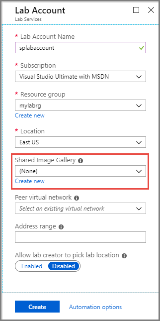
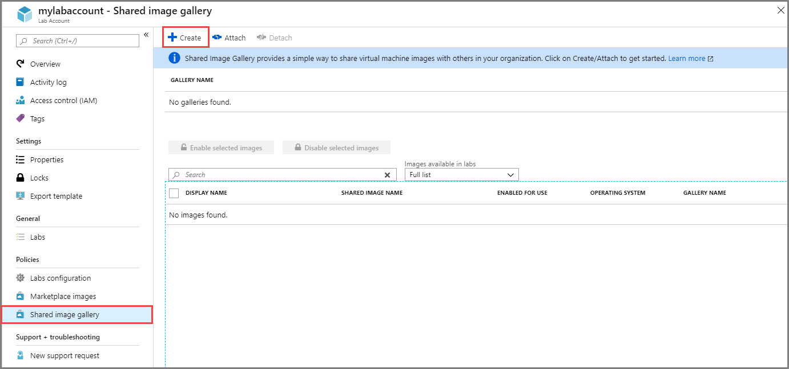
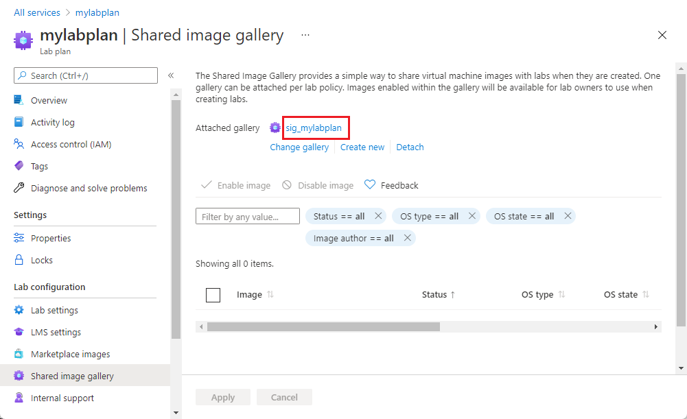
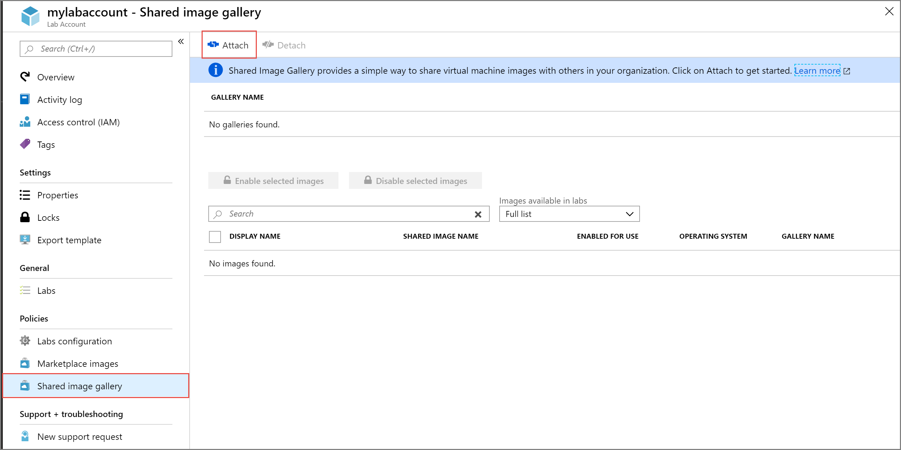
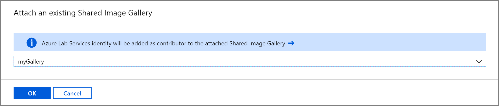
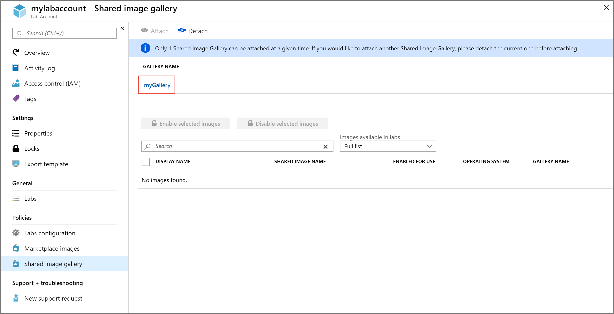
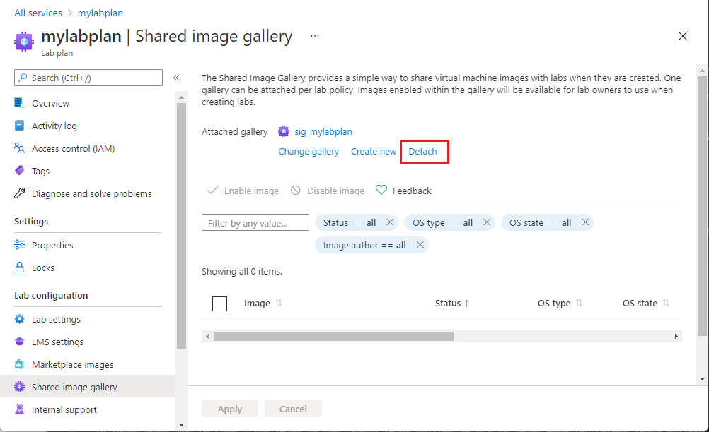

# Attach or detach a shared image gallery in Azure Lab Services
This article shows you how to attach or detach a shared image gallery to a lab account. 

> [!NOTE]
> When you [save a template image of a lab](how-to-use-shared-image-gallery.md#save-an-image-to-the-shared-image-gallery) in Azure Lab Services to a shared image gallery, the image is uploaded to the gallery as a specialized image. [Specialized images](https://docs.microsoft.com/azure/virtual-machines/windows/shared-image-galleries#generalized-and-specialized-images) keep machine-specific information and user profiles. You can still directly upload a generalized image to the gallery outside of Azure Lab Services. 
>
> A lab creator can create a template VM based on both generalized and specialized images in Azure Lab Services. 

## Scenarios
Here are the couple of scenarios supported by this feature: 

- A lab account admin attaches a shared image gallery to the lab account, and uploads an image to the shared image gallery outside the context of a lab. Then, lab creators can use that image from the shared image gallery to create labs. 
- A lab account admin attaches a shared image gallery to the lab account. A lab creator (instructor) saves the customized image of his/her lab to the shared image gallery. Then, other lab creators can select this image from the shared image gallery to create a template for their labs. 

    When an image is saved to a shared image gallery, Azure Lab Services replicates the saved image to other regions available in the same [geography](https://azure.microsoft.com/global-infrastructure/geographies/). It ensures that the image is available for labs created in other regions in the same geography. Saving images to a shared image gallery incurs an additional cost, which includes cost for all replicated images. This cost is separate from the Azure Lab Services usage cost. For more information about Shared Image Gallery pricing, see [Shared Image Gallery – Billing](https://docs.microsoft.com/azure/virtual-machines/windows/shared-image-galleries#billing).

## Configure at the time of lab account creation
When you are creating a lab account, you can attach a shared image gallery to the lab account. You can either select an existing shared image gallery from the drop-down list or create a new one. To create and attach a shared image gallery to the lab account, select **Create new**, enter a name for the gallery, and enter **OK**. 

## Configure after the lab account is created
After the lab account is created, you can do the following tasks:

- Create and attach a shared image gallery
- Attach a shared image gallery to the lab account
- Detach a shared image gallery from the lab account

## Create and attach a shared image gallery
1. Sign in to the [Azure portal](https://portal.azure.com).
2. Select **All Services** on the left menu. Select **Lab Services** in the **DEVOPS** section. If you select star (`*`) next to **Lab Services**, it's added to the **FAVORITES** section on the left menu. From the next time onwards, you select **Lab Services** under **FAVORITES**.

    
3. Select your lab account to see the **Lab Account** page. 
4. Select **Shared image gallery** on the left menu, and select **+ Create** on the toolbar.  

    
5. In the **Create shared image gallery** window, enter a **name** for the gallery, and enter **OK**. 

    

    Azure Lab Services creates the shared image gallery and attached it to the lab account. All labs created in this lab account have access to the attached shared image gallery. 

    

    In the bottom pane, you see images in the shared image gallery. In this new gallery, there are no images. When you upload images to the gallery, you see them on this page.     

    All images in the attached shared image gallery are enabled by default. You can enable or disable selected images by selecting them in the list and using the **Enable selected images** or **Disable selected images** button.

## Attach an existing shared image gallery
The following procedure shows you how to attach an existing shared image gallery to a lab account. 

1. On the **Lab Account** page, select **Shared image gallery** on the left menu, and select **Attach** on the toolbar. 

    
5. On the **Attach an existing Shared Image Gallery** page, select your shared image gallery, and select **OK**.

    
6. You see the following screen: 

    
    
    In this example, there are no images in the shared image gallery yet.

    Azure Lab Services identity is added as a contributor to the shared image gallery that is attached to the lab. It allows educators/IT admins to save virtual machine images to the shared image gallery. All labs created in this lab account have access to the attached shared image gallery. 

    All images in the attached shared image gallery are enabled by default. You can enable or disable selected images by selecting them in the list and using the **Enable selected images** or **Disable selected images** button. 

## Detach a shared image gallery
Only one shared image gallery can be attached to a lab. If you would like to attach another shared image gallery, detach the current one before attaching the new one. To detach a shared image gallery from your lab, select **Detach** on the toolbar, and confirm the detach operation. 

## Next steps
To learn about how to save a lab image to the shared image gallery or use an image from the shared image gallery to create a VM, see [How to use shared image gallery](how-to-use-shared-image-gallery.md).

For more information about shared image galleries in general, see [shared image gallery](https://docs.microsoft.com/azure/virtual-machines/windows/shared-image-galleries).
