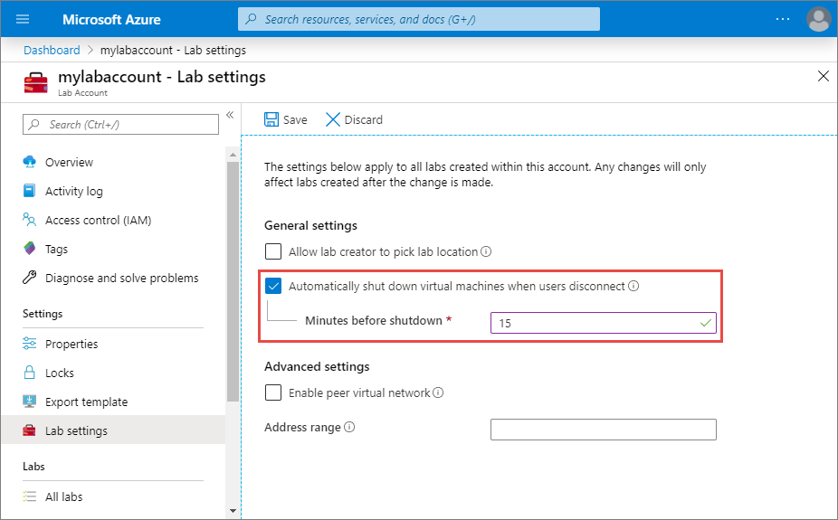

# Configure automatic shutdown of VMs on disconnect setting for a lab account
You can enable or disable automatic shutdown of Windows lab VMs (template or student) after a remote desktop connection is disconnected. You can also specify how long Lab Services should wait for the user to reconnect before automatically shutting down.

## Enable automatic shutdown

1. On the **Lab Account** page, select **Labs settings** on the left menu.
2. Select the **Automatically shut down virtual machines when users disconnect** option.
3. Specify how long Lab Services should wait for the user to reconnect before automatically shutting down the VMs.

    

    This setting applies to all the labs created in the lab account. A lab creator (educator) can override this setting at the lab level. The change to this setting at the lab account will only affect labs that are created after the change is made.

    To disable this setting, uncheck the checkbox for the **Automatically shutdown virtual machines when users disconnect** option on this page. 

## Next steps
To learn about how a lab owner can configure or override this setting at the lab level, see [this article](how-to-enable-shutdown-disconnect.md)
