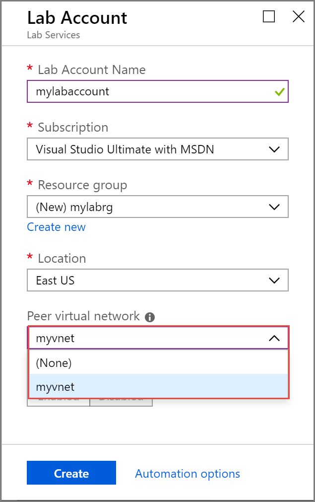
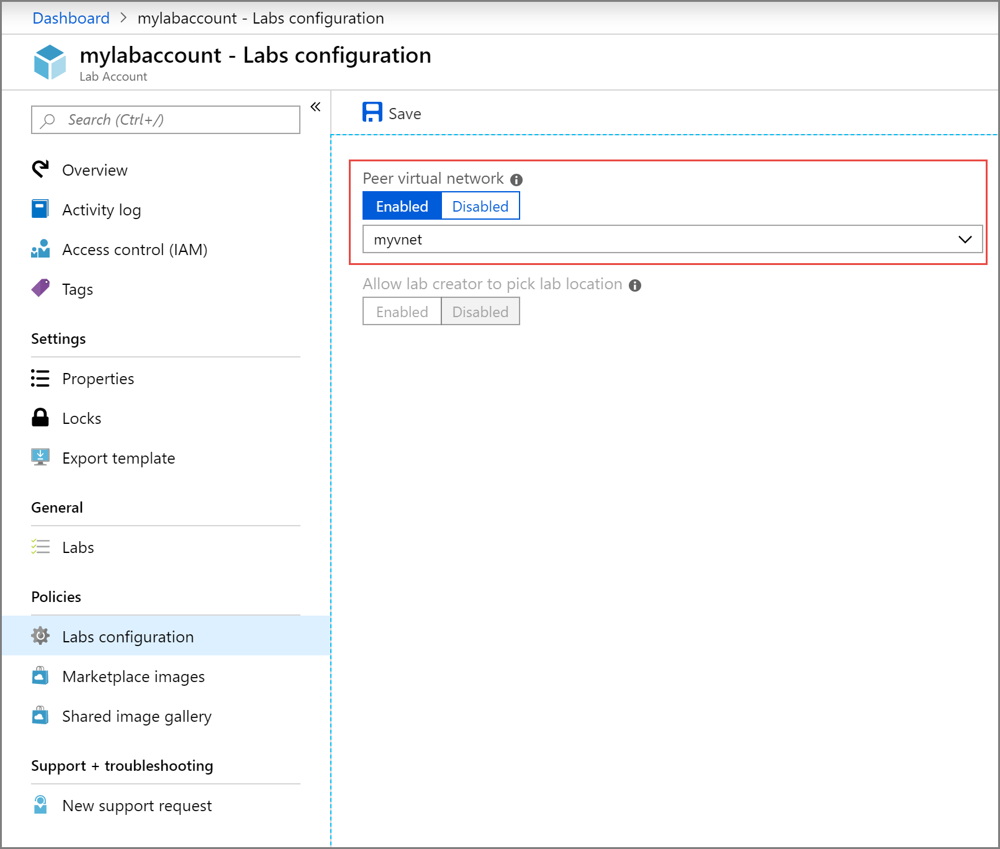
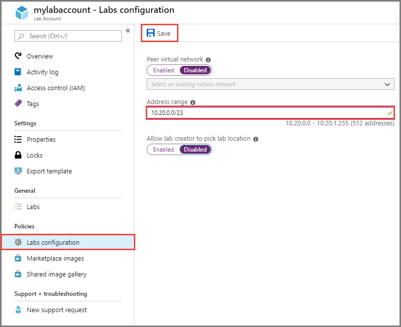

# Connect your lab's network with a peer virtual network in Azure Lab Services

[!INCLUDE [preview note](./includes/lab-services-labaccount-focused-article.md)]

This article provides information about peering your labs network with another network.

## Overview

Virtual network peering enables you to seamlessly connect Azure virtual networks. Once peered, the virtual networks appear as one, for connectivity purposes. The traffic between virtual machines in the peered virtual networks is routed through the Microsoft backbone infrastructure, much like traffic is routed between virtual machines in the same virtual network, through private IP addresses only. For more information, see [Virtual network peering](../virtual-network/virtual-network-peering-overview.md).

You may need to connect your lab's network with a peer virtual network in some scenarios including the following ones:

- The virtual machines in the lab have software that connects to on-premises license servers to acquire license.
- The virtual machines in the lab need access to data sets (or any other files) on university's network shares.

Certain on-premises networks are connected to Azure Virtual Network either through [ExpressRoute](../expressroute/expressroute-introduction.md) or [Virtual Network Gateway](../vpn-gateway/vpn-gateway-about-vpngateways.md). These services must be set up outside of Azure Lab Services. To learn more about connecting an on-premises network to Azure using ExpressRoute, see [ExpressRoute overview](../expressroute/expressroute-introduction.md). For on-premises connectivity using a Virtual Network Gateway, the gateway, specified virtual network, and the lab account must all be in the same region.

> [!NOTE]
> When creating a Azure Virtual Network that will be peered with a lab account, it's important to understand how the virtual network's region impacts where labs are created.  For more information, see the administrator guide's section on [regions/locations](./administrator-guide-1.md#regionslocations).

> [!NOTE]
> If your school needs to perform content filtering, such as for compliance with the [Children's Internet Protection Act (CIPA)](https://www.fcc.gov/consumers/guides/childrens-internet-protection-act), you will need to use 3rd party software.  For more information, read guidance on [content filtering with Lab Services](./administrator-guide.md#content-filtering).

## Configure at the time of lab account creation

During the new [lab account creation](tutorial-setup-lab-account.md), you can pick an existing virtual network that shows in the **Peer virtual network** dropdown list on the **Advanced** tab.  The list only shows virtual networks in the same region as the lab account. The selected virtual network is connected (peered) to labs created under the lab account.  All the virtual machines in labs that are created after the making this change have access to the resources on the peered virtual network.

### Address range

There's also an option to provide an address range for virtual machines for the labs.  The address range setting applies only if you enable a peer virtual network for the lab. If the address range is provided, all the virtual machines in the labs under the lab account are created in that address range. The address range should be in CIDR notation (for example, 10.20.0.0/20) and shouldn't overlap with any existing address ranges.

When you provide an address range, it's important to think about the number of *labs* that you create. Azure Lab Services assumes a maximum of 512 virtual machines per lab. For example, an IP range with '/23' can create only one lab.  A range with a '/21' allows for the creation of four labs.

If the address range isn't specified, Azure Lab Services uses the default address range given to it by Azure when creating the virtual network to be peered with your virtual network.  The range is often something like 10.x.0.0/16.  This large range might lead to IP range overlap, so make sure to either specify an address range in the lab settings or check the address range of your virtual network being peered.

> [!NOTE]
> Lab creation can fail if the lab account is peered to a virtual network but has too narrow of an IP address range. You can run out of space in the address range if there are too many labs in the lab account (each lab uses 512 addresses). 
>
> For example, if you have a block of /19, this address range can accommodate 8192 IP addresses and 16 labs (8192/512 = 16 labs). In this case, lab creation fails on the 17th lab creation.
> 
> If the lab creation fails, contact your lab account owner/admin and request for the address range to be increased. The admin can increase the address range using steps mentioned in the [Specify an address range for VMs in a lab account](#specify-an-address-range-for-vms-in-the-lab-account) section. 

## Configure after the lab account is created

The same property can be enabled from the **Labs configuration** tab of the **Lab Account** page if you didn't set up a peer network at the time of lab account creation. Change made to this setting applies only to the labs that are created after the change. As you can see in the image, you can enable or disable **Peer virtual network** for labs in the lab account.

When you select a virtual network for the **Peer virtual network** field, the **Allow lab creator to pick lab location** option is disabled. Labs in the lab account must be in the same region as the lab account for them to connect with resources in the peer virtual network.

> [!IMPORTANT]
> The peered virtual network setting applies only to labs that are created after the change is made, not to the existing labs.

## Specify an address range for VMs in the lab account
The following procedure has steps to specify an address range for VMs in the lab. If you update the range that you previously specified, the modified address range applies only to VMs that are created after the change was made. 

Here are some restrictions when specifying the address range that you should keep in mind. 

- The prefix must be smaller than or equal to 23. 
- If a virtual network is peered to the lab account, the provided address range can't overlap with address range from peered virtual network.

1. On the **Lab Account** page, select **Lab settings** on the left menu.
2. For the **Address range** field, specify the address range for VMs that are created in the lab. The address range should be in the classless inter-domain routing (CIDR) notation (example: 10.20.0.0/23). Virtual machines in the lab are created in this address range.
3. Select **Save** on the toolbar. 

    

## Next steps

See the following articles:

- [Allow lab creator to pick lab location](allow-lab-creator-pick-lab-location.md)
- [Attach a compute gallery to a lab](how-to-attach-detach-shared-image-gallery-1.md)
- [Add a user as a lab owner](how-to-add-user-lab-owner.md)
- [View firewall settings for a lab](how-to-configure-firewall-settings.md)
- [Configure other settings for a lab](how-to-configure-lab-accounts.md)