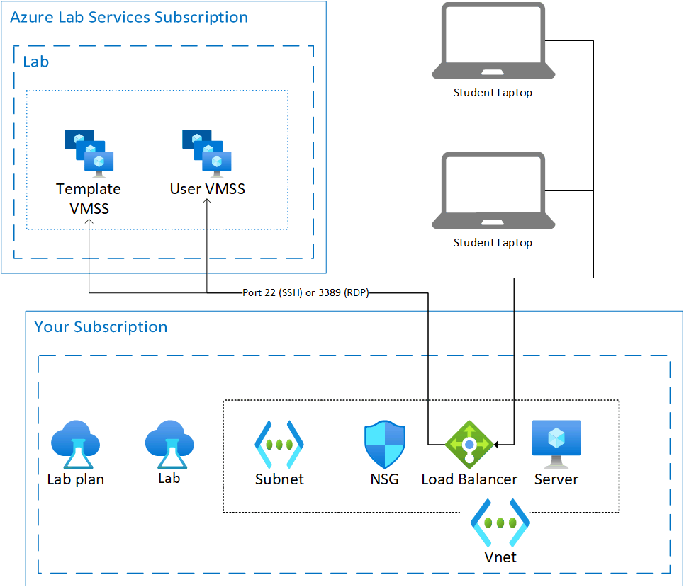

# How to create a lab with a shared resource in Azure Lab Services

Sometimes when creating a classroom lab, there may be some resources that need to be shared among all the students in a lab.  For example, you have a licensing server or SQL Server for a database class.  This article will discuss the steps to enable the shared resource for a lab.  We’ll also talk about how to limit access to that shared resource.

## Architecture

As shown in the diagram below we'll have a lab account with a lab.  The lab account will have the vnet peering settings so the virtual network for the lab is connected to the network of the shared resource.  In the diagram below there are two virtual networks with non-overlapping IP ranges.  These IP ranges are just example ranges.  Also note that the shared resource virtual network is in the same subscription as the lab account.

## Setup shared resource

The virtual network for the shared resource must be created before the lab is created.  For more information on how to create a virtual network, see [create a virtual network](../virtual-network/quick-create-portal.md).  Planning out virtual network ranges so they don’t overlap with the ip address of the lab machines is important.  For more information about planning your network, see the [plan virtual networks](../virtual-network/virtual-network-vnet-plan-design-arm.md) article. In our example, the shared resource is in a virtual network with the range 10.2.0.0/16.  If not done already, [create a subnet](../virtual-network/virtual-network-manage-subnet.md#add-a-subnet) to hold the shared resource.  In the example, we use the 10.2.0.0/24 range, but your range may be different depending on the needs of your network.

The shared resource can be software running on a virtual machine or an Azure provided service. The shared resource should be available through private IP address.  By making the shared resource available through private IP only, you limit access to that shared resource.

The diagram also shows a network security group (NSG) which can be used to restrict traffic coming from the student VM.  For example, you can write a security rule that states traffic from the student VM's IP addresses can only access one shared resource and nothing else.  For more information how to set security rules, see [manage network security group](../virtual-network/manage-network-security-group.md#work-with-security-rules). If you want to restrict access to a shared resource to a specific lab, get the IP address for the lab from the [lab settings from the lab account](manage-labs.md#view-labs-in-a-lab-account) and set an inbound rule to allow access only from that IP address.  Don’t forget to allow ports 49152 to 65535 for that IP address.  Optionally you can find the private IP address of the student’s VMs by using the [virtual machine pool page](how-to-set-virtual-machine-passwords.md).

If your shared resource is an Azure virtual machine running necessary software, you may have to modify the default firewall rules for the virtual machine.

## Lab Account

To use a shared resource, the lab account must be set up to use a [peered virtual network](how-to-connect-peer-virtual-network.md).  In this case, we will be peering to the virtual network that holds the shared resource.

>[!WARNING]
>The lab for your class must be created **after** the lab account is peered to the shared resource virtual network.  
Template machine

Once your lab account is peered to the virtual network, the template machine should now have access to the shared resource.  You may have to update the firewall rules, depending on the shared resource being accessed.
