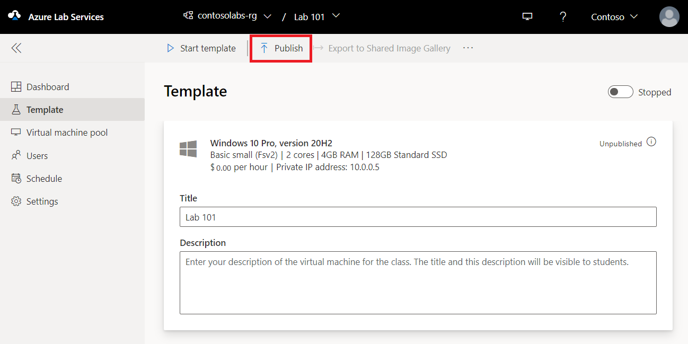

# Create and manage a template in Azure Lab Services

A template in a lab is a base VM image from which all users' virtual machines are created. Modify the template VM so that it's configured with exactly what you want to provide to the lab users. You can provide a name and description of the template that the lab users see. Then, you publish the template to make instances of the template VM available to your lab users. When you publish a template, Azure Lab Services creates VMs in the lab using the template. The number of VMs created during publish equals lab capacity.  If using [Teams integration](lab-services-within-teams-overview.md), or [Canvas integration](lab-services-within-canvas-overview.md), the number of VMs created during publish equals the number of users in the lab.  All virtual machines have the same configuration as the template.

When you create a lab, the template VM is created but it's not started. You can start it, connect to it, and install any pre-requisite software for the lab, and then publish it. When you publish the template VM, it's automatically shut down for you if you haven't done so.  This article describes how to manage a template VM of a lab.

> [!NOTE]
> Template VMs incur cost when running, so ensure that the template VM is shutdown when you aren't using it.

## Set or update template title and description

Use the following steps to set title and description for the lab.  Educators and students will see the title and description on the tiles of the [My Virtual Machines](instructor-access-virtual-machines.md) page.

1. On the **Template** page, enter the new **title** for the lab.  
2. Enter the new **description** for the template. When you move the focus out of the text box, it's automatically saved.

    

## Update a template VM

Use the following steps to update a template VM.  

1. On the **Template** page for the lab, select **Start template** on the toolbar.
1. Wait until the template VM is started, and then select **Connect to template** on the toolbar to connect to the template VM.  Depending on the setting for the lab, you'll connect using Remote Desktop Protocol (RDP) or Secure Shell (SSH).
1. Once you connect to the template and make changes, it will no longer have the same setup as the virtual machines last published to your users. Template changes won't be reflected on your students' existing virtual machines until after you publish again.

    

1. Install any software that's required for students to do the lab (for example, Visual Studio, Azure Storage Explorer, etc.).
1. Disconnect (close your remote desktop session) from the template VM.
1. **Stop** the template VM by selecting **Stop template**.
1. Follow steps in the next section to **Publish** the updated template VM.

## Publish the template VM

In this step, you publish the template VM. When you publish the template VM, Azure Lab Services creates VMs in the lab by using the template. All virtual machines have the same configuration as the template.

1. On the **Template** page, select **Publish** on the toolbar.

    

    > [!WARNING]
    > Publishing is a permanent action.  It can't be undone.

2. On the **Publish template** page, enter the number of virtual machines you want to create in the lab, and then select **Publish**.

    
3. You see the **status of publishing** the template on page.  If using [Azure Lab Services August 2022 Update](lab-services-whats-new.md), publishing can take up to 20 minutes.

    
4. Wait until the publishing is complete and then switch to the **Virtual machines pool** page by selecting **Virtual machines** on the left menu or by selecting **Virtual machines** tile. Confirm that you see virtual machines that are in **Unassigned** state. These VMs aren't assigned to students yet. They should be in **Stopped** state. You can start a student VM, connect to the VM, stop the VM, and delete the VM on this page. You can start them in this page or let your students start the VMs.

    

## Next steps

See the following articles:

- [As an admin, create and manage lab plans](how-to-manage-lab-plans.md)
- [As a lab owner, create and manage labs](how-to-manage-labs.md)
- [As a lab owner, configure and control usage of a lab](how-to-configure-student-usage.md)
- [As a lab user, access labs](how-to-use-lab.md)
