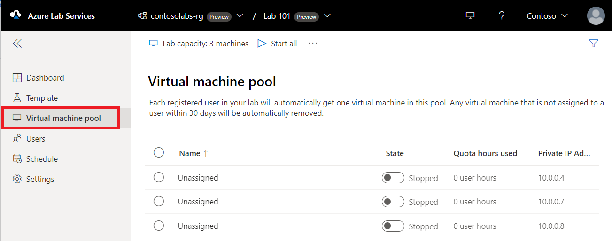

# Create and manage a lab template in Azure Lab Services

A lab template is a base VM image from which all lab users' virtual machines are created. You can use a template to customize the base VM image for lab VMs.  For example, you might install extra software components, such as Visual Studio, or configure the operating system to disable the web server process. In this article, you learn how to create and manage a lab template.

When you [publish a lab](./tutorial-setup-lab.md#publish-lab), Azure Lab Services creates the lab VMs, based on the template VM image. If you modify the template VM at a later stage, when you republish the template VM, all lab VMs are updated to match the new template. When you republish a template VM, Azure Lab Services reimages the lab VMs and removes all changes and data on the VM.

When you create a lab, the template VM is created but it's not started. You can start it, connect to it, and install any prerequisite software for the lab, and then publish it. When you publish the template VM, it's automatically shut down for you if you haven't done so.

The number of VMs created during publish equals lab capacity.  If you're using [Teams integration](lab-services-within-teams-overview.md), or [Canvas integration](lab-services-within-canvas-overview.md), the number of VMs created during publish equals the number of users in the lab.

> [!NOTE]
> Template VMs incur cost when running, so ensure that the template VM is shutdown when you aren't using it.

## Set or update template title and description

Lab creators and lab users can see the title and description on the tiles of the [My Virtual Machines](instructor-access-virtual-machines.md) page.

Use the following steps to set title and description for the lab:

1. On the **Template** page, enter the new **title** for the lab.

2. Enter the new **description** for the template. When you move the focus out of the text box, it's automatically saved.

    :::image type="content" source="./media/how-to-create-manage-template/template-name-description.png" alt-text="Screenshot that shows the Template page in the Lab Services portal, allowing users to edit the template title and description.":::

## Update a template VM

Use the following steps to update a template VM:

1. On the **Template** page for the lab, select **Start template** on the toolbar.

1. Wait until the template VM is started, and then select **Connect to template** on the toolbar to connect to the template VM.

    Depending on the setting for the lab, you connect using Remote Desktop Protocol (RDP) or Secure Shell (SSH).

    :::image type="content" source="./media/how-to-create-manage-template/connect-template-vm.png" alt-text="Screenshot that shows the Template page in the Lab Service portal, highlighting the Connect to template button.":::

1. Install any software that's required for students to do the lab (for example, Visual Studio, Azure Storage Explorer, etc.).

1. Disconnect (close your remote desktop session) from the template VM.

1. **Stop** the template VM by selecting **Stop template**.

> [!NOTE]
> Template changes are not available on lab users' existing virtual machines until after you publish the lab template again. Follow steps in the next section to publish the updated template VM.

## Publish the template VM

In this step, you publish the template VM. When you publish the template VM, Azure Lab Services creates VMs in the lab by using the template. All virtual machines have the same configuration as the template.

> [!CAUTION]
> When you republish a template VM, Azure Lab Services reimages the lab VMs and removes all changes and data on the VM.

1. On the **Template** page, select **Publish** on the toolbar.

    Publishing is a permanent action and can't be undone.

1. On the **Publish template** page, enter the number of virtual machines you want to create in the lab, and then select **Publish**.

    :::image type="content" source="./media/how-to-create-manage-template/publish-template-number-vms.png" alt-text="Screenshot that shows the Publish template window, allowing you to specify the lab capacity (number of lab VMs in the lab).":::

    You can track the publishing status on the template. If you're using [lab plans](lab-services-whats-new.md), publishing can take up to 20 minutes.

1. Wait until the publishing is complete and then switch to the **Virtual machine pool** page by selecting **Virtual machines** on the left menu or by selecting **Virtual machines** tile. 

    Confirm that you see virtual machines that are marked **Unassigned**, which indicates the lab VMs aren't assigned to lab users yet. The lab VMs should be in **Stopped** state. You can start a lab VM, connect to the VM, stop the VM, and delete the VM on this page.

    
    :::image type="content" source="./media/how-to-create-manage-template/virtual-machines-stopped.png" alt-text="Screenshot that shows the Virtual machine pool page in the Lab Services portal, showing the list of unassigned lab VMs.":::

## Known issues

When you create a new lab from an exported lab VM image, you’re unable to sign in with the credentials you used for creating the lab. Follow these steps to [troubleshoot the sign-in problem](./troubleshoot-access-lab-vm.md#unable-to-login-with-the-credentials-you-used-for-creating-the-lab).

## Related content

- [As an admin, create and manage lab plans](how-to-manage-lab-plans.md)
- [As a lab owner, create and manage labs](how-to-manage-labs.md)
- [As a lab owner, configure and control usage of a lab](how-to-manage-lab-users.md)
- [As a lab user, access labs](how-to-use-lab.md)
