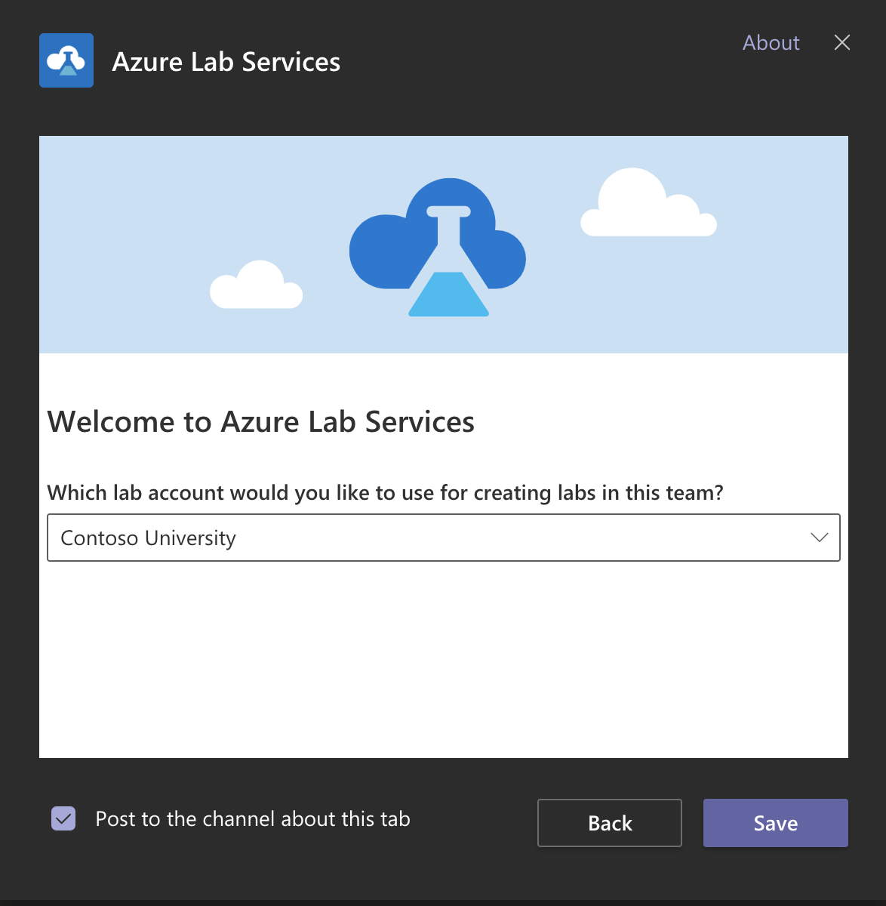

# Get started and create a Lab Services lab from Teams

This article shows how to add an Azure Lab Services app to Teams. Then, how to create a lab from Teams.

## Add a Lab Services app to Teams

You can add Lab Services directly in your Teams channels, and then the app is available for everyone in the team to use. Follow these three steps:

1. Navigate to the Teams channel where you want to add the app and select **+** to add a tab by clicking on "..." from the top of the right window. 
1. Search for **Azure Lab Services** from the tab options and add this app. 

    > [!NOTE]
    > Only Team **Owners** will be able to create labs for the team.
1. Select a Lab Services account, which you would like to use for creating classroom labs in this team. 

    Azure Lab Services uses single sign-on into the [Azure Lab Services website](https://labs.azure.com) and pulls all the lab accounts that you have access to. 

    The accounts that are in the same tenant as Teams and for which you have **Owner**, **Contributor**, or **Creator** access are displayed. 

    
1. Press **Save** and the app gets added to Teams and the tab gets added to the channel. 

    Now you can select the **Azure Lab Services** tab from your channel and start managing labs as described in the following step.

    Once one member of a team adds the tab, it shows up for everyone in the channel. Any users who have access to the app get single sign-on access with the credentials they use for Microsoft Teams. Any users who don't have access to the app can see the tab in Teams, but are blocked until you give them permissions to the on-premises app and the Azure portal published version of the app.

## Create a classroom lab

After the lab account is selected, Team owners will be able to create labs for the team. The entire lab creation process and all the tasks at the lab level can be performed within Teams. Users will have the option to create multiple labs within the same team and the Team owner, with appropriate access at the lab account level, will see only the labs associated with the specific team.

## Giving access to users of the lab account

Provisioning access to users at the lab account level needs to happen in the [Azure](https://ms.portal.azure.com/) portal.

1. In the Azure portal, navigate to your Azure Lab Services account. 
1. On the **Lab Account** page, select **Access control (IAM)**, select **+ Add** on the toolbar, and then select **+ Add role assignment** on the toolbar. 

    
1. On the **Add role assignment** page, select **Lab Creator** for **Role**, select the user you want to add to the Lab Creators role, and select **Save**. 

    

### Creating classroom labs

The classroom labs creation process is the same whether you are creating labs from Teams or the [Lab Services website](https://labs.azure.com). 

For details about setting up This article outline labs creation process: [Manage classroom labs in Azure Lab Services](how-to-manage-classroom-labs.md).

## Deleting classroom labs

A lab created within Teams can be deleted in the [Lab Services website](https://labs.azure.com) by deleting the lab directly, as described in [Manage classroom labs in Azure Lab Services](how-to-manage-classroom-labs.md). 

Lab deletion is also triggered when the team is deleted. If the team in which the lab is created gets deleted, lab would be automatically deleted 24 hours after the automatic user list sync is triggered. 

Deletion of the tab or uninstalling the app will not result in deletion of the lab. If the tab is deleted, users on the team membership list will still be able to access the VMs on the [Lab Services website](https://labs.azure.com) unless the lab deletion is explicitly triggered by deleting the lab on website or deleting the team. 

## Next steps

When a lab is created within Teams, the lab user list is automatically populated and synced with the team membership. Everyone on the team, including Owners, Members and Guests will be automatically added to the lab user list. Azure lab Services will maintain a sync with the team membership and an automatic sync is triggered every 24 hours. For details, see:

[Manage Lab Services user lists from Teams](how-to-manage-user-lists-within-teams.md)

### See also

Also see the following articles:

- [Use Azure Lab Services within Teams overview](lab-services-within-teams-overview.md)
- [Manage a VM pool in Lab Services from Teams](how-to-manage-vm-pool-within-teams.md)
- [Create Lab Services schedules from Teams](how-to-create-schedules-within-teams.md)
- [Access a VM (student view) in Lab Services from Teams](how-to-access-vm-for-students-within-teams.md)

