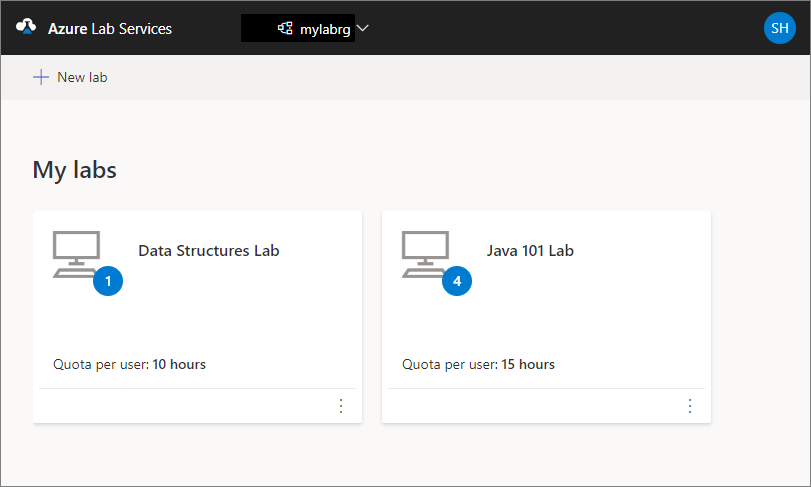
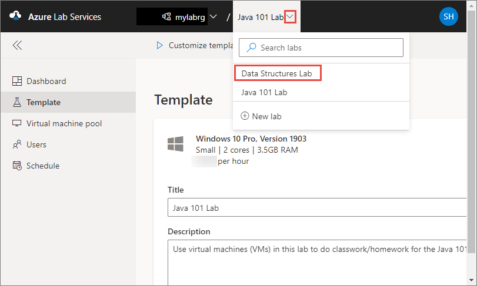

# Manage labs in Azure Lab Services

This article describes how to create and delete a classroom lab. It also shows you how to view all the labs in a lab plan. 

## Prerequisites

To set up a classroom lab in a lab plan, you must be a member of the **Lab Creator** role in the lab plan. The account you used to create a lab plan is automatically added to this role. A lab owner can add other users to the Lab Creator role by using steps in the following article: [Add a user to the Lab Creator role](tutorial-setup-lab-account.md#add-a-user-to-the-lab-creator-role).

## Create a classroom lab

1. Navigate to [Azure Lab Services website](https://labs.azure.com).
1. Select **Sign in** and enter your credentials. Select or enter a **user ID** that is a member of the **Lab Creator** role in the lab plan, and enter password. Azure Lab Services supports organizational accounts and Microsoft accounts.
1. Select **New lab**.

    :::image type="content" source="./media/tutorial-setup-classroom-lab/new-lab-button.png" alt-text="Create a classroom lab":::
1. In the **New Lab** window, do the following actions:
    1. Specify a **name** for your lab. 
    1. Select the **size of the virtual machines** you need for the class. For the list of sizes available, see the [VM Sizes](#vm-sizes) section.
    1. Select the **virtual machine image** that you want to use for the classroom lab. If you select a Linux image, you see an option to **enable remote desktop connection**. For details, see [Enable remote desktop connection for Linux](how-to-enable-remote-desktop-linux.md).

        If you signed in using lab plan owner credentials, you will see an option to enable more images for the lab. For more information, see [Enable images at the time of lab creation](specify-marketplace-images.md#enable-images-at-the-time-of-lab-creation).
    1. Select the **location** (region) for the lab.
        If your lab plan is connected to your own virtual network, labs can only be created in the same Azure region as that virtual network.
    1. Review the **total price per hour** displayed on the page.
    1. Select **Save**.

        :::image type="content" source="./media/tutorial-setup-classroom-lab/new-lab-window.png" alt-text="Screenshot that shows the New lab window.":::

        > [!NOTE]
        > You see an option to select a location for your lab if the lab plan was configured to [allow lab creator to pick lab location](allow-lab-creator-pick-lab-location.md) option. 
1. On the **Virtual machine credentials** page, specify default credentials for all VMs in the lab.
    1. Specify the **name of the user** for all VMs in the lab.
    2. Specify the **password** for the user.

        > [!IMPORTANT]
        > Make a note of user name and password. They won't be shown again.
    3. Select **Give lab users a non-admin account on their virtual machines** if you want to automatically create accounts for lab users.

       When you select this option, you then set the user name and password for the non-admin account.
    4. Disable **Use same password for all virtual machines** option if you want students to set their own passwords. This step is **optional**. 

        An educator can choose to use the same password for all the VMs in the lab, or allow students to set passwords for their VMs. By default, this setting is enabled for all Windows and Linux images except for Ubuntu. When you select **Ubuntu** VM, this setting is disabled, so the students will be prompted to set a password when they sign in for the first time.  

        
    5. Then, select **Next** on the **Virtual machine credentials** page. 
1. On the **Lab policies** page, do the following steps:
    1. Enter the number of hours allotted for each user (**quota for each user**) outside the scheduled time for the lab.
    1. Enter the timeouts for the auto-shutdown settings.

        For idle settings, idle detection examines both mouse/keyboard input (user absence) and disk/CPU usage (resource usage). By selecting resource usage as an idle setting, operations such as long-running queries are accounted for.
    1. Then, select **Next**.

        

1. On the **Template Virtual Machine Settings** page, select whether to create a template VM or a non-customized VM.
    1. If you choose **Create a template virtual machine**, the lab owner gets a template VM, which can be customized with software, settings, etc., and each student gets a copy of the template.
    2. If you choose **Use a virtual machine image without customization**, each student gets a VM directly from the source VM image with no customization. (No template VM.)

       If you choose this option, you then select the maximum number of VMs for the lab.
        :::image type="content" source="./media/tutorial-setup-classroom-lab/template-virtual-machine-settings.png" alt-text="Template virtual machine settings":::
    1. Select **Finish**.

1. (Template VM) You should see the following screen that shows the status of the template VM creation. The creation of the template in the lab takes up to 15 minutes. 

    
1. (Template VM) On the **Template** page, do the following steps: These steps are **optional** for the tutorial.

    1. Connect to the template VM by selecting **Start**. If it's a Linux template VM, you choose whether you want to connect using SSH or a GUI remote desktop.  Additional setup is required to use a GUI remote desktop. See [Enable graphical remote desktop for Linux virtual machines](how-to-use-remote-desktop-linux-student.md) for more information.
    1. Select **Reset password** to reset the password for the VM.
    1. Install and configure software on your template VM.
    1. **Stop** the VM.  
    1. Enter a **description** for the template

## Publish a VM

The following steps apply for publishing a template VM or a non-customized VM.

1. On the **Template** page, select **Publish** on the toolbar.

    

    > [!WARNING]
    > Once you publish, you can't unpublish. 
1. On the **Publish template** page, enter the number of virtual machines you want to create in the lab, and then select **Publish**.

    
1. You see the **status of publishing** the VM on the page.

    

## VM sizes  

For information on VM sizes and their cost, see the [Azure Pricing Calculator](https://azure.microsoft.com/pricing/calculator/).

> [!NOTE]
> You may not see some of these VM sizes in the list when creating a classroom lab. The list is populated based on the current capacity of the lab's location. If the lab plan creator [allows lab creators to pick a location for the lab](allow-lab-creator-pick-lab-location.md), you may try choosing a different location for the lab and see if the VM size is available.

## View the student VM pool

Switch to the **Virtual machines pool** page by selecting Virtual machines on the left menu or by selecting Virtual machines tile. Confirm that you see virtual machines that are in **Unassigned** state. These VMs are not assigned to students yet. They should be in **Stopped** state. You can start a student VM, connect to the VM, stop the VM, and delete the VM on this page. You can start them in this page or let your students start the VMs. 

You do the following tasks on this page (don't do these steps for the tutorial. These steps are for your information only.):

1. To change the lab capacity (number of VMs in the lab), select **Lab capacity** on the toolbar.
2. To start all the VMs at once, select **Start all** on the toolbar. 
3. To start a specific VM, select the down arrow in the **Status**, and then select **Start**. You can also start a VM by selecting a VM in the first column, and then by selecting **Start** on the toolbar.

## View all labs

1. Navigate to [Azure Lab Services portal](https://labs.azure.com).
1. Select **Sign in**. Select or enter a **user ID** that is a member of the **Lab Creator** role in the lab plan, and enter password. Azure Lab Services supports organizational accounts and Microsoft accounts.

    [!INCLUDE [Select a tenant](./includes/multi-tenant-support.md)]
1. Confirm that you see all the labs in the selected lab plan. On the lab's tile, you see the number of virtual machines in the lab and the quota for each user (outside the scheduled time).

    
1. Use the drop-down list at the top to select a different lab plan. You see labs in the selected lab plan. 

## Delete a classroom lab

1. On the tile for the lab, select three dots (...) in the corner, and then select **Delete**.

    
1. On the **Delete lab** dialog box, select **Delete** to continue with the deletion.

## Switch to another classroom lab

To switch to another classroom lab from the current, select the drop-down list of labs in the lab plan at the top.

You can also create a new lab using the **New lab** in this drop-down list.

> [!NOTE]
> You can also use the Az.LabServices PowerShell module (preview) to manage labs. For more information, see the [Az.LabServices home page on GitHub](https://aka.ms/azlabs/samples/PowerShellModule).

To switch to a different lab plan, select the drop-down next to the lab plan and select the other lab plan.

## Next steps

See the following articles:

- [As a lab owner, set up and publish templates](how-to-create-manage-template.md)
- [As a lab owner, configure and control usage of a lab](how-to-configure-student-usage.md)
- [As a lab user, access labs](how-to-use-classroom-lab.md)
