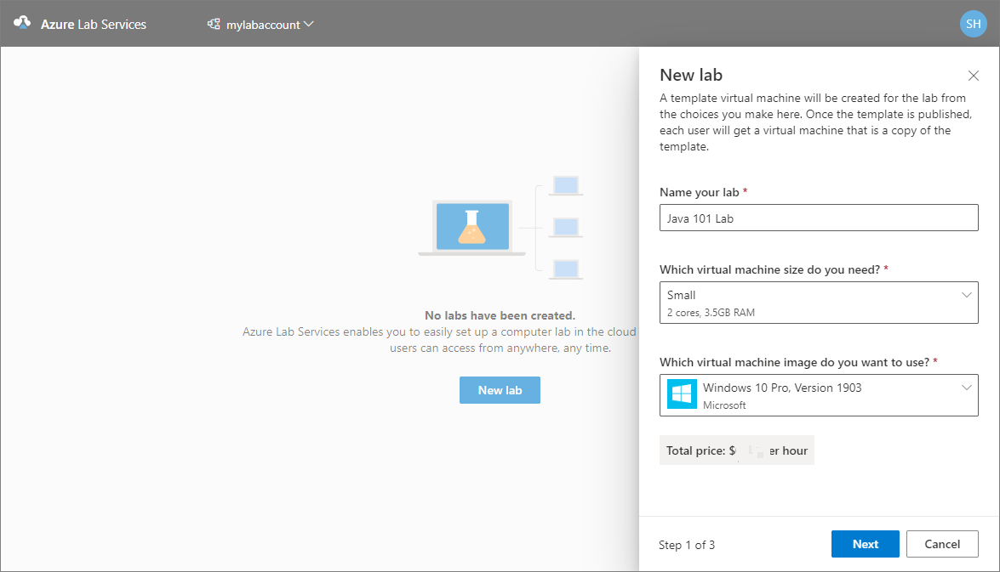
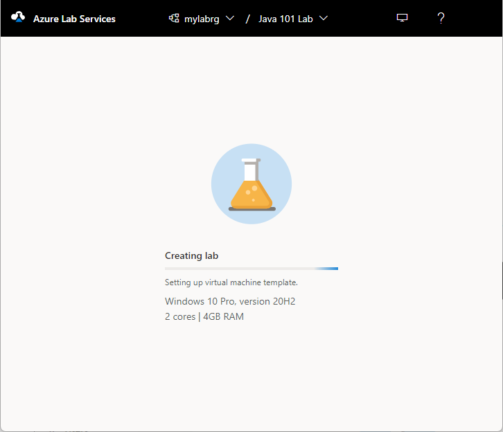
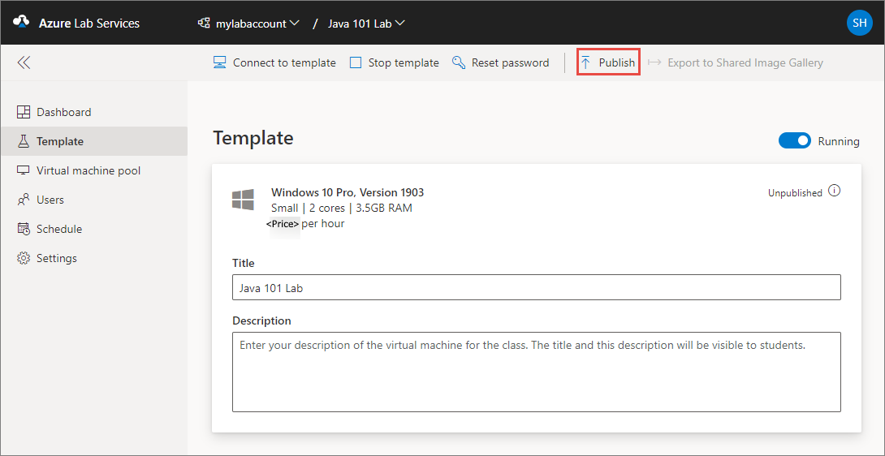
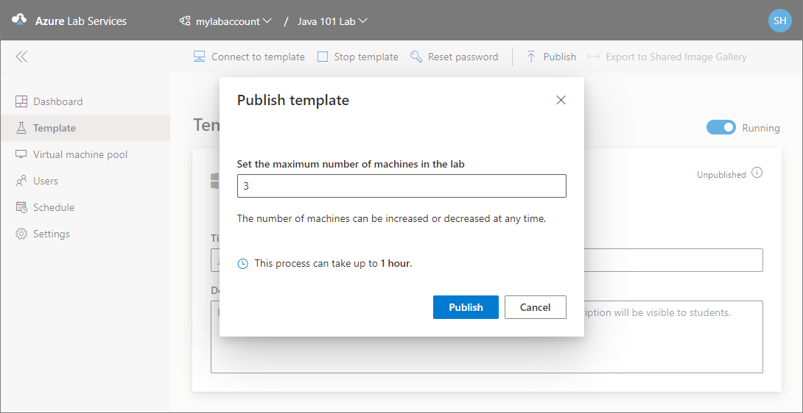
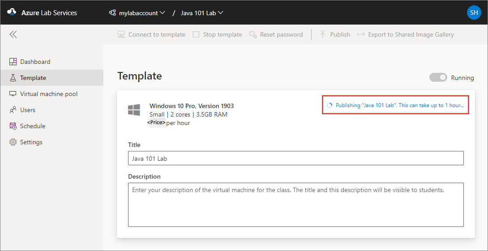
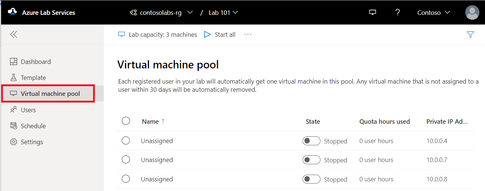
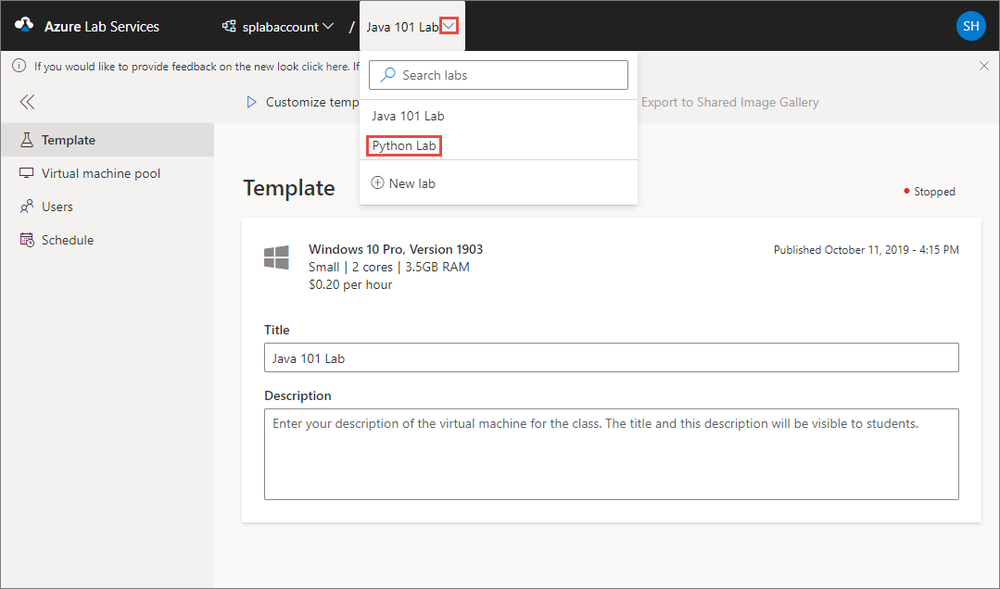

# Manage labs in Azure Lab Services when using lab accounts

[!INCLUDE [preview note](./includes/lab-services-labaccount-focused-article.md)]

This article describes how to create and delete a lab. It also shows you how to view all the labs in a lab account.

## Prerequisites

To set up a lab in a lab account, you must be a member of the **Lab Creator** role in the lab account. The account you used to create a lab account is automatically added to this role. A lab owner can add other users to the Lab Creator role by using steps in the following article: [Add a user to the Lab Creator role](tutorial-setup-lab-account.md#add-a-user-to-the-lab-creator-role).

## Create a lab

1. Navigate to Lab Services web portal: [https://labs.azure.com](https://labs.azure.com).
2. Select **Sign in** and enter your credentials. Select or enter a **user ID** that is a member of the **Lab Creator** role in the lab account, and enter password. Azure Lab Services supports organizational accounts and Microsoft accounts.
3. Select **New lab**.

    

4. In the **New Lab** window, do the following actions:
    1. Specify a **name** for your lab.
    1. Select the **size of the virtual machines** you need for the class. For the list of sizes available, see the [VM Sizes](#vm-sizes) section.
    1. Select the **virtual machine image** that you want to use for the lab. If you select a Linux image, you see an option to **enable remote desktop connection**. For details, see [Enable remote desktop connection for Linux](how-to-enable-remote-desktop-linux.md).

    1. Review the **total price per hour** displayed on the page.
    1. Select **Save**.

        

        > [!NOTE]
        > You see an option to select a location for your lab if the lab account was configured to [allow lab creator to pick lab location](allow-lab-creator-pick-lab-location.md) option.
5. On the **Virtual machine credentials** page, specify default credentials for all VMs in the lab.
    1. Specify the **name of the user** for all VMs in the lab.
    2. Specify the **password** for the user.

        > [!IMPORTANT]
        > Make a note of user name and password. They won't be shown again.
    3. Disable **Use same password for all virtual machines** option if you want students to set their own passwords. This step is **optional**.

        An educator can choose to use the same password for all the VMs in the lab, or allow students to set passwords for their VMs. By default, this setting is enabled for all Windows and Linux images except for Ubuntu. When you select **Ubuntu** VM, this setting is disabled and students are prompted to set a password when they sign in for the first time.  

        :::image type="content" source="./media/how-to-manage-classroom-labs/virtual-machine-credentials.png" alt-text="Screenshot that shows the Virtual machine credentials page of the New lab wizard.":::

    4. Then, select **Next** on the **Virtual machine credentials** page.

6. On the **Lab policies** page, do the following steps:
    1. Enter the number of hours allotted for each user (**quota for each user**) outside the scheduled time for the lab.
    2. For the **Auto-shutdown of virtual machines** option, specify whether you want the VM to be automatically shut down when user disconnects. You can also specify how long the VM should wait for the user to reconnect before automatically shutting down. For more information, see [Enable automatic shutdown of VMs on disconnect](how-to-enable-shutdown-disconnect.md).
    3. Then, select **Finish**.

        :::image type="content" source="./media/how-to-manage-classroom-labs/quota-for-each-user.png" alt-text="Screenshot that shows the Lab policies page of the New lab wizard.":::

7. You should see the following screen that shows the status of the template VM creation. The creation of the template in the lab takes up to 20 minutes.

    

8. On the **Template** page, do the following steps: These steps are **optional** for the tutorial.

    1. Start the template VM.
    1. Connect to the template VM by selecting **Connect**. If it's a Linux template VM, you choose whether you want to connect using SSH or a GUI remote desktop.  Additional setup is required to use a GUI remote desktop. For more information, see [Enable graphical remote desktop for Linux virtual machines in Azure Lab Services](how-to-enable-remote-desktop-linux.md).
    1. Select **Reset password** to reset the password for the VM. The VM must be running before the reset password button is available.
    1. Install and configure software on your template VM.
    1. **Stop** the VM.  

9. On **Template** page, select **Publish** on the toolbar.

    

    > [!WARNING]
    > Once you publish, you can't unpublish.

10. On the **Publish template** page, enter the number of virtual machines you want to create in the lab, and then select **Publish**.

    

11. You see the **status of publishing** the template on page. This process can take up to an hour.

    

12. Switch to the **Virtual machines pool** page by selecting Virtual machines on the left menu or by selecting Virtual machines tile. Confirm that you see virtual machines that are in **Unassigned** state. These VMs aren't assigned to students yet. They should be in **Stopped** state. You can start a student VM, connect to the VM, stop the VM, and delete the VM on this page. You can start them in this page or let your students start the VMs.

    

    You do the following tasks on this page (don't do these steps for the tutorial. These steps are for your information only.):

    1. To change the lab capacity (number of VMs in the lab), select **Lab capacity** on the toolbar.
    2. To start all the VMs at once, select **Start all** on the toolbar.
    3. To start a specific VM, select the down arrow in the **Status**, and then select **Start**. You can also start a VM by selecting a VM in the first column, and then by selecting **Start** on the toolbar.

### VM sizes  

For information on VM sizes and their cost, see the [Azure Pricing Calculator](https://azure.microsoft.com/pricing/calculator/).

> [!NOTE]
> You may not see some of the expected VM sizes in the list when creating a lab. The list is populated based on the current capacity of the lab's location. If the lab account creator [allows lab creators to pick a location for the lab](allow-lab-creator-pick-lab-location.md), you may try choosing a different location for the lab and see if the VM size is available.

## View all labs

1. Navigate to Lab Services web portal: [https://labs.azure.com](https://labs.azure.com).
1. Select **Sign in**. Select or enter a **user ID** that is a member of the **Lab Creator** role in the lab account, and enter password. Azure Lab Services supports organizational accounts and Microsoft accounts.

    [!INCLUDE [Select a tenant](./includes/multi-tenant-support.md)]

1. Confirm that you see all the labs in the selected lab account. On the lab's tile, you see the number of virtual machines in the lab and the quota for each user (outside the scheduled time).

    

1. Use the drop-down list at the top to select a different lab account. You see labs in the selected lab account.

## Delete a lab

1. On the tile for the lab, select three dots (...) in the corner, and then select **Delete**.

    

1. On the **Delete lab** dialog box, select **Delete** to continue with the deletion.

## Switch to another lab

To switch to another lab from the current, select the drop-down list of labs in the lab account at the top.

You can also create a new lab using the **New lab** in this drop-down list.

> [!NOTE]
> You can also use the Az.LabServices PowerShell module to manage labs. For more information, see the [Az.LabServices home page on GitHub](https://aka.ms/azlabs/samples/PowerShellModule).

To switch to a different lab account, select the drop-down next to the lab account and select the other lab account.

## Troubleshooting

[!INCLUDE [Troubleshoot insufficient IP addresses](./includes/lab-services-troubleshoot-insufficient-ip-addresses.md)]

## Next steps

See the following articles:

- [As a lab owner, set up and publish templates](how-to-create-manage-template.md)
- [As a lab owner, configure and control usage of a lab](how-to-manage-lab-users.md)
- [As a lab user, access labs](how-to-use-lab.md)
