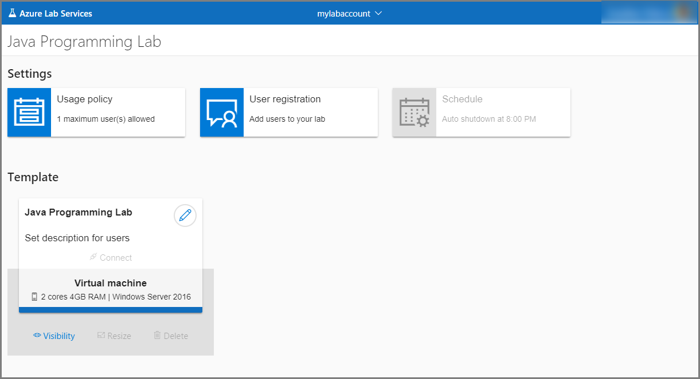
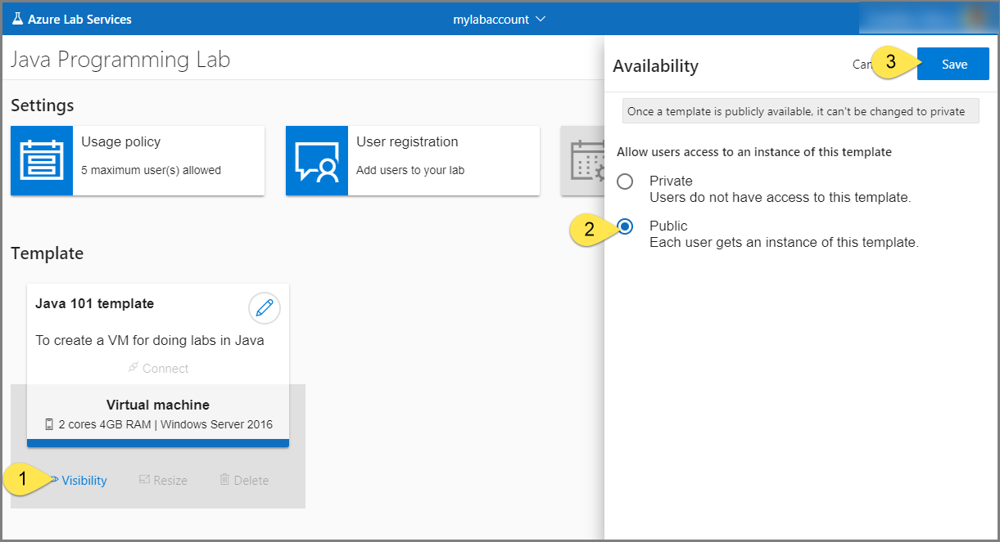
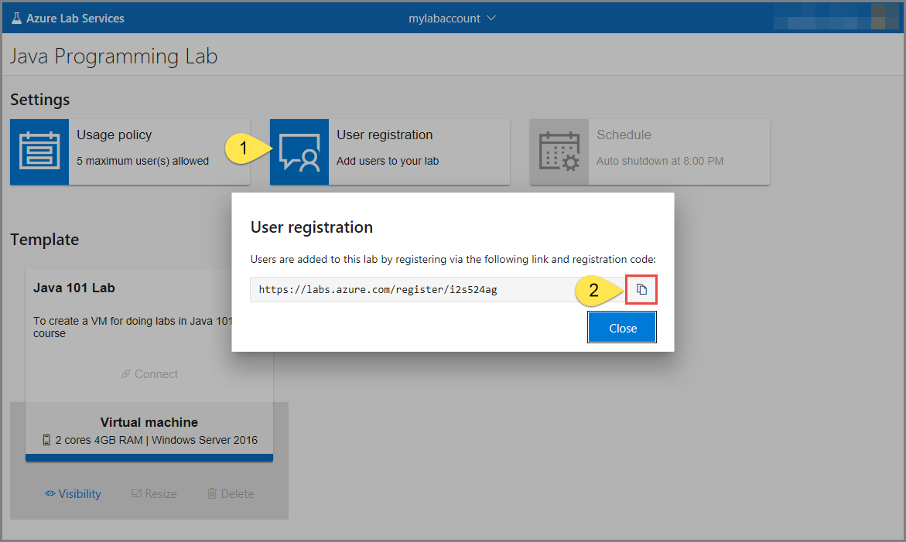

# Manage classroom labs in Azure Lab Services (formerly Azure DevTest Labs)
This article describes how to create and configure a classroom lab, view all classroom labs, or delete a classroom lab.

## Create a classroom lab

1. Navigate to [Azure Lab Services portal](https://labs.azure.com).
2. In the **New Lab** window, do the following actions: 
    1. Specify a **name** for the classroom lab. 
    2. Select the **size** of the virtual machine that you plan to use in the classroom.
    3. Select the **image** to use to create the virtual machine.
    4. Specify the **name of the user** who has access to the lab. 
    5. Specify the password for the user. 
    6. Confirm the password. 
    7. Select **Save**.

        
1. You see the **home page** for the lab. 
    
    

## Configure usage policy

1. Select **Usage policy**. 
2. In the **Usage policy**, settings, enter the **number of users** allowed to use the lab.
3. Select **Save**. 

    

## Set template title and description
1. In the **Template** section, select **Edit** (pencil icon) for the template. 
2. In the **User view** window, Enter a **title** for the template.
3. Enter **description** for the template.
4. Select **Save**.

    

## Configure template visibility
1. Select **Visibility** in the **Template** section. 
2. In the **Availability** page, select **Public**.
    
    > [!IMPORTANT]
    > Once a template is publicly available, its access can't be changed to private. 
3. Select **Save**.

    

## Send registration link to students

1. Select **User registration** tile.
2. In the **User registration** dialog box, select the **Copy** button. The link is copied to the clipboard. Paste it in an email editor, and send an email to the student. 

    

## View all labs
1. Navigate to [Azure Lab Services portal](https://labs.azure.com).
2. Confirm that you see all the labs in the selected lab account. 

    
3. Use the drop-down list at the top to select a different lab account. You see labs in the selected lab account. 

## Delete a lab
1. On the tile for the lab, select three dots (...) in the corner. 

    
2. Select **Delete**. 

    
3. On the **Delete lab** dialog box, select **Delete**. 

    
 

## Next steps
Get started with setting up a lab using Azure Lab Services:

- [Set up a classroom lab](how-to-manage-classroom-labs.md)
- [Set up a custom lab](tutorial-create-custom-lab.md)
