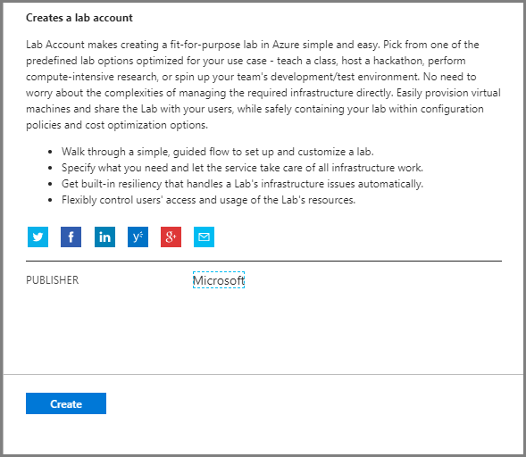
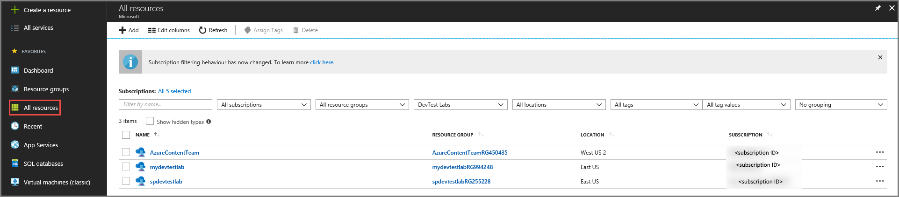
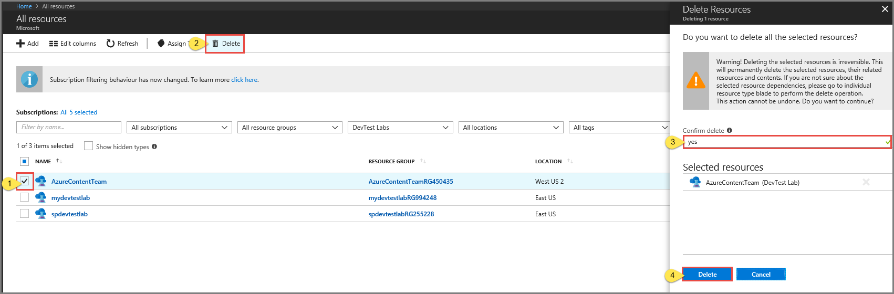

# Manage lab accounts in Azure Lab Services (formerly Azure DevTest Labs)
This article describes how to create a lab account, view all lab account, or delete a lab account. 

## Create a lab account
1. Sign in to the [Azure portal](https://portal.azure.com).
2. From the main menu on the left side, select **Create a resource** (at the top of the list), point to **Developer tools**, and click **Lab Services (preview)**.

	
1. In the **Create a lab account** window, select **Create**.
2. In the **Lab account** window, do the following actions: 
    1. For **Lab account name**, enter a name. 
    2. Select the **Azure subscription** in which you want to create the lab account.
    3. For **Resource group**, select **Create new**, and enter a name for the resource group.
    4. For **Location**, select a location/region in which you want the lab account to be created. 
    5. Select **Create**. 

        
5. If you don't see the page for the lab account, select the notifications button, and then click **Go to resource** button in the notifications. 

        
6. You see the following **lab account** page:

    

## Add lab creators to the lab account

1. Select **Access control (IAM)** from the menu.
2. Add users to the **lab creator** role so that they can create classroom labs in this lab account. 

## View lab accounts
1. Sign in to the [Azure portal](https://portal.azure.com).
2. Select **All resources** from the menu. 
3. Select **DevTest Labs** for the **type**. 

    
    You can also filter by subscription, resource group, locations, and tags. 

## Delete a lab account
Follow instructions from the previous section that displays lab accounts in a list. Use the following instructions to delete a lab account: 

1. Select the **lab account** that you want to delete. 
2. Select **Delete** from the toolbar. 
3. Type **Yes** for confirmation.
4. Select **Delete**. 
    

## Next steps
Get started with setting up a lab using Azure Lab Services:

- [Set up a classroom lab](tutorial-setup-classroom-lab.md)
- [Set up a custom lab](tutorial-create-custom-lab.md)
