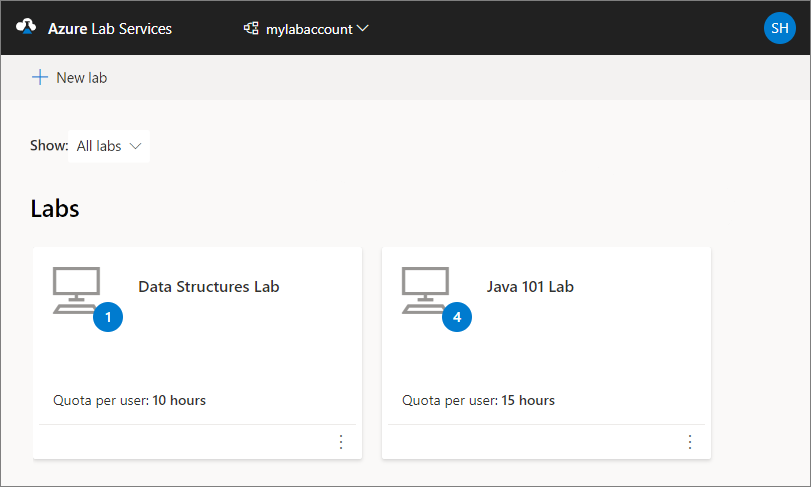
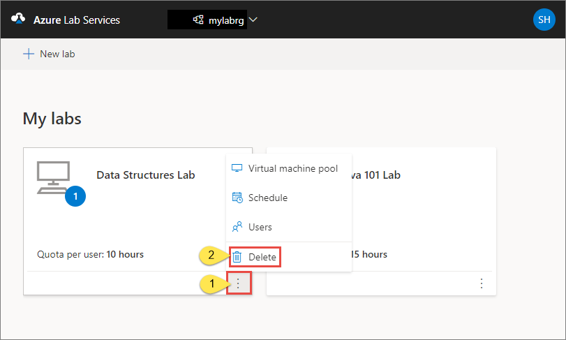
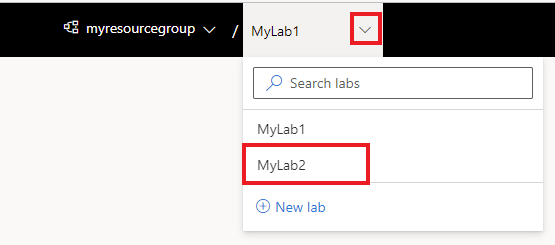

# Manage labs in Azure Lab Services

This article describes how to create and delete labs. It also shows you how to view all the labs in a lab plan.

## Prerequisites

- One or more labs. To create a lab, see [Tutorial: Create a lab](tutorial-setup-lab.md).
- Permission to edit the lab.  To give educators permission to add and creation labs, see [Add a user to the Lab Creator role](tutorial-setup-lab-plan.md#add-a-user-to-the-lab-creator-role).  For more role options, see [Lab Services built-in roles](administrator-guide.md#rbac-roles).

## View all labs

1. Navigate to Lab Services web portal: [https://labs.azure.com](https://labs.azure.com).
1. Select **Sign in**. Select or enter a **user ID** that is a member of the **Lab Creator** role in the lab plan, and enter password. Azure Lab Services supports organizational accounts and Microsoft accounts.

    [!INCLUDE [Select a tenant](./includes/multi-tenant-support.md)]
1. Confirm that you see all the labs in the selected resource group. On the lab's tile, you see the number of virtual machines in the lab and the quota for each user.

    
1. Use the drop-down list at the top to select a different lab plan. You see labs in the selected lab plan.

## Delete a lab

1. On the tile for the lab, select three dots (...) in the corner, and then select **Delete**.

    
1. On the **Delete lab** dialog box, select **Delete** to continue with the deletion.

## Switch to another lab

To switch to another lab from the current, select the drop-down list of labs at the top.

To switch to a different group, select the left drop-down and choose the lab plan's resource group.  To switch to a different lab account, select the left drop-down and choose the lab account name.  The Azure Lab Services portal organizes labs by lab plan's resource group/lab account, then by lab name.

## Next steps

See the following articles:

- [As a lab owner, set up and publish templates](how-to-create-manage-template.md)
- [As a lab owner, configure and control usage of a lab](how-to-configure-student-usage.md)
- [As a lab user, access labs](how-to-use-lab.md)
