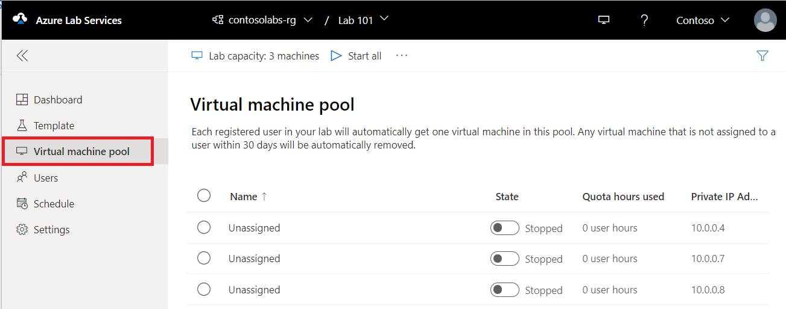

# Manage labs in Azure Lab Services

This article describes how to create and delete a lab. It also shows you how to view all the labs in a lab plan.

## Prerequisites

To set up a lab in a lab plan, you must have `Microsoft.LabServices/labPlans/CreateLab/action` permission.  Often instructors are given the **Lab Creator** role in the lab plan.  A lab owner can add other users to the Lab Creator role by using steps in the following article: [Add a user to the Lab Creator role](tutorial-setup-lab-plan.md#add-a-user-to-the-lab-creator-role). For more role options, see [Lab Services RBAC roles](administrator-guide.md#rbac-roles).

## Create a lab

To create a lab, see [Tutorial: Create a lab](tutorial-setup-lab.md).

## Publish the lab

Before publishing, make sure your template VM is configured as required.  To configure a template, see [Manage templates](how-to-create-manage-template.md). To publish a lab, see [Tutorial: Publish a lab](tutorial-setup-lab.md)](tutorial-setup-lab.md#publish-a-lab).

## View the student VM pool

Switch to the **Virtual machines pool** page by selecting Virtual machines on the left menu or by selecting Virtual machines tile. Confirm that you see virtual machines that are in **Unassigned** state. These VMs aren't assigned to students yet. They should be in **Stopped** state. You can start a student VM, connect to the VM, stop the VM, and delete the VM on this page. You can start them in this page or let your students start the VMs.

You can do the following tasks on this page.

1. To change the lab capacity (number of VMs in the lab), select **Lab capacity** on the toolbar.
2. To start all the VMs at once, select **Start all** on the toolbar.
3. To start a specific VM, select the down arrow in the **Status**, and then select **Start**. You can also start a VM by selecting a VM in the first column, and then by selecting **Start** on the toolbar.

## View all labs

1. Navigate to [Azure Lab Services portal](https://labs.azure.com).
1. Select **Sign in**. Select or enter a **user ID** that is a member of the **Lab Creator** role in the lab plan, and enter password. Azure Lab Services supports organizational accounts and Microsoft accounts.

    [!INCLUDE [Select a tenant](./includes/multi-tenant-support.md)]
1. Confirm that you see all the labs in the selected lab plan. On the lab's tile, you see the number of virtual machines in the lab and the quota for each user.

    
1. Use the drop-down list at the top to select a different lab plan. You see labs in the selected lab plan.

## Delete a lab

1. On the tile for the lab, select three dots (...) in the corner, and then select **Delete**.

    
1. On the **Delete lab** dialog box, select **Delete** to continue with the deletion.

## Switch to another lab

To switch to another lab from the current, select the drop-down list of labs in the resource group at the top.

To switch to a different lab plan, select the left drop-down and choose the resource group that contains the lab plan.  The Azure Lab Services portal organizes labs by resource group, then lab name.

## Next steps

See the following articles:

- [As a lab owner, set up and publish templates](how-to-create-manage-template.md)
- [As a lab owner, configure and control usage of a lab](how-to-configure-student-usage.md)
- [As a lab user, access labs](how-to-use-lab.md)
