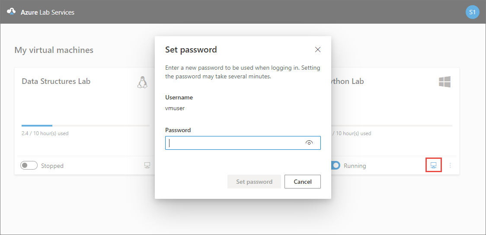
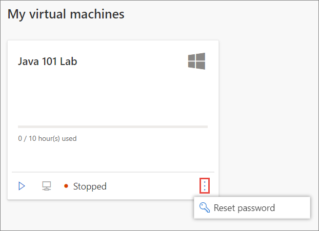

# Set or reset password for virtual machines in labs (students)

This article shows you how students can set/reset password for their VMs.

## Enable resetting of passwords

At the time of creating the lab, the lab owner can enable or disable the **Use same password for all virtual machines**. If this option was enabled, students can't reset password. All the VMs in the labs will have the same password that's set by the educator.

If this option is disabled, users will have to set a password when trying to connect to the VM for the first time. Students can also reset the password later at any time as shown in the last section of this article.

## Reset password for the first time

If the **Use same password for all virtual machines** option was disabled, when users (students) select the **Connect** button on the lab tile on the **My virtual machines** page, the user sees the following dialog box to set the password for the VM:

## Reset password later

Student also can set the password by clicking the overflow menu (**vertical three dots**) on the lab tile, and selecting **Reset password**.

## Next steps

To learn about other student usage options that a lab owner can configure, see the following article: [Configure student usage](how-to-manage-lab-users.md).
