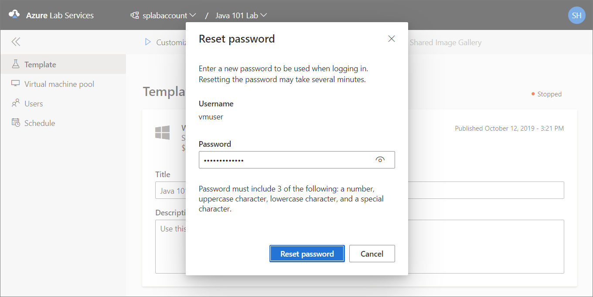

# Set or reset virtual machine passwords

A lab owner (educator) sets the password for VMs at the time of creating the lab or after creating the lab on the **Template** page.

## Set password at the time of lab creation

A lab owner (educator) can set a password for VMs in the lab on the **Virtual machine credentials** page of the lab creation wizard.

:::image type="content" source="./media/how-to-set-virtual-machine-passwords/virtual-machine-credentials.png" alt-text="Screenshot of windows the enter credentials for template VM.":::

By enabling the **Use same password for all virtual machines** option on this page, an educator chooses to use the same password for all VMs in the lab.  Disabling the **Use same password for all virtual machines** option makes the students set a password for their VMs before logging in for the first time. By default, labs use the same password for all VMs.  (Ubuntu doesn't support use of the same password for all VMs.)

## Reset password later

1. On the **Template** page of the lab, select **Start template** on the toolbar.  
1. Once the template machine has fully started, select **Reset password** on the toolbar.
1. On the **Reset password** dialog box, enter a password, and select **Reset password**.

    

> [!NOTE]
> Reset password option is not available for [lab plans](./concept-lab-accounts-versus-lab-plans.md) created without a template.

## Next steps

To learn about other student usage options you (as a lab owner) can configure, see the following article: [Configure student usage](how-to-manage-lab-users.md).

To learn about how students can reset passwords for their VMs, see [Set or reset password for virtual machines in labs (students)](how-to-set-virtual-machine-passwords-student.md).
