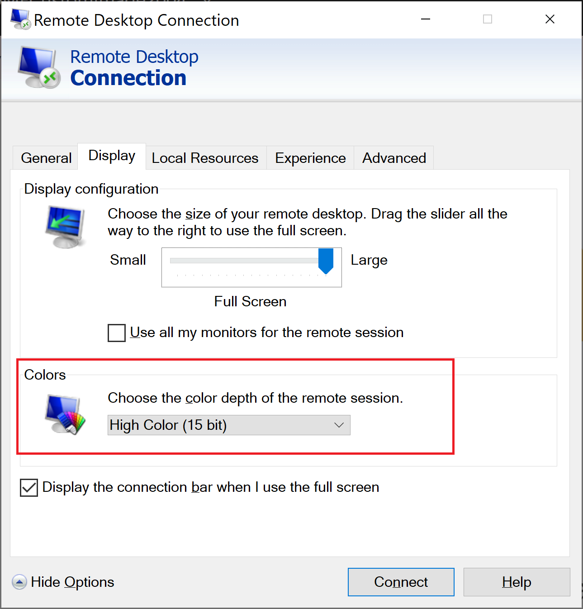
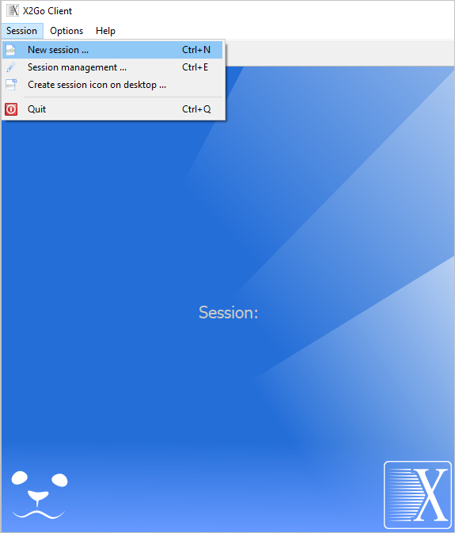
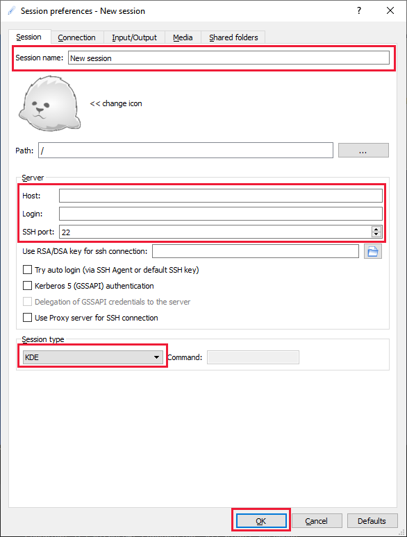
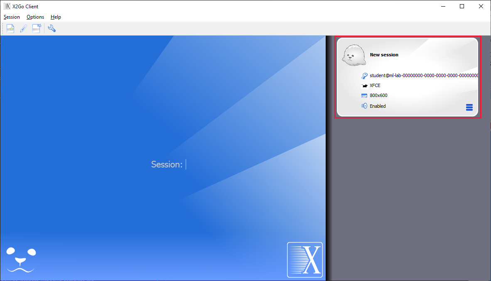

# Connect to Linux virtual machines in a classroom lab of Azure Lab Services
This article shows how students can connect to a Linux virtual machine (VM) in a lab using:
- SSH (secure shell protocol) terminal
- GUI (graphical user interface) remote desktop

> [!IMPORTANT] 
> SSH is configured automatically so that both students and the instructor can SSH into Linux VMs without any additional setup. However, if students need to connect to using a GUI remote desktop, the instructor may need to do additional setup.  For details, see [Enable remote desktop for Linux virtual machines](how-to-enable-remote-desktop-linux.md).

## Connect to the student VM using SSH

1. When a student signs in to the Labs portal directly (`https://labs.azure.com`) or by using a registration link (`https://labs.azure.com/register/<registrationCode>`), a tile for each lab the student has access to is displayed. 
   
1. On the tile, toggle the button to start the VM if it's in stopped state. 

2. Select **Connect**. You see two options to connect to the VM: **SSH** and **RDP**.

    

3. Select the **SSH** option and you will see the **Connect to your virtual machine** dialog box:  

    

4. Click the **Copy** button next to the text box to copy the SSH connection information to the clipboard. 

5. Save the SSH connection information, such as in Text pad, so that you can use this connection information in the next step.

6. From an SSH terminal (like [Putty](https://www.putty.org/)), connect to your VM.

## Connect to the student VM using GUI remote desktop
The instructor may choose to configure VMs so that students can also connect using a GUI remote desktop.  In this case, students need to find out from their instructor whether to connect to their VMs using the **Microsoft Remote Desktop (RDP)** or **X2Go** client application.  Both of these applications allow a student to connect remotely to their VM and display the Linux graphical desktop on their local computer.

> [!WARNING]
>  If you need to use [GNOME](https://www.gnome.org/) or [MATE](https://mate-desktop.org/) you should coordinate with your instructor to ensure your lab VM can be properly configured.  There is a known networking conflict that can occur with the Azure Linux Agent which is needed for the VMs to work properly in Azure Lab Services.  Instead, we recommend using a different graphical desktop environment, such as [XFCE](https://www.xfce.org/).

### Connect to the student VM using Microsoft Remote Desktop (RDP)
Students can use Microsoft Remote Desktop (RDP) to connect to their Linux VMs after their instructor sets up their lab with RDP and GUI packages for a Linux graphical desktop environment, such as XFCE. Here are the steps to connect: 

1. On the tile for your VM, ensure the VM is running and click **Connect**. You see two options to connect to the VM: **SSH** and **RDP**.

    
2. Select the **RDP** option.  When the RDP file is downloaded onto your machine, save it to your VM.

3. If you are connecting from a Windows computer, typically, the RDP client is already installed and configured.  As a result, all you need to do is click on the RDP file to open it and start the remote session.

    Instead, if you are connecting from either a Mac or Chromebook, refer to the following steps:
   - [Connect to a VM using RDP on a Mac](connect-virtual-machine-mac-remote-desktop.md).
   - [Connect to a VM using RDP on a Chromebook](connect-virtual-machine-chromebook-remote-desktop.md).

The RDP client includes various settings that can be adjusted to optimize the user's connection experience.  Typically, these settings don't need to be changed.  By default, the settings are already configured to choose the right experience based on your network connection.  For more information on these settings, [read the article about the RDP client's **Experience** settings](/windows-server/administration/performance-tuning/role/remote-desktop/session-hosts#client-experience-settings).

If your instructor has configured the GNOME graphical desktop with the RDP client, we recommend the following settings to optimize performance:
- Under the **Display** tab, set the color depth to **High Color (15 bit)**.
    

- Under the **Experience** tab, set the connection speed to **Modem (56 kbps)**.
    

### Connect to the student VM using X2Go
Students can use X2Go to connect to their Linux VMs after their instructor sets up their lab with X2Go and the GUI packages for a Linux graphical desktop environment, such as XFCE.

Students need to find out from their instructor which Linux graphical desktop environment their instructor has installed.  This information is needed in the next steps to connect using the X2Go client.

1. Install the [X2Go client](https://wiki.x2go.org/doku.php/doc:installation:x2goclient) on your local computer.

1. Follow the instructions in the [first section](how-to-use-remote-desktop-linux-student.md#connect-to-the-student-vm-using-ssh) to copy the SSH connection information for your VM.  You need this information to connect using the X2Go client.

1. Once you have the SSH connection information, open the X2Go client and select **Session** > **New Session**.
   

1. Enter the values in the **Session Preferences** pane based on your SSH connection information.  For example, your connection information will look similar to this:

    ```bash
    ssh -p 12345 student@ml-lab-00000000-0000-0000-0000-000000000000.eastus2.cloudapp.azure.com
    ```

    Using this example, the following values are entered:

   - **Session name** - Specify a name, such as the name of your VM.
   - **Host** - The ID of your VM; for example, **`ml-lab-00000000-0000-0000-0000-000000000000.eastus2.cloudapp.azure.com`**.
   - **Login** - The username for your VM; for example, **student**.
   - **SSH port** - The unique port assigned to your VM; for example, **12345**.
   - **Session type** - Select the Linux graphical desktop environment that your instructor configured your VM.  You  need to get this information from your instructor.  For example, select `XFCE` if you are using either XFCE or Xubuntu graphical desktop environments.
        

    Finally, click **OK** to create the session.

    

1.  Click on your session in the right-hand pane.

    

    > [!NOTE] 
    > If you are prompted with a similar message to this, select **yes** to continue to entering your password: **The authenticity of host '[`00000000-0000-0000-0000-000000000000.eastus2.cloudapp.eastus.cloudapp.azure.com`]:12345' can't be established.  ECDSA key fingerprint is SHA256:00000000000000000000000000000000000000000000.Are you sure you want to continue connecting (yes/no)?**

2. When prompted, enter your password and click **OK**.  You will now be remotely connected to your VM's GUI desktop environment.

## Next steps
To learn how to enable the remote desktop connection feature for Linux VMs in a classroom lab, see [Enable remote desktop for Linux virtual machines](how-to-enable-remote-desktop-linux.md). 

