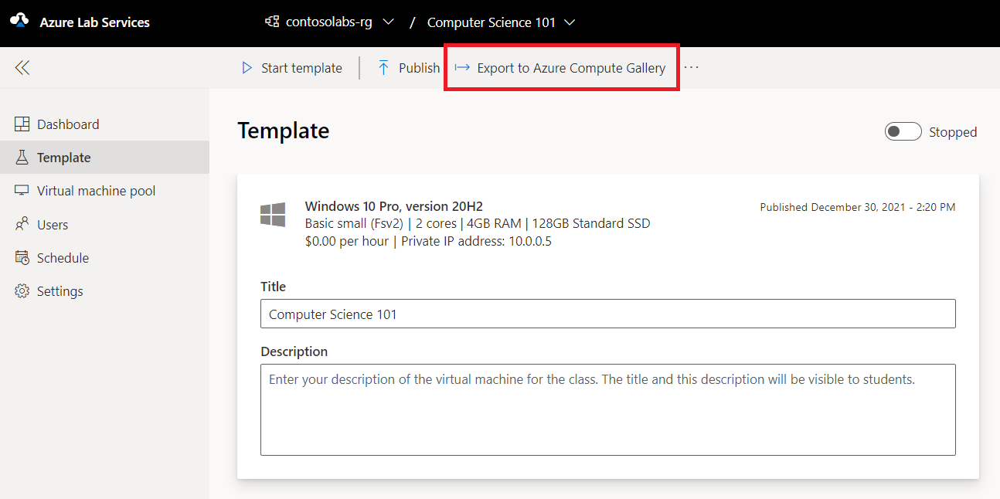
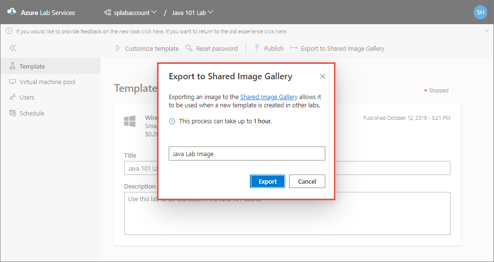
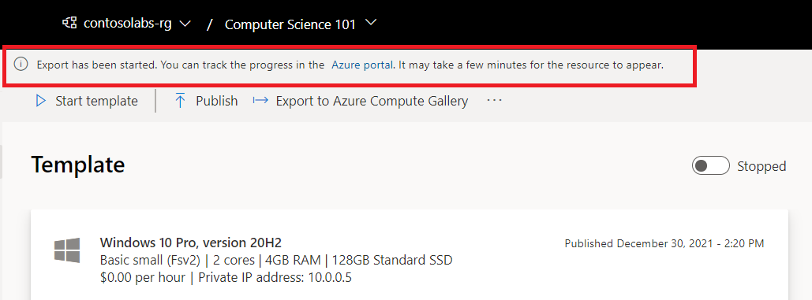
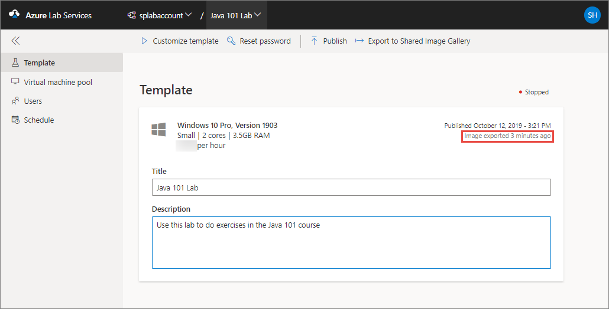
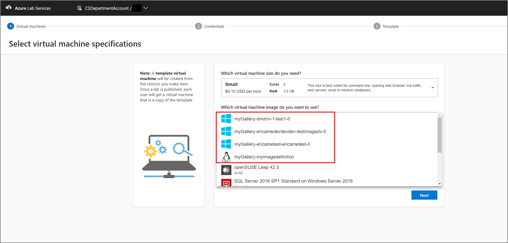

# Use a shared image gallery in Azure Lab Services
This article shows how educators/lab admins can save a template virtual machine image to a [shared image gallery](https://docs.microsoft.com/azure/virtual-machines/windows/shared-image-galleries) so that it can be used by others to create labs. 

## Scenarios
Here are the couple of scenarios supported by this feature: 

- A lab account admin attaches a shared image gallery to the lab account, and uploads an image to the shared image gallery outside the context of a lab. Then, lab creators can use that image from the shared image gallery to create labs. 
- A lab account admin attaches a shared image gallery to the lab account. A lab creator (instructor) saves the customized image of his/her lab to the shared image gallery. Then, other lab creators can select this image from the shared image gallery to create a template for their labs. 

    When an image is saved to a shared image gallery, Azure Lab Services replicates the saved image to other regions available in the same [geography](https://azure.microsoft.com/global-infrastructure/geographies/). It ensures that the image is available for labs created in other regions in the same geography. Saving images to a shared image gallery incurs an additional cost, which includes cost for all replicated images. This cost is separate from the Azure Lab Services usage cost. For more information about Shared Image Gallery pricing, see [Shared Image Gallery – Billing]( https://docs.microsoft.com/azure/virtual-machines/windows/shared-image-galleries#billing).
    
## Prerequisites
- Create a shared image gallery by using either [Azure PowerShell](../virtual-machines/windows/shared-images.md) or [Azure CLI](../virtual-machines/linux/shared-images.md).
- You have attached the shared image gallery to the lab account. For step-by-step instructions, see [How to attach or detach shared image gallery](how-to-attach-detach-shared-image-gallery.md).

## Save an image to the shared image gallery
After a shared image gallery is attached, a lab account admin or an educator can save an image to the shared image gallery so that it can be reused by other educators. 

1. On the **Template** page for the lab, select **Export to Shared Image Gallery** on the toolbar.

    
2. On the **Export to Shared Image Gallery** dialog, enter a **name for the image**, and then select **Export**. 

    
3. You can see the progress of this operation on the **Template** page. This operation can take sometime. 

    
4. When the export operation is successful, you see the following message:

    

    After you save the image to the shared image gallery, you can use that image from the gallery when creating another lab. You can also upload an image to the shared image gallery outside the context of a lab. For more information, see [Shared image gallery overview](../virtual-machines/windows/shared-images.md). 

    > [!IMPORTANT]
    > When you [save a template image of a lab](how-to-use-shared-image-gallery.md#save-an-image-to-the-shared-image-gallery) in Azure Lab Services to a shared image gallery, the image is uploaded to the gallery as a **specialized image**. [Specialized images](https://docs.microsoft.com/azure/virtual-machines/windows/shared-image-galleries#generalized-and-specialized-images) keep machine-specific information and user profiles. You can still directly upload a generalized image to the gallery outside of Azure Lab Services.    

## Use an image from the shared image gallery
An educator can pick a custom image available in the shared image gallery for the template during new lab creation.

> [!NOTE]
> You can create a template VM based on both **generalized** and **specialized** images in Azure Lab Services. 

## Next steps
For more information about shared image galleries, see [shared image gallery](https://docs.microsoft.com/azure/virtual-machines/windows/shared-image-galleries).
