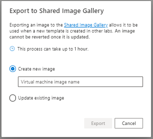

# Use a shared image gallery in Azure Lab Services

An image contains the operating system, software applications, files, and settings that are installed on a VM.  There are two types of images that you can use when you set up a new lab:
-   Marketplace images that are prebuilt by Microsoft for use within Azure.  These images have either Windows or Linux installed and may also include software applications.  For example, the [Data Science Virtual Machine image](../machine-learning/data-science-virtual-machine/overview.md#whats-included-on-the-dsvm) includes installed deep learning frameworks and tools.
-   Custom images that are created by your institution’s IT department and\or other educators.  You can create both Windows and Linux custom images and have the flexibility to install Microsoft and 3rd party applications based on your unique needs.  You also can add files, change application settings, and more.

This article shows how educators/lab admins can create and save a custom image from a template virtual machine to a [shared image gallery](../virtual-machines/shared-image-galleries.md) so that it can be used by others to create new labs.

> [!IMPORTANT]
> While using a Shared Image Gallery, Azure Lab Services supports only images with less than 128 GB of OS Disk Space. Images with more than 128 GB of disk space or multiple disks will not be shown in the list of virtual machine images during lab creation.

## Scenarios
Here are the couple of scenarios supported by this feature: 

- A lab account admin attaches a shared image gallery to the lab account, and uploads an image to the shared image gallery outside the context of a lab. Then, lab creators can use that image from the shared image gallery to create labs. 
- A lab account admin attaches a shared image gallery to the lab account. A lab creator (instructor) saves the customized image of his/her lab to the shared image gallery. Then, other lab creators can select this image from the shared image gallery to create a template for their labs. 

    When an image is saved to a shared image gallery, Azure Lab Services replicates the saved image to other regions available in the same [geography](https://azure.microsoft.com/global-infrastructure/geographies/). It ensures that the image is available for labs created in other regions in the same geography. Saving images to a shared image gallery incurs an additional cost, which includes cost for all replicated images. This cost is separate from the Azure Lab Services usage cost. For more information about Shared Image Gallery pricing, see [Shared Image Gallery – Billing](../virtual-machines/shared-image-galleries.md#billing).
    
## Prerequisites
- Create a shared image gallery by using either [Azure PowerShell](../virtual-machines/shared-images-powershell.md) or [Azure CLI](../virtual-machines/shared-images-cli.md).
- You have attached the shared image gallery to the lab account. For step-by-step instructions, see [How to attach or detach shared image gallery](how-to-attach-detach-shared-image-gallery.md).

## Save an image to the shared image gallery
After a shared image gallery is attached, a lab account admin or an educator can save an image to the shared image gallery so that it can be reused by other educators. 

1. On the **Template** page for the lab, select **Export to Shared Image Gallery** on the toolbar.

    
2. On the **Export to Shared Image Gallery** dialog, enter a **name for the image**, and then select **Export**. 

    

3. You can see the progress of this operation on the **Template** page. This operation can take sometime. 

    
4. When the export operation is successful, you see the following message:

    

    After you save the image to the shared image gallery, you can use that image from the gallery when creating another lab. You can also upload an image to the shared image gallery outside the context of a lab. For more information, see:

    - [Shared image gallery overview](../virtual-machines/shared-images-powershell.md)
    - [Recommended approaches for creating custom images](approaches-for-custom-image-creation.md)

    > [!IMPORTANT]
    > When you [save a template image of a lab](how-to-use-shared-image-gallery.md#save-an-image-to-the-shared-image-gallery) in Azure Lab Services to a shared image gallery, the image is uploaded to the gallery as a **specialized image**. [Specialized images](../virtual-machines/shared-image-galleries.md#generalized-and-specialized-images) keep machine-specific information and user profiles. You can still directly upload a generalized image to the gallery outside of Azure Lab Services.    

## Use a custom image from the shared image gallery
An educator can pick a custom image available in the shared image gallery for the template VM that is created when you setup a new lab.

> [!NOTE]
> You can create a template VM based on both **generalized** and **specialized** images in Azure Lab Services.

### Resave a custom image to shared image gallery

After you've created a lab from a custom image in a shared image gallery, you can make changes to the image using the template VM and reexport the image to shared image gallery.  When you reexport, you have the option to either create a new image or to update the original image. 

  

If you choose **Create new image**, a new [image definition](../virtual-machines/shared-image-galleries.md#image-definitions) is created.  This allows you to save an entirely new custom image without changing the original custom image that already exists in shared image gallery.

If instead you choose **Update existing image**, the original custom image's definition is updated with a new [version](../virtual-machines/shared-image-galleries.md#image-versions).  Lab Services automatically will use the most recent version the next time a lab is created using the custom image.

## Next steps
To learn about how to set up shared image gallery by attaching and detaching it to a lab account, see [How to attach and detach shared image gallery](how-to-attach-detach-shared-image-gallery.md).

To explore other options for bringing custom images to shared image gallery outside of the context of a lab, see [Recommended approaches for creating custom images](approaches-for-custom-image-creation.md).

For more information about shared image galleries in general, see [shared image gallery](../virtual-machines/shared-image-galleries.md).