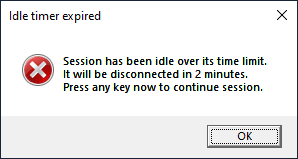
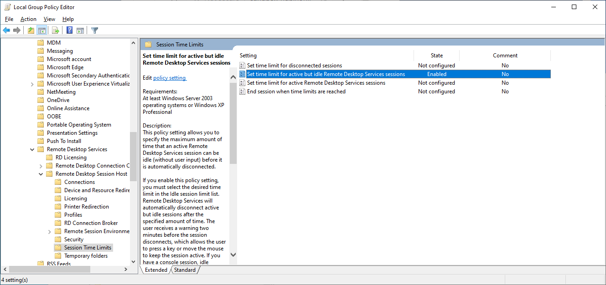
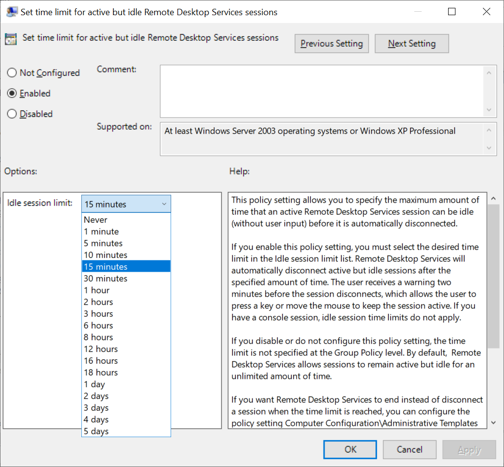
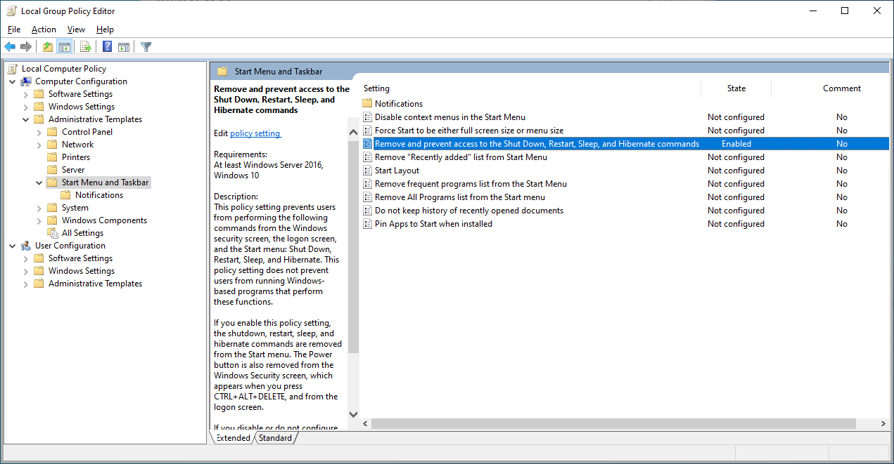
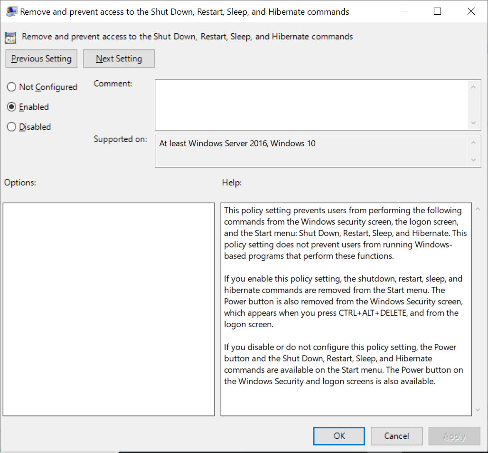
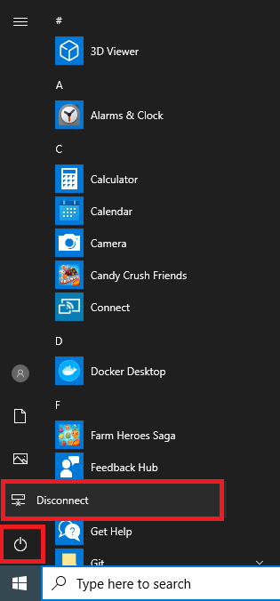

# Guide to controlling Windows shutdown behavior

Azure Lab Services provides several cost controls to ensure that Windows virtual machines (VMs) are not running unexpectedly:
 - [Set a schedule](https://docs.microsoft.com/azure/lab-services/classroom-labs/tutorial-setup-classroom-lab#set-a-schedule-for-the-lab)
 - [Set quotas for users](https://docs.microsoft.com/azure/lab-services/classroom-labs/how-to-configure-student-usage#set-quotas-for-users)
 - [Enable automatic shutdown on disconnect](https://docs.microsoft.com/azure/lab-services/classroom-labs/how-to-enable-shutdown-disconnect)

Even with these cost controls, there are situations where a Windows VM may unexpectedly continue to run; and as a result, deduct from the student's quota:

- **RDP window is left open**
  
    When a student connects to their VM using RDP, they may inadvertently leave the RDP window open.  As long as the RDP window remains open, the **automatic shutdown on disconnect** setting will never take effect since it is only triggered after the RDP session is disconnected.

- **Windows shutdown command is used to turn off the VM**
  
    A student may use Windows shutdown command, or other shutdown mechanisms provided within Windows, to turn off the VM instead of using [Azure Lab Services' stop button](https://docs.microsoft.com/azure/lab-services/classroom-labs/how-to-use-classroom-lab#start-or-stop-the-vm).  When this happens, from the perspective of Azure Lab Services, the VM is still being used.
    
To help you prevent these situations from happening, this guide provides steps to automatically shutdown an idle Windows VM and remove the Windows shutdown command from the **Start** menu.  

> [!NOTE]
> A VM may also unexpectedly deduct from the quota when the student starts their VM, but never actually connects to it using RDP.  This guide does *not* currently address this scenario.  Instead, students should be reminded to immediately connect to their VM using RDP after they start it; or, they should stop the VM.

## Automatic RDP disconnect and shutdown for idle VM

Windows provides **Local Group Policy** settings that you can use to set a time limit to automatically disconnect an RDP session when it becomes idle.  A session is determined to be idle when there is *not* any mouse\keyboard input.  Any long running activities that don't involve mouse\keyboard input cause the VM to be in an idle state.  This includes executing a long query, streaming video, compiling, etc.  Depending on your class's needs, you can choose to set the idle time limit so that it's long enough to handle these types of activities.  For example, you can set the idle time limit to 1 or more hours if needed.

Here is the student's experience when you configure the **idle session limit** in combination with the [**automatic shutdown on disconnect**](https://docs.microsoft.com/azure/lab-services/classroom-labs/how-to-enable-shutdown-disconnect) setting:
 1. The student connects to their Windows VM using RDP.
 2. When the student leaves their RDP window open and the VM is idle for the **idle session limit** that you specified (such as 5 minutes), the student will see the following dialog:

    

1. If the student does *not* click **OK**, their RDP session will automatically disconnect after 2 minutes.
2. After the RDP session disconnects, once the specified time frame for the **automatic shutdown on disconnect** setting is reached, the VM is automatically shutdown by Azure Lab Services.

### Set RDP idle session time limit on the template VM

To set the RDP session idle time limit, you can connect to the template VM and execute the below PowerShell script.

```powershell
# The MaxIdleTime is in milliseconds; by default, this script sets MaxIdleTime to 15 minutes.
$maxIdleTime = 15 * 60 * 1000

Set-ItemProperty -Path "HKLM:\SOFTWARE\Policies\Microsoft\Windows NT\Terminal Services" -Name "MaxIdleTime" -Value $maxIdleTime -Force
```
Or, you can choose to follow these manual steps using the template VM:

1. Press the Windows key, type **gpedit**, then select **Edit group policy (Control panel)**.

1. Go to **Computer Configuration > Administrative Templates > Windows Components > Remote Desktop Services > Remote Desktop Session Host > Session Time Limits**.  

    
   
1. Right-click **Set time limit for active but idle Remote Desktop Services sessions**, and click **Edit**.

1. Enter the following settings, and then click **OK**:
   1. Select **Enabled**.
   1. Under **Options**, specify the **Idle session limit**.

    

1. Finally, to combine this behavior with the **automatic shutdown on disconnect** setting, you should follow steps in the how-to article: [Enable automatic shutdown of VMs on disconnect](https://docs.microsoft.com/azure/lab-services/classroom-labs/how-to-enable-shutdown-disconnect).

> [!WARNING]
> After configuring this setting using either PowerShell to modify the registry setting directly or manually using the Group Policy editor, you must first restart the VM for the settings to take effect.  Also, if you configure the setting using the registry, the Group Policy editor doesn't always refresh to reflect changes to the registry setting; however, the registry setting still takes effect as expected and you will see the RDP session disconnected when idle for the length of time that you've specified.

## Remove Windows shutdown command from Start menu

Windows **Local Group Policy** settings also allow you to remove the shutdown command from the **Start** menu.

To remove the shutdown command, you can connect to the template VM and execute the below PowerShell script.

```powershell
Set-ItemProperty -Path "HKLM:\SOFTWARE\Microsoft\Windows\CurrentVersion\Policies\Explorer" -Name "HidePowerOptions" -Value 1 -Force
```

Or, you can choose to follow these manual steps using the template VM:

1. Press the Windows key, type **gpedit**, then select **Edit group policy (Control panel)**.

1. Go to **Computer Configuration > Administrative Templates > Start Menu and Taskbar**.  

    

1. Right-click **Remove and prevent access to the Shut Down, Restart, Sleep, and Hibernate commands**, and click **Edit**.

1. Select the **Enabled** setting and then click **OK**:
 
   

1. Notice that the shutdown command no longer appears under Windows **Start** menu; only the **Disconnect** command appears.

    

## Next steps
See the article on how to prepare a Windows template VM: [Guide to setting up a Windows template machine in Azure Lab Services](how-to-prepare-windows-template.md)