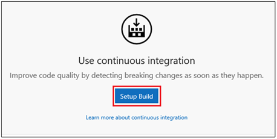
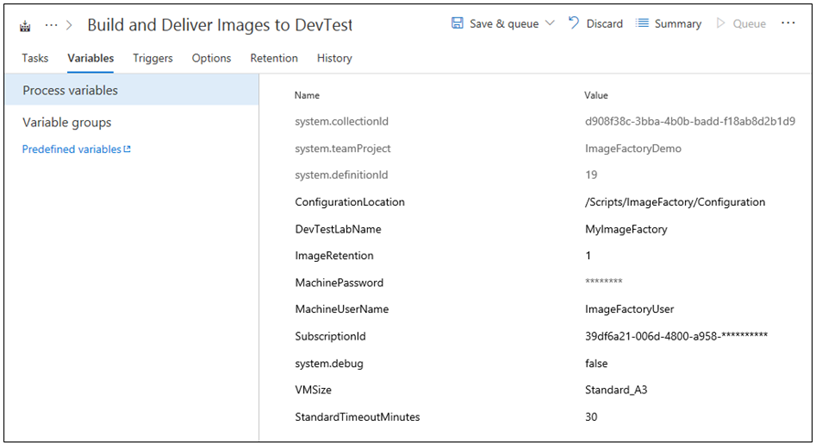
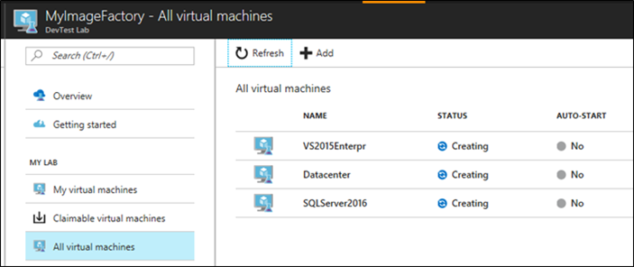

# Run an image factory from Azure DevOps
This article covers all the preparations needed to run the image factory from Azure DevOps (formerly Visual Studio Team Services).

> [!NOTE]
> Any orchestration engine will work! Azure DevOps is not mandatory. The image factory is run using Azure PowerShell scripts, so it could be run manually, by using Windows Task Scheduler, other CI/CD systems, and so on.

## Create a lab for the image factory
The first step in setting up the image factory is to create a lab in Azure DevTest Labs. This lab is the image factory lab where we create the virtual machines and save custom images. This lab is considered as part of the overall image factory process. Once you create a lab, make sure to save the name since you’ll need it later.

## Scripts and templates
The next step in adopting the image factory for your team is to understand what’s available. The image factory scripts and templates are available publicly in the [DevTest Labs GitHub Repo](https://github.com/Azure/azure-devtestlab/tree/master/samples/DevTestLabs/Scripts/ImageFactory). Here is an outline of the pieces:

- Image Factory. It's the root folder.
    - Configuration. The inputs to the image factory
        - GoldenImages. This folder contains JSON files that represent the definitions of custom images.
        - Labs.json. File where teams sign up to receive specific custom images.
- Scripts. The engine for the image factory.

The articles in this section provide more details about these scripts and templates.

## Create an Azure DevOps team project
Azure DevOps let you store the source code, run the Azure PowerShell in one place. You can schedule recurring runs to keep images up-to-date. There are good facilities for logging the results to diagnose any issues.  Using Azure DevOps isn’t a requirement however, you can use any harness/engine that can connect to Azure and can run Azure PowerShell.

If you have an existing DevOps account or project you would like to use instead, skip this step.

To get started, create a free account in Azure DevOps. Visit https://www.visualstudio.com/ and select **Get started for free** right under **Azure DevOps** (formerly VSTS). You’ll need to choose a unique account name and make sure to choose to manage code using Git. Once this is created, save the URL to your team project. Here is a sample URL: `https://<accountname>.visualstudio.com/MyFirstProject`.

## Check in the image factory to Git
All the PowerShell, templates and configuration for the image factory are located in the [public DevTest Labs GitHub repo](https://github.com/Azure/azure-devtestlab/tree/master/samples/DevTestLabs/Scripts/ImageFactory). The fastest way to get the code into your new team project is to import a repository. This pulls in the whole DevTest Labs repository (so you’ll get extra docs, and samples).

1. Visit the Azure DevOps project that you created in the previous step (URL looks like **https:\//\<accountname>.visualstudio.com/MyFirstProject**).
2. Select **Import a Repository**.
3. Enter the **clone URL** for the DevTest Labs Repo: `https://github.com/Azure/azure-devtestlab`.
4. Select **Import**.

    

If you decide to only check in exactly what’s needed (the image factory files), follow the steps [here](https://www.visualstudio.com/en-us/docs/git/share-your-code-in-git-vs) to clone the Git repo and push only the files located in the **scripts/ImageFactory** directory.

## Create a build and connect to Azure
At this point, you have the source files stored in a Git repo in Azure DevOps. Now, you need to set up a pipeline to run the Azure PowerShell. There are lots of options to do these steps. In this article, you use build definition for simplicity, but it works with DevOps Build, DevOps Release (single or multiple environments), other execution engines like Windows Task Scheduler or any other harness that can execute Azure PowerShell.

> [!NOTE]
> One important point to keep in mind that some of the PowerShell files take a long time to run when there are a lot (10+) custom images to create. Free hosted DevOps Build/Release agents have a timeout of 30 min, so you can’t use the free hosted agent once you start building many images. This timeout challenge applies to whatever harness you decide to use, it’s good to verify up front that you can extend the typical timeouts for long running Azure PowerShell scripts. In the case of Azure DevOps, you can either use paid hosted Agents or use your own build agent.

1. To start, select **Set up Build** on the homepage of your DevOps Project:

    
2. Specify a **name** for the build (for example: Build and Deliver Images to DevTest Labs).
3. Select an **empty** build definition, and select **Apply** to create your build.
4. At this stage, you can choose **Hosted** for the build agent.
5. **Save** the build definition.

    

## Configure the build variables
To simplify the command-line parameters, encapsulate the key values that drive the image factory to a set of build variables. Select the **Variables** tab and you’ll see a list of several default variables. Here’s the list of variables to enter in to Azure DevOps:

| Variable Name	| Value	| Notes |
| ------------- | ----- | ----- |
| ConfigurationLocation | /Scripts/ImageFactory/Configuration | This is the full path in the repository to the **Configuration** folder. If you imported the whole repo above, the value to the left is correct. Otherwise update to point to the Configuration location. |
| DevTestLabName | MyImageFactory | The name of the lab in Azure DevTest Labs used as the factory to produce images. If you don’t have one, create one. Make sure that the Lab is in the same subscription that the service endpoint has access to. |
| ImageRetention | 1 | The number of images you want to save of each type. Set default value to 1. |
| MachinePassword | ******* | The built-in admin account password for the virtual machines. This is a transient account, so make sure that it’s secure. Select the little lock icon on the right to ensure it’s a secure string. |
| MachineUserName | ImageFactoryUser | The built-in admin account username for the virtual machines. This is a transient account. |
| StandardTimeoutMinutes | 30 | The timeout we should wait for regular Azure operations. |
| SubscriptionId |	0000000000-0000-0000-0000-0000000000000	| The ID of the subscription where the lab exists and that the service endpoint has access to. |
| VMSize | Standard_A3 | The size of the virtual machine to use for the **Create** step. The VMs created are transient. The size must be the one that's [enabled for the lab](devtest-lab-set-lab-policy.md). Confirm that there's enough [subscription cores quota](../azure-subscription-service-limits.md).

## Connect to Azure
The next step is to set up service principal. This is an identity in Azure Active Directory that enables the DevOps build agent to operate in Azure on the user’s behalf. To set it up, start with adding you first Azure PowerShell Build Step.

1. Select **Add Task**.
2. Search for **Azure PowerShell**.
3. Once you find it, select **Add** to add the task to the build. When you do this, you’ll see the task appear on the left side as added.

The fastest way to set up a service principal is to let Azure DevOps do it for us.

1. Select the **task** you just added.
2. For **Azure Connection Type**, choose **Azure Resource Manager**.
3. Select the **Manage** link to set up the service principal.

For more information, see this [blog post](https://devblogs.microsoft.com/devops/automating-azure-resource-group-deployment-using-a-service-principal-in-visual-studio-online-buildrelease-management/). When you select the **Manage** link, you’ll land in the right place in DevOps (second screenshot in the blog post) to set up the connection to Azure. Make sure to choose **Azure Resource Manager Service Endpoint** when setting this up.

## Complete the build task
If you select the build task, you’ll see all the details on the right pane that should be filled in.

1. First, name the build task: **Create Virtual Machines**.
2. Choose the **service principal** you created by choosing **Azure Resource Manager**
3. Choose the **service endpoint**.
4. For **Script Path**, select **… (ellipsis)** on the right.
5. Navigate to **MakeGoldenImageVMs.ps1** script.
6. Script Parameters should look like this: `-ConfigurationLocation $(System.DefaultWorkingDirectory)$(ConfigurationLocation) -DevTestLabName $(DevTestLabName) -vmSize $(VMSize) -machineUserName $(MachineUserName) -machinePassword (ConvertTo-SecureString -string '$(MachinePassword)' -AsPlainText -Force) -StandardTimeoutMinutes $(StandardTimeoutMinutes)`

    

## Queue the build
Let’s verify that you have everything set up correctly by queuing up a new build. While the build is running, switch to the [Azure portal](https://portal.azure.com) and select on **All Virtual Machines** in your image factory lab to confirm that everything is working correctly. You should see three virtual machines get created in the lab.

## Next steps
The first step in setting up the image factory based on Azure DevTest Labs is complete. In the next article in the series, you get those VMs generalized and saved to custom images. Then, you have them distributed to all your other labs. See the next article in the series: [Save custom images and distribute to multiple labs](image-factory-save-distribute-custom-images.md).
