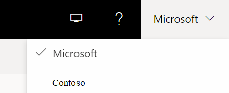

If you have an Administrator or Lab Owner role in two or more Microsoft Entra tenants, you can switch between tenants in the Lab Services web portal ([https://labs.azure.com](https://labs.azure.com)) by selecting the control at the upper right, as shown in the following screenshot: 

