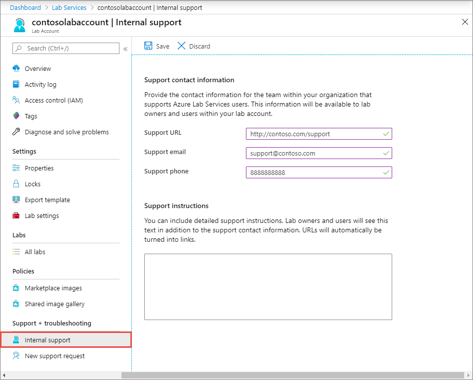

# Set up support information (lab account owner in Azure Lab Services)
This article explains how you (as a lab account owner) can specify support information that lab creators (educators) and lab users (students) can use to get help if they run into any technical issues with using the lab account or lab. 

The support information includes:

- URL
- Email
- Phone
- Additional instructions 

## Specify support information
1. Sign in to [Azure portal](https://portal.azure.com).
2. In the search bar, enter **Lab Services**, and select **Lab Services** in the search results. 
3. Select your lab account from the list of lab accounts. 
4. Switch to the **Internal support** page, do the following steps:
    1. Enter the **support URL**. 
	 2. Enter the **support email**. 
	 3. Enter the **support phone**.
	 4. Enter detailed **support instructions** (optional). Lab owners and users will see this text along with the support contact information. URLs will be automatically turned into links. 
	 5. Select **Save** on the toolbar.

	     		

## Next steps
See the following articles:

- [View contact information (lab creator)](lab-creator-support-information.md)
- [View contact information (lab user)](lab-user-support-information.md)
