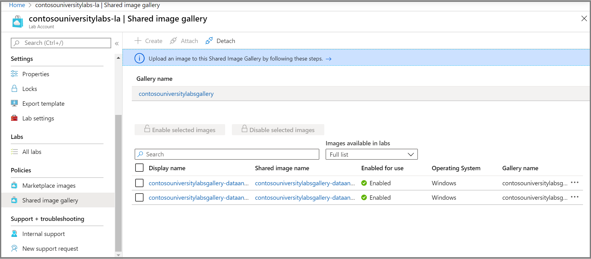

# Lab plan setup guide

If you're an administrator, before you set up your Azure Lab Services environment, you first need to create a *lab plan* within your Azure subscription. A lab plan is associated one or more labs, and it takes only a few minutes to set up.

This guide includes three sections:

- Prerequisites
- Plan your lab plan settings
- Set up your lab plan

[!INCLUDE [preview note](./includes/lab-services-new-update-note.md)]

## Prerequisites

The following sections outline what you need to do before you can set up a lab plan.

### Access your Azure subscription

To create a lab plan, you need access to an Azure subscription that's already set up for your school. Your school might have one or more subscriptions. You use a subscription to manage billing and security for all your Azure resources and services, including lab plans.  Azure subscriptions are usually managed by your IT department.  For more information, see the "Subscription" section of [Azure Lab Services - Administrator guide](./administrator-guide.md#subscription).

### Estimate how many VMs and VM sizes you need

It's important to know how many [virtual machines (VMs) and VM sizes](./administrator-guide.md#vm-sizing) your school lab requires.

For guidance on structuring your labs and images, see [Moving from a physical lab to Azure Lab Services](./concept-migrating-physical-labs.md).

For additional guidance on how to structure labs, see the "Lab" section of [Azure Lab Services - Administrator guide](./administrator-guide.md#lab).

### Understand subscription VM limits and regional VM capacity

After you've estimated the number of VMs and the VM sizes for your labs, you need to:

- Ensure that your Azure subscription's capacity limit allows for the number of VMs and the VM size that you plan to use in your labs.
- Create your lab plan within a region that has sufficient available VM capacity.

For more information, see [VM subscription limits and regional capacity](https://techcommunity.microsoft.com/t5/azure-lab-services/vm-subscription-limits-and-regional-capacity/ba-p/1845553).

### Decide how many lab plans to create

To get started quickly, create a single lab plan within its own resource group.  Later, you can create additional lab plans and resource groups, as needed. For example, you might eventually have one lab plan and resource group per department as a way to clearly separate costs.

For more information about lab plans, resource groups, and separating costs, see:

- The "Resource group" section of [Azure Lab Services - Administrator guide](./administrator-guide.md#resource-group)
- The "Lab plan" section of [Azure Lab Services - Administrator guide](./administrator-guide.md#lab-plan)
- [Cost management for Azure Lab Services](./cost-management-guide.md)

## Plan your lab plan settings

To plan your lab plan settings, consider the following questions.

### Who should be the Owners and Contributors of the lab plan?

Your school's IT administrators ordinarily take on the Owner and Contributor roles for a lab plan. These roles are responsible for managing the policies that apply to all the labs in the lab plan. The person who creates the lab plan is automatically an Owner. You can add additional Owners and Contributors from the Azure Active Directory (Azure AD) tenant that's associated with your subscription.

For more information about the lab plan Owner and Contributor roles, see [RBAC roles](./concept-lab-services-role-based-access-control.md).

[!INCLUDE [Select a tenant](./includes/multi-tenant-support.md)]

Lab users see only a single list of the VMs that they have access to across Azure AD tenants in Azure Lab Services.

### Who will be allowed to create labs?

You may choose to have your IT team or faculty members create labs. To create labs, you then assign these people to the Lab Creator role within the lab plan. You ordinarily assign this role from the Azure AD tenant that's associated with your school subscription. Whoever creates a lab is automatically assigned as the Owner of the lab.  

For more information about the Lab Creator role, see [RBAC roles](./concept-lab-services-role-based-access-control.md).

### Who will be allowed to own and manage labs?

You can also choose to have IT and faculty members own\manage labs *without* giving them the ability to create labs.  In this case, users from your subscription's Azure AD tenant are assigned either the Owner or Contributor for existing labs.  

For more information about the lab Owner and Contributor roles, see [RBAC roles](./concept-lab-services-role-based-access-control.md).

### Do you want to save images and share them across labs?

Azure Compute Gallery is a service that you can use for saving and sharing images. For classes that need to use the same image, Lab Creators can create the image and then export it to a compute gallery.  After an image is exported to the compute gallery, it can be used to create new labs.

You might want to create your images in your physical environment and then import them to a compute gallery. For more information, see the blog post [Import a custom image to a compute gallery](https://techcommunity.microsoft.com/t5/azure-lab-services/import-custom-image-to-shared-image-gallery/ba-p/1777353).

If you decide to use the compute gallery service, you'll need to create or attach a compute gallery to your lab plan. You can postpone this decision for now, because a compute gallery can be attached to a lab plan at any time.  

For more information, see:

- The "Azure computegallery" section of [Azure Lab Services - Administrator guide](./administrator-guide.md#azure-compute-gallery)
- The "Pricing" section of [Azure Lab Services - Administrator guide](./administrator-guide.md#pricing)

### Which images in Azure Marketplace will your labs use?

Azure Marketplace provides hundreds of images that you can enable so that Lab Creators can use them for creating their labs. Some images might include everything that a lab already needs. In other cases, you might use an image as a starting point, and then the Lab Creator can customize it by installing additional applications or tools.

If you don't know which images you need, you can come back later to enable them. The best way to see which images are available is to first create a lab plan. This gives you access so that you can review the list of available images and their contents.  

For more information, see [Specify the Azure Marketplace images that are available to Lab Creators](./specify-marketplace-images.md).
  
### Do the lab VMs need access to other Azure or on-premises resources?

When you set up a lab plan, you also can bring your own virtual network to your lab plan.  Keep in mind that both your virtual network and the lab plan must be located in the same region.  To decide whether you need to use a virtual network, consider the following scenarios:

- **Access to a license server**
  
    When you use Azure Marketplace images, the cost of the operating system license is bundled into the pricing for lab services. However, you don't need to provide licenses for the operating system itself. For additional software and applications that are installed, you do need to provide a license, as appropriate.  To access a license server:

  - You may choose to connect to an on-premises license server.  Connecting to an on-premises license server requires additional setup.
  - Another option, which is faster to set up, is to create a license server that you host on an Azure VM.  The Azure VM is located within a virtual network that you associated with your lab plan.

- **Access to other on-premises resources such as a file share or database**

   You ordinarily create a virtual network to provide access to on-premises resources by using a site-to-site virtual network gateway. Setting up this type of environment will take additional time.

- **Access to other Azure resources that are located outside a virtual network**

   If you need access to Azure resources that are *not* secured within a virtual network, you can access them through the public internet, without adding your own virtual network.

   For more information about virtual networks, see:

  - The "Virtual network" section of [Architecture fundamentals in Azure Lab Services](./classroom-labs-fundamentals.md#virtual-network)
  - [Connect to your virtual network in Azure Lab Services](./how-to-connect-vnet-injection.md)
  - [Create a lab with a shared resource in Azure Lab Services](./how-to-create-a-lab-with-shared-resource.md)

## Set up your lab plan

After you've finished planning, you're ready to set up your lab plan.

1. **Create your lab plan**. For instructions, see [Create a lab plan](./quick-create-resources.md).

   For information about naming conventions, see the "Naming" section of [Azure Lab Services - Administrator guide](./administrator-guide.md#naming).

1. **Add users to the Lab Creator role**. For instructions, see [Add users to the Lab Creator role](./quick-create-resources.md#add-a-user-to-the-lab-creator-role).

1. **Connect to your virtual network**. For instructions, see [Connect to your virtual network in Azure Lab Services](./how-to-connect-vnet-injection.md).

1. **Enable and review images**. For instructions, see [Specify which Azure Marketplace images are available to Lab Creators](./specify-marketplace-images.md).

   To review the contents of each Azure Marketplace image, select the image name. For example, the following screenshot shows the details of the Ubuntu Data Science VM image:

   

   If a compute gallery is attached to your lab plan, and you want to enable custom images to be shared by Lab Creators, complete similar steps as shown in the following screenshot:

   

## Next steps

For more information about setting up and managing labs, see:

- [Manage lab plans](how-to-manage-lab-plans.md)  
- [Lab setup guide](setup-guide.md)
