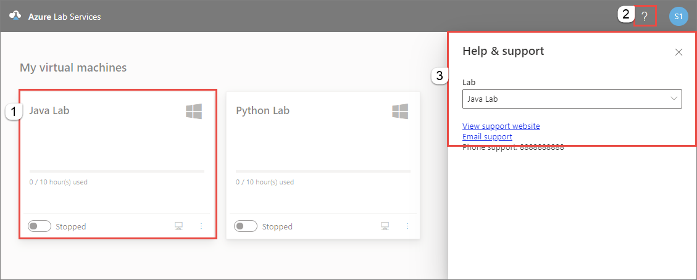
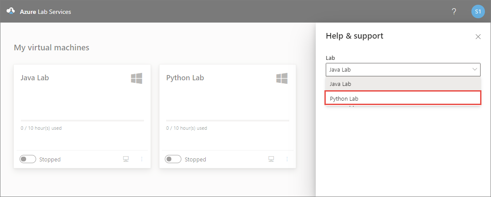
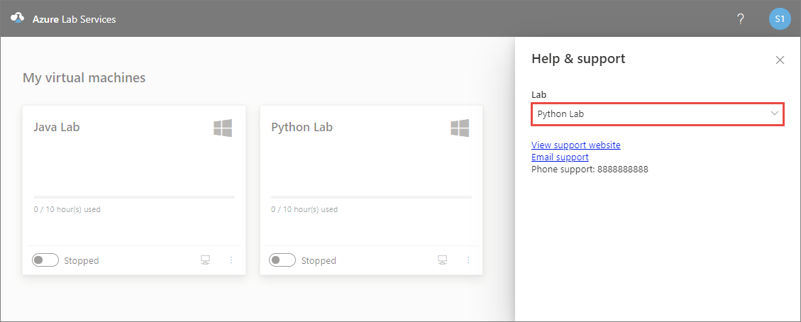

# View support information (lab user in Azure Lab Services)
This article explains how you (as a lab user) can view the following support information:

- URL
- Email
- Phone
- Additional instructions

You can use this information to get help when you run into any technical issues while using a lab in a lab account.

 
## View support information
1. Sign in to [Azure Lab Services portal](https://labs.azure.com).
2. Select the **lab or virtual machine** for which you need help, and select **?** at the top-right corner of the page. 
3. Confirm that you see links to the **view support website**, **email support**, and **support phone number**.

    
4. You can view support contact information for another lab by switching to that lab in the drop-down list. 

    
5. Now, you see the support contact information for the other lab. 

    

## Next steps
See the following article to learn about how a lab user views the support contact information:

- [How a lab account owner can set support contact information](lab-account-owner-support-information.md)
- [How a lab creator can view support contact information](lab-creator-support-information.md)
