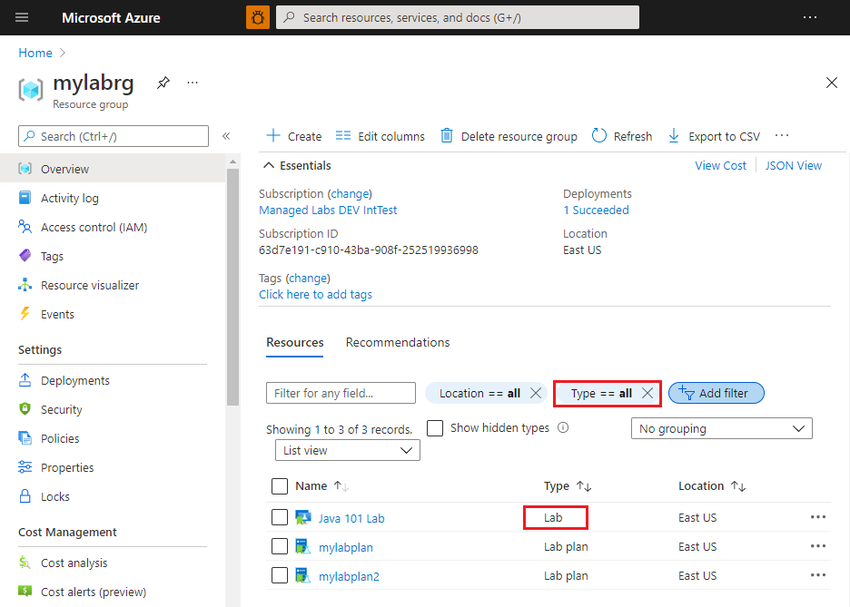
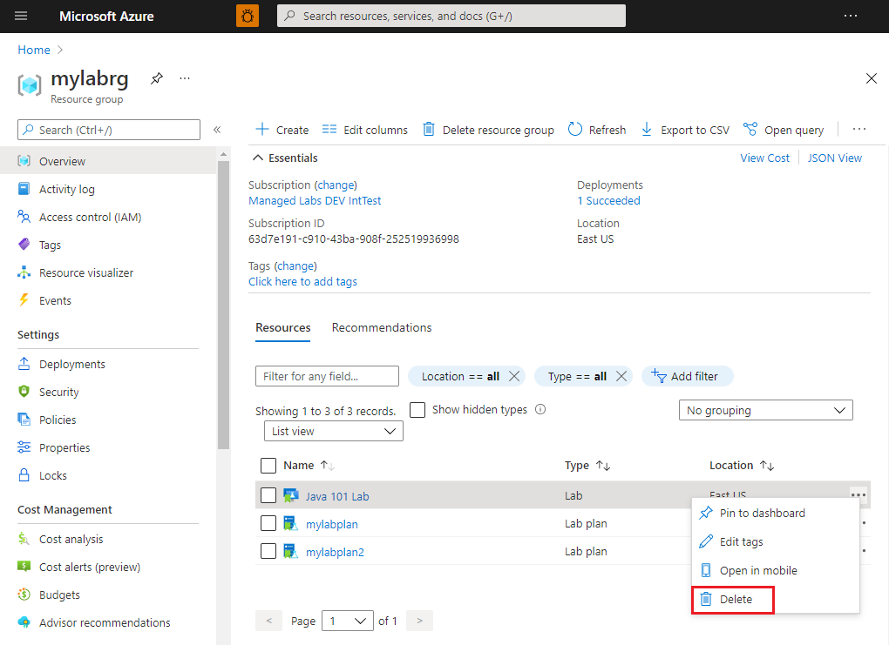
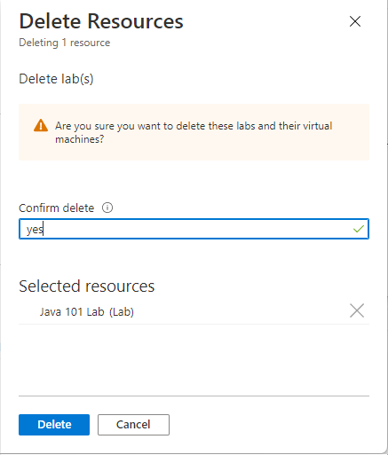

# Manage labs

This article shows you how a lab plan owner or administrator can view all the labs and delete labs associated with a lab plan.

Lab plans and labs are sibling resources contained in a resource group. Administrators can use existing tools in the Azure Portal to manage labs.

## View labs

1. Open the **Resource Group** page.

    

    To view only lab resources, set a filter for `Type == Lab`.
1. You see a **list of labs** with the following information:
    1. Name of the lab.
    2. Type of resource (Lab)
    3. Location of the lab.

1. Open a lab to view additional information such as the associated lab plan, OS type, and virtual machine size.

## Delete a lab

1. Open the **Resource Group** page.

    To view only lab resources, set a filter for `Type == Lab`.

1. Select **... (ellipsis)**, and select **Delete**.

    
1. Type **Yes** on the warning message.

    

## Next steps

See other articles in the **How-to guides** -> **Create and configure lab plans (lab plan owner)** section of the table-of-content (TOC).