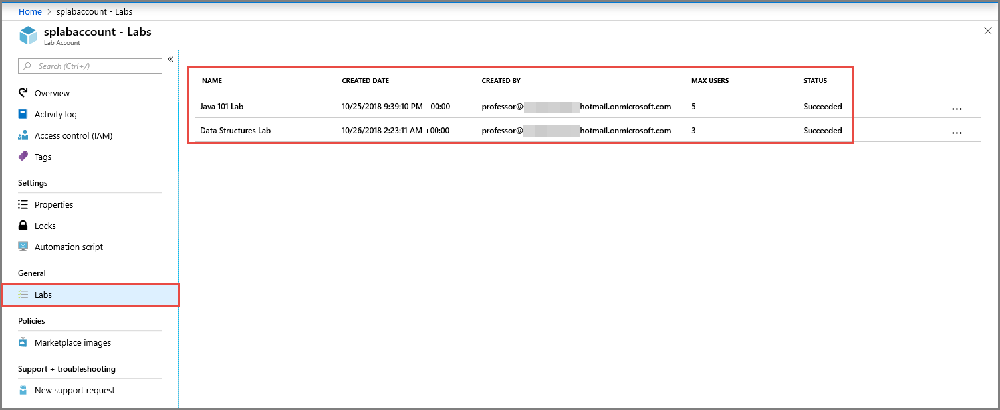
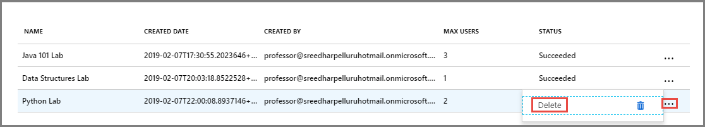
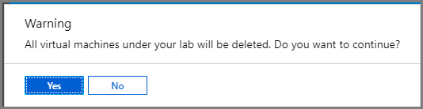

# Manage labs in a lab account
This article shows you how a lab account owner or administrator can view all the labs in a lab account, and delete a lab in the lab account. 

## View labs in a lab account

1. On the **Lab Account** page, select **All labs** on the left menu.

    
1. You see a **list of labs** in the account with the following information: 
    1. Name of the lab.
    2. The date on which the lab was created. 
    3. Email address of the user who created the lab. 
    4. Maximum number of users allowed into the lab. 
    5. Status of the lab. 
    6. Role assignments. 

## Delete a lab in a lab account
Follow instructions in the previous section to see a list of the labs in the lab account.

1. Select **... (ellipsis)**, and select **Delete**. 

    
2. Select **Yes** on the warning message. 

    

## Next steps
See other articles in the **How-to guides** -> **Create and configure lab accounts (lab account owner)** section of the table-of-content (TOC). 