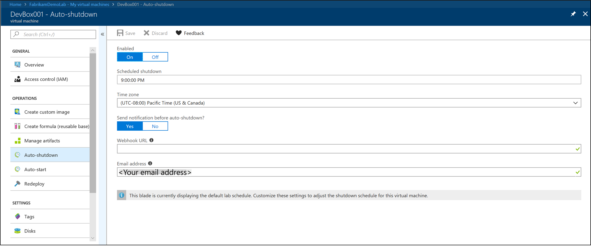

# Export or delete personal data from Azure DevTest Labs
This article provides steps for deleting and exporting personal data from the Azure DevTest Labs service. 

## What personal data does DevTest Labs collect?
DevTest Labs collects two main pieces of personal data from the user. They are: user email address and user object ID. This information is critical for the service to provide in-service features to lab admins and lab users.

### User email address
DevTest Labs uses the user email address to send auto shutdown email notifications to lab users. The email notifies users of their machine being shut down. The users can either postpone or skip the shutdown if they wish to do so. You configure the email address at the lab level or at the VM level.

**Setting email at the lab:**

**Setting email at the VM:**

### User object ID
DevTest Labs uses the user object ID to show month-over-month cost trends and cost by resource information to lab admins. It allows them to track costs and manage thresholds for their Lab. 

**Estimated cost trend for the current calendar month:**

**Estimated month-to-date cost by resource:**

## Why do we need this personal data?
The DevTest Labs service uses the personal data for operational purposes. This data is critical for the service to deliver key features. If you set a retention policy on the user email address, lab users do not receive timely auto shutdown email notifications after their email address is deleted from our system. Similarly, the lab admin can't view month-over-month cost trends and cost by resource for machines in their labs if the user object IDs are deleted based on a retention policy. Therefore, this data needs to be retained for as long as the user's resource is active in the Lab.

## How can I have the system to forget my personal data?
As a lab user, if you like to have this personal data deleted, you can do so by deleting the corresponding resource in the Lab. The DevTest Labs service anonymizes the deleted personal data 30 days after it's deleted by the user.

For example, If you delete your VM, or removed your email address, the DevTest Labs service anonymizes this data 30 days after the resource is deleted. The 30-day retention policy after deletion is to make sure that we provide an accurate month-over-month cost projection to the lab admin.

## How can I request an export on my personal data?
As a lab user, you can request an export on the personal data that the DevTest Labs service stores. To request for an export, navigate to the **Personal data** option on the **Overview** page of your lab. Select the **Request export** button kicks off the creation of a downloadable excel file in your Lab admin's storage account. You can then contact your lab admin to view this data.

1. Select **Personal data** on the left menu. 

    
2. Select the **resource group** that contains the lab.

    
3. Select the **storage account** in the resource group.
4. On the **Storage account** page, select **Blobs**.

    
5. Select the container named **labresourceusage** in the list of containers.

    
6. Select the **folder** named after your lab. You find **csv** files for **disks** and **virtual machines** in your lab in this folder. You can download these csv files, filter the content for the lab user requesting an access, and share it with them.

    

## Next steps
See the following articles: 

- [Set policies for a lab](devtest-lab-get-started-with-lab-policies.md)
- [Frequently asked questions](devtest-lab-faq.md)
