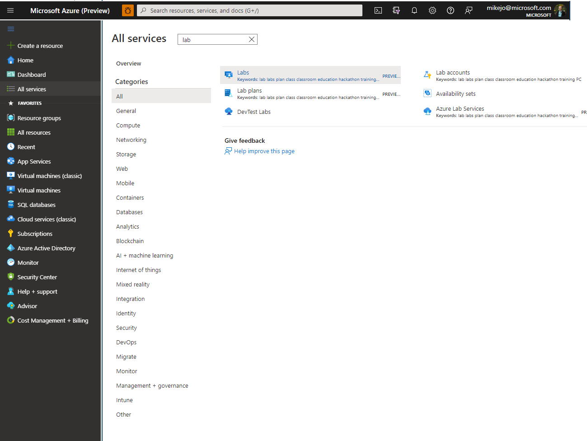
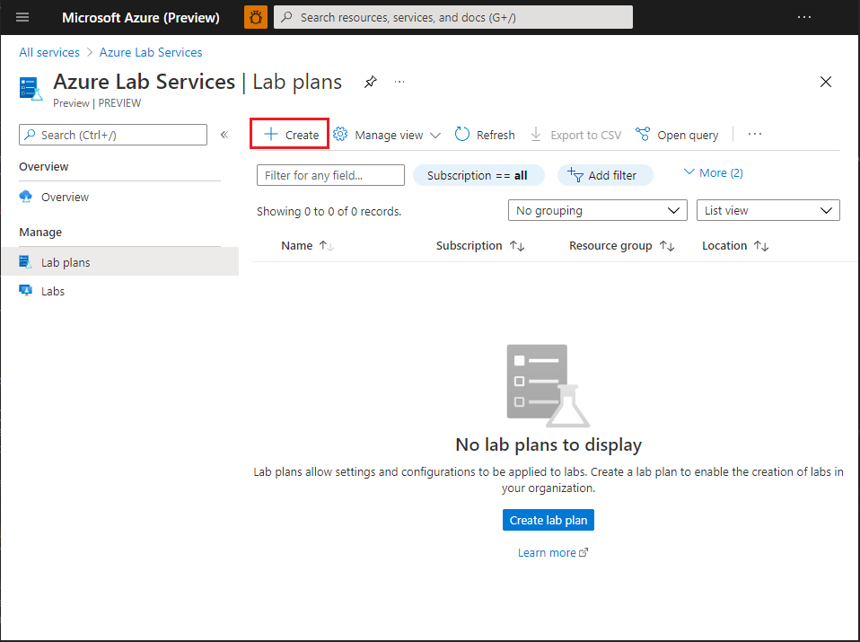
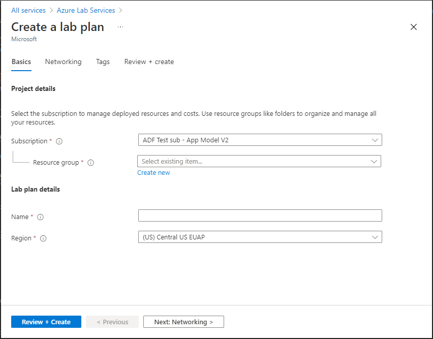
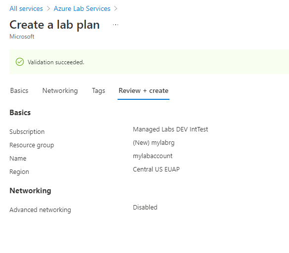
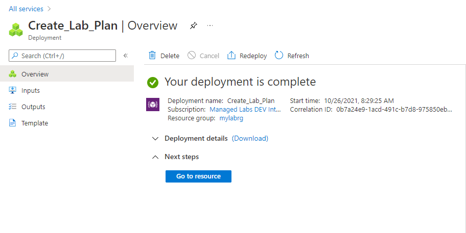
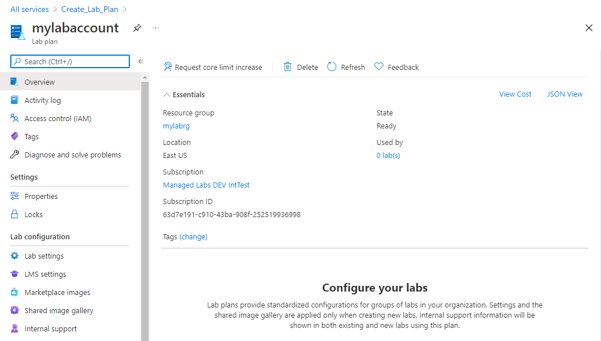

# Tutorial: Set up a lab plan with Azure Lab Services

In Azure Lab Services, a lab plan serves as the central account in which your organization's labs are managed. In your lab plan, give permission to others to create labs, and set policies that apply to all labs under the lab plan. In this tutorial, learn how to create a lab plan. 

In this tutorial, you do the following actions:

> [!div class="checklist"]
> * Create a lab plan
> * Add a user to the Lab Creator role

If you don't have an Azure subscription, create a [free account](https://azure.microsoft.com/free/) before you begin.

## Create a lab plan

The following steps illustrate how to use the Azure portal to create a lab plan with Azure Lab Services.

1. Sign in to the [Azure portal](https://portal.azure.com).
2. Select **All Services** on the left menu. Type **lab** in the search filter. Then, select **Azure Lab Services**. If you select star (`*`) next to **Azure Lab Services**, it's added to the **FAVORITES** section on the left menu. From the next time onwards, you select **Azure Lab Services** under **FAVORITES**.

    
3. On the **Azure Lab Services** page, **Lab Plans**, and then select **Create** on the toolbar or select **Create lab plan** button on the page. 

    
4. On the **Basics** tab of the **Create a lab plan** page, do the following actions:
    1. Select the **Azure subscription** in which you want to create the lab plan.
    2. For **Resource group**, select an existing resource group or select **Create new**, and enter a name for the resource group.
    3. For **Name**, enter a lab plan name.
    4. For **Region**, select a location/region in which you want to create the lab plan.

        
    5. Select **Review + create**.
    6. Review the summary, and select **Create**. 

            
5. When the deployment is complete, expand **Next steps**, and select **Go to resource**. 

    
6. Confirm that you see the **Lab Account** page. 

    

## Add a user to the Lab Creator role

Copy from Lab Account article and update

## Next steps
In this tutorial, you created a lab plan. To learn about how to create a classroom lab as an educator, advance to the next tutorial:

> [!div class="nextstepaction"]
> [Set up a classroom lab](tutorial-setup-classroom-lab.md)

