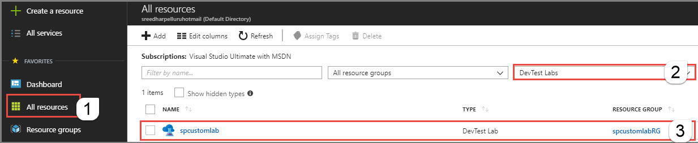
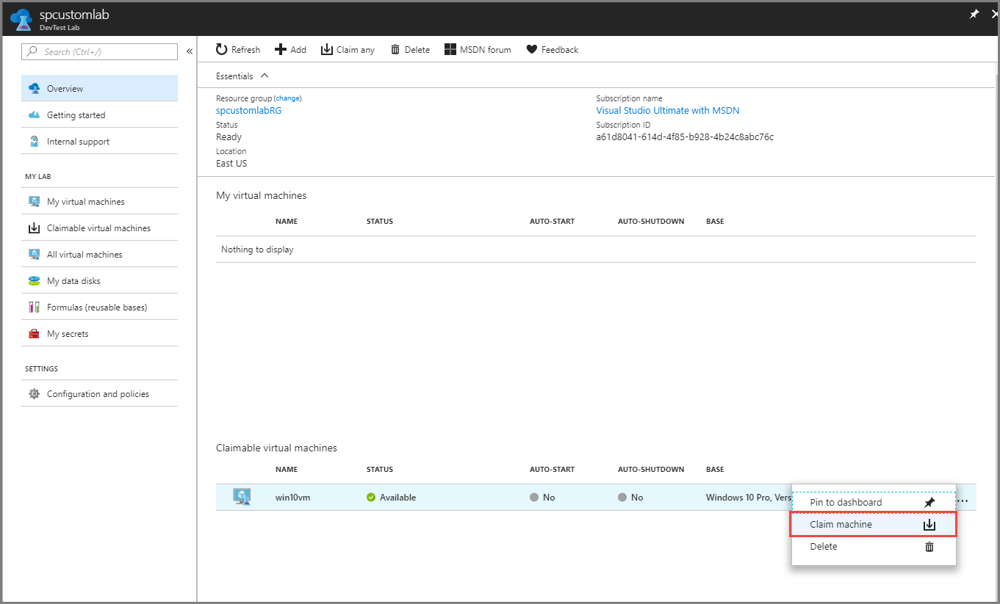
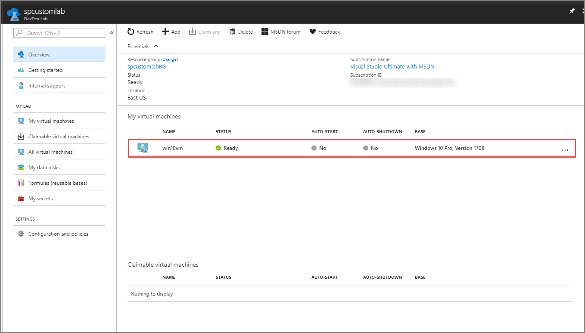
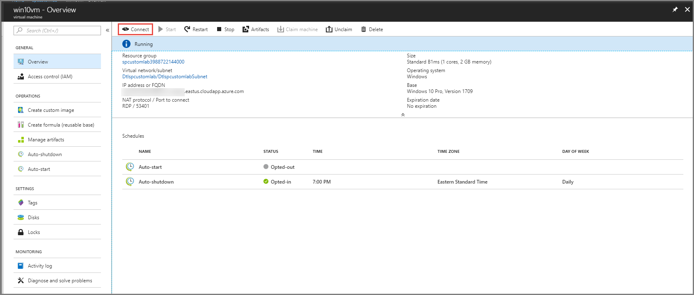
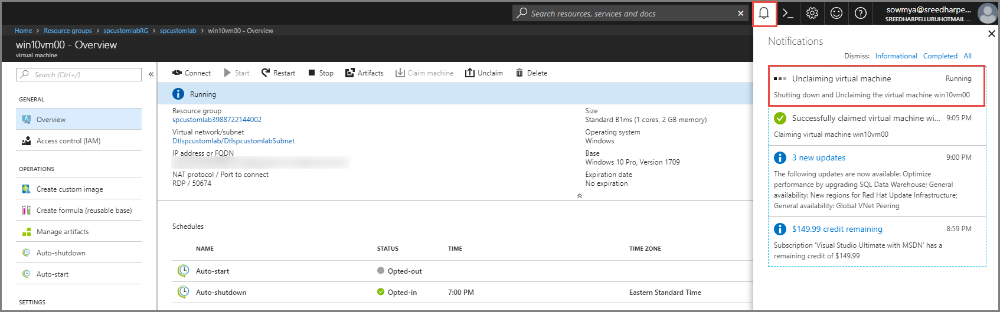

# Tutorial: Access a self-managed custom lab (formerly DevTest Labs) 
In this tutorial, you use a custom lab that was created in the [Tutorial: Create a custom lab](tutorial-create-custom-lab.md) .

In this tutorial, you do the following actions:

> [!div class="checklist"]
> * Claim a virtual machine (VM)
> * Connect to the VM
> * Unclaim the VM

If you don't have an Azure subscription, create a [free account](https://azure.microsoft.com/free/) before you begin.

## Access the custom lab

1. Sign in to the [Azure portal](https://portal.azure.com).
2. Select **All resources** on the left menu. 
3. Select **DevTest Labs** for resource type. 
4. Select the custom lab. 
    

## Claim a VM

1. In the list of **Claimable virtual machines**, select **...** (ellipsis), and select **Claim machine**.
    
2. Confirm that you see the VM in the list **My virtual machines**.
    

## Connect to the VM
3. Select your VM in the list. You see the **Virtual Machine page** for your VM. Select **Connect** on the toolbar.
     
2. Save the downloaded **RDP** file your hard disk and use it to connect to the virtual machine. Specify the user name and password you mentioned when the VM was created in the previous section. 

## Unclaim the VM
After you are done with using the VM, unclaim the VM by following these steps: 

1. On the virtual machine page, and select **Unclaim** on the toolbar. 
    
3. The VM is shut down before it's unclaimed. 
     
4. After the unclaim operation is done, you see the VM in the list of **Claimable virtual machines** list at the bottom. 
    
## Next steps
This tutorial showed you how to access a custom lab, claim a VM in the lab, connect to the VM, and unclaim the VM.

> [!div class="nextstepaction"]
> [Tutorial: Create a custom lab](tutorial-create-custom-lab.md)

