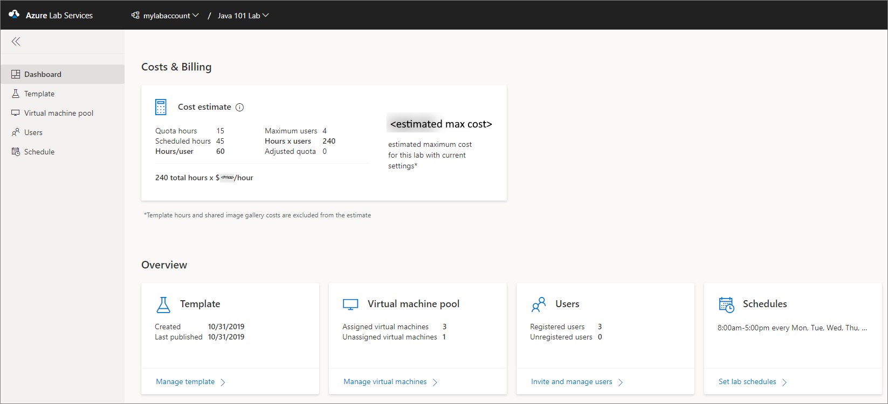
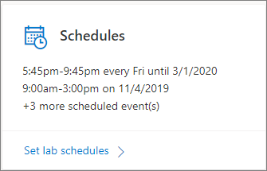

# Dashboard for labs

This article describes the dashboard view of a lab in Azure Lab Services.

## Costs and billing tile

This tile provides the following cost estimate details:

| Setting | Value |
| ------- | ----- |
| Quota hours | The maximum number of hours a user can use the VM outside the scheduled hours. |
| Scheduled hours | Hours that will be incurred based on the schedule set in the lab. This value is only available if there is a from/to date set on all the schedule events. |
| Hours/user | The sum of quota hours and scheduled hours. |
| Maximum users | Maximum number of users in the lab based on all virtual machines to be claimed. |
| Hours x users | Hours/user multiplied by the number of users. |
| Adjusted quota | The sum of the quota hours added to specific users. |
| Total hours * $/hour | The cost per hour based on the VM size selected. This is based on the regular pay as you go price. |
| Total estimated cost | This is the maximum price for this lab based on current settings. |

## Template tile

You see the following information on this tile:

- The date on which the template was created
- The date on which the template was last published

It also has a link to navigate to the **Template** page where you can [manage the template VM](how-to-create-manage-template.md) for the class.

## Virtual machine pool tile

You see the following information on this tile:

- Number of virtual machines that are assigned to students (users)
- Number of virtual machines that haven't been assigned to students yet

It also has a link to navigate to the **Virtual machine pool** page where you can [manage the pool of virtual machines](how-to-set-virtual-machine-passwords.md) in the lab.

## Users tile

You see the following information on this tile:

- Number of users registered to the class
- Number of users who are added to the lab but not registered to the class

It also has a link to navigate to the **Users** page where you can [manage users](how-to-manage-lab-users.md) for the lab.

## Schedules tile

You see the current scheduled events for the lab on the tile. It also has a link to navigate to the **Schedule** page where you can [create and manage schedules](how-to-create-schedules.md). The tile shows you details for only two scheduled events and the number of remaining scheduled events for the lab.

