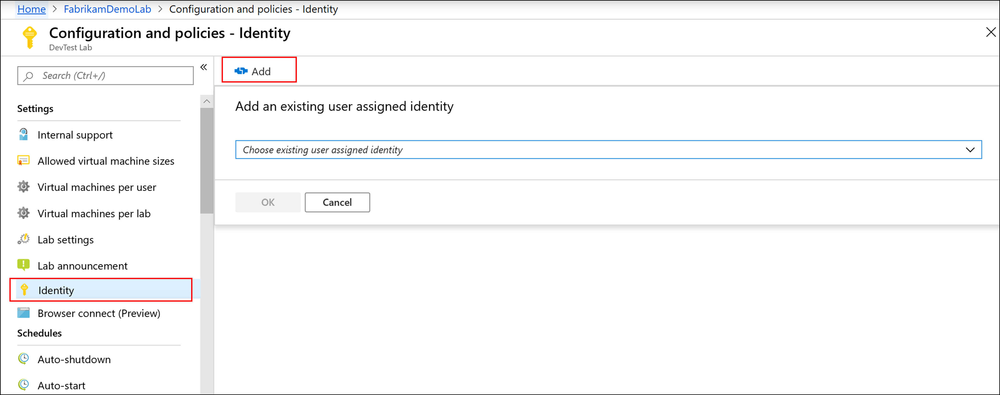
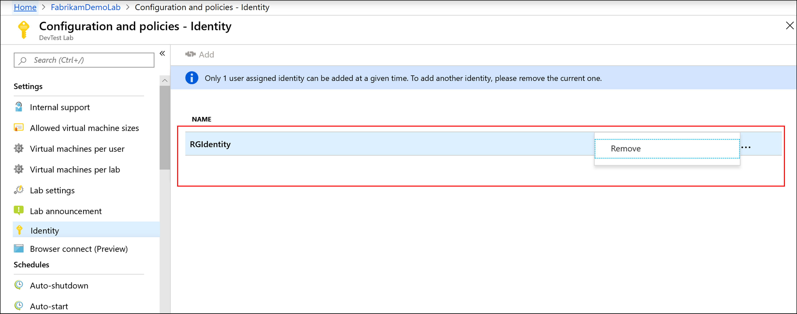

# Use Azure managed identities to deploy environments in a lab 
As a lab owner, you can use a managed identity to deploy environments in a lab. This feature is helpful in scenarios where the environment contains or has references to Azure resources such as key vaults, shared image galleries, and networks that are external to the environment’s resource group. It enables creation of sandbox environments that aren't limited to the resource group of that environment.

> [!NOTE]
> Currently, a single user-assigned identity is supported per lab. 

## Prerequisites
- [Create, list, delete or assign a role to a user-assigned managed identity using the Azure portal](../active-directory/managed-identities-azure-resources/how-to-manage-ua-identity-portal.md). 

## Use Azure portal
In this section you, as a lab owner, use the Azure portal to add a user-managed identity to the lab. 

1. On the lab page, select **Configuration and policies**. 
1. Select **Identity** in the **Settings** section.
1. To add a user assigned identity, select **Add** on the toolbar. 
1. Select an **identity** from a pre-populated drop-down list.
1. Select **OK**.

    
2. You see the added user-managed identity in the list. 

    

Once saved, the lab will use this identity while deploying all lab environments. You can also access the identity resource in Azure by selecting the identity from the list. 

The lab owner doesn't need to do anything special while deploying an environment as long as the identity added to the lab has permissions to the external resources that the environment needs to access. 

To change the user-managed identity assigned to the lab, remove the identity attached to the lab first and then add another one to the lab. To remove an identity attached to the lab, select **... (ellipsis)**, and click **Remove**. 

  

## Use API

1. After creating an identity, note the resource ID of this identity. It should look like the following sample: 

    `/subscriptions/0000000000-0000-0000-0000-00000000000000/resourceGroups/<RESOURCE GROUP NAME> /providers/Microsoft.ManagedIdentity/userAssignedIdentities/<NAME of USER IDENTITY>`.
1. Perform a PUT Https method to add a new `ServiceRunner` resource to the lab similar to the following example. Service runner resource is a proxy resource to manage and control managed identities in DevTest Labs. The service runner name can be any valid name but we recommend that you use the name of the managed identity resource. 
 
    ```json
    PUT https://management.azure.com/subscriptions/{subId}/resourceGroups/{rg}/providers/Microsoft.Devtestlab/labs/{yourlabname}/serviceRunners/{serviceRunnerName}

    {
        "location": "{location}",
        "identity":{
            "type": "userAssigned",
            "userAssignedIdentities":{
                "[userAssignedIdentityResourceId]":{}
            }
        }
        "properties":{
            "identityUsageType":"Environment"
                     }
          
    }
    ```
 
    Here's an example: 

    ```json
    PUT https://management.azure.com/subscriptions/0000000000-0000-0000-0000-000000000000000/resourceGroups/exampleRG/providers/Microsoft.Devtestlab/labs/mylab/serviceRunners/sampleuseridentity

    {
        "location": "eastus",
        "identity":{
            "type": "userAssigned",
            "userAssignedIdentities":{
                "/subscriptions/0000000000-0000-0000-0000-000000000000000/resourceGroups/exampleRG/providers/Microsoft.ManagedIdentity/userAssignedIdentities/sampleuseridentity":{}
            }
        }
        "properties":{
            "identityUsageType":"Environment"
                     }
    }
    ```
 
Once the user assigned identity is added to the lab, the Azure DevTest Labs service will use it while deploying Azure Resource Manager environments. For example, if you need your Resource Manager template to access an external shared image gallery image, make sure that the identity you added to the lab has minimum required permissions for the shared image gallery resource. 
