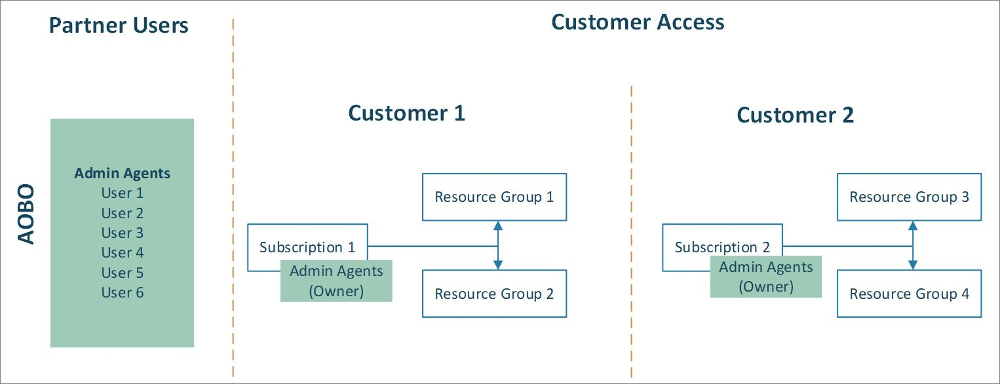
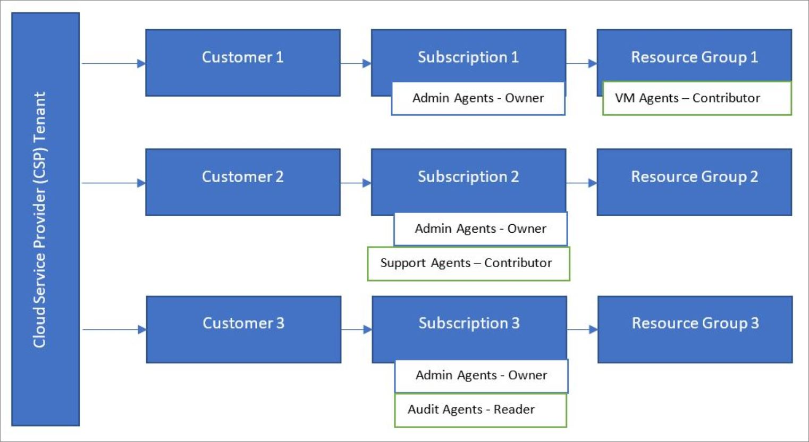

# Azure Lighthouse and the Cloud Solution Provider program

If you're a [CSP (Cloud Solution Provider)](https://docs.microsoft.com/partner-center/csp-overview) partner, you can access the Azure subscriptions created for your customers through the CSP program by using the [Administer On Behalf Of (AOBO)](https://channel9.msdn.com/Series/cspdev/Module-11-Admin-On-Behalf-Of-AOBO) functionality. This access allows you to directly support, configure, and manage your customers' subscriptions.

The AOBO mechanism grants complete access to customer environments. Using Azure delegated resource management along with AOBO helps improve security by letting you reduce unnecessary access by enabling more granular permissions for your users. 

## Administer on Behalf of (AOBO)

With AOBO, any user with the [Admin Agent](https://docs.microsoft.com/partner-center/permissions-overview#manage-commercial-transactions-in-partner-center-azure-ad-and-csp-roles) role in your tenant will have AOBO access to Azure subscriptions that you create through the CSP program. Any users who need access to any customers' subscriptions must be a member of this group. AOBO doesn’t allow the flexibility to create distinct groups that work with different customers, or to enable different roles for groups or users.

## Azure delegated resource management

Using Azure delegated resource management, you can assign different groups to different customers or roles, as shown in the following diagram. Because users will have the appropriate level of access through Azure delegated resource management, you can reduce the number of users who have the Admin Agent role (and thus have full AOBO access). This provides greater security by limiting unnecessary access to your customers’ resources. It also gives you more flexibility to manage multiple customers at scale.

Onboarding a subscription that you created through the CSP program follows the steps described in [Onboard a subscription to Azure delegated resource management](../how-to/onboard-customer.md). Any user who has the Admin Agent role in your tenant can perform this onboarding.

Note that for subscriptions created through the CSP programs, support requests can only be generated by users with the Admin Agent role in the service provider's tenant. Users added through Azure delegated resource management won't be able to open support requests for delegated resources in these subscriptions.

## Partner Admin Link

You can associate your Microsoft Partner Network (MPN) ID with your onboarded subscriptions to track your impact across customer engagements.

If you [publish a managed services offer to the Azure Marketplace](../how-to/publish-managed-services-offers.md), your MPN ID is associated with your publisher profile and is automatically associated with the offer. Revenue generated by Azure resources via this offer will then be attributed to your organization. In partner reporting systems such as Partner Center or MPN, the attribution will appear as Partner Admin Link (PAL).

If you [onboard customers for Azure delegated resource management using Azure Resource Manager templates](../how-to/onboard-customer.md), you can still associate your MPN ID in order to receive recognition for your impact on customer engagements, but you will have to do so manually. For more info, see [Link a partner ID to your Azure accounts](https://docs.microsoft.com/azure/billing/billing-partner-admin-link-started). 

## Next steps

- Learn about [cross-tenant management experiences](cross-tenant-management-experience.md).
- Learn about the [Cloud Solution Provider program](https://docs.microsoft.com/partner-center/csp-overview).
