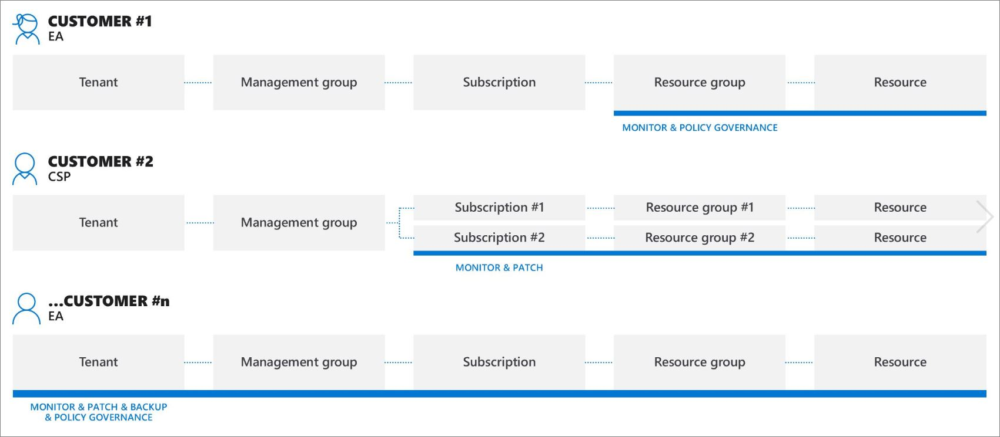
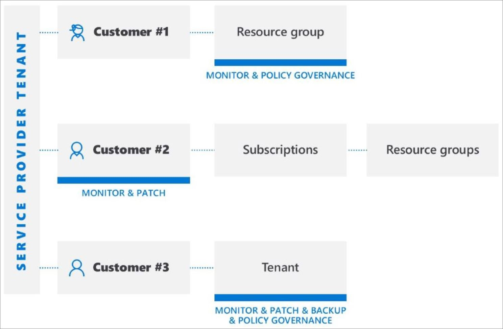

# Cross-tenant management experiences

This article describes the scenarios that you, as a service provider, can use with [Azure delegated resource management](../concepts/azure-delegated-resource-management.md) to manage Azure resources for multiple customers from within your own tenant in the [Azure portal](https://portal.azure.com).

> [!NOTE]
> Azure delegated resource management can also be used within an enterprise which has multiple tenants of its own to simplify cross-tenant administration.

## Understanding customer tenants

An Azure Active Directory (Azure AD) tenant is a representation of an organization. It's a dedicated instance of Azure AD that an organization receives when they create a relationship with Microsoft by signing up for Azure, Microsoft 365, or other services. Each Azure AD tenant is distinct and separate from other Azure AD tenants, and has its own tenant ID (a GUID). For more info, see [What is Azure Active Directory?](https://docs.microsoft.com/azure/active-directory/fundamentals/active-directory-whatis)

Typically, in order to manage Azure resources for a customer, service providers would have to sign in to the Azure portal using an account associated with that customer's tenant, requiring an administrator in the customer's tenant to create and manage user accounts for the service provider.

With Azure delegated resource management, the onboarding process specifies users within the service provider's tenant who will be able to access and manage subscriptions, resource groups, and resources in the customer's tenant. These users can then sign in to the Azure portal using their own credentials. Within the Azure portal, they can manage resources belonging to all customers to which they have access. This can be done by visiting the [My customers](../how-to/view-manage-customers.md) page in the Azure portal, or by working directly within the context of that customer's subscription, either in the Azure portal or via APIs.

Azure delegated resource management allows greater flexibility to manage resources for multiple customers without having to sign in to different accounts in different tenants. For example, a service provider may have three customers, with different responsibilities and access levels, as shown here:

Using Azure delegated resource management, authorized users can sign in to the service provider’s tenant to access these resources, as shown here:

## Supported services and scenarios

Currently, the cross-tenant management experience supports the following scenarios with delegated customer resources:

[Azure Automation](https://docs.microsoft.com/azure/automation/):

- Use automation accounts to access and work with delegated customer resources

[Azure Backup](https://docs.microsoft.com/azure/backup/):

- Back up and restore customer data in customer tenants

[Azure Kubernetes Service (AKS)](https://docs.microsoft.com//azure/aks/):

- Manage hosted Kubernetes environments and deploy and manage containerized applications within customer tenants

[Azure Monitor](https://docs.microsoft.com/azure/azure-monitor/):

- View alerts for delegated subscriptions in the Azure portal or programmatically through REST API calls, with the ability to view alerts across all subscriptions
- View activity log details for delegated subscriptions
- Log analytics: Query data from remote customer workspaces in multiple tenants

[Azure Policy](https://docs.microsoft.com/azure/governance/policy/):

- Compliance snapshots show details for assigned policies within delegated subscriptions
- Create and edit policy definitions within a delegated subscription
- Assign customer-defined policy definitions within the delegated subscription
- Customers see policies authored by the service provider alongside any policies they've authored themselves
- Can remediate deployIfNotExists assignments within the customer tenants if the customer has configured the managed identity and *roleDefinitionIds* for that policy assignment

[Azure Resource Graph](https://docs.microsoft.com/azure/governance/resource-graph/):

- Now includes the tenant ID in returned query results, allowing you to identify whether a subscription belongs to the customer tenant or service provider tenant

[Azure Security Center](https://docs.microsoft.com/azure/security-center/):

- Cross-tenant visibility
  - Monitor compliance to security policies and ensure security coverage across all tenants’ resources
  - Continuous regulatory compliance monitoring across multiple customers in a single view
  - Monitor, triage, and prioritize actionable security recommendations with secure score calculation
- Cross-tenant security posture management
  - Manage security policies
  - Take action on resources that are out of compliance with actionable security recommendations
  - Collect and store security-related data
- Cross-tenant threat detection and protection
  - Detect threats across tenants’ resources
  - Apply advanced threat protection controls such as just-in-time (JIT) VM access
  - Harden network security group configuration with Adaptive Network Hardening
  - Ensure servers are running only the applications and processes they should be with adaptive application controls
  - Monitor changes to important files and registry entries with File Integrity Monitoring (FIM)

[Azure Service Health](https://docs.microsoft.com/azure/service-health/):

- Monitor the health of customer resources with Azure Resource Health
- Track the health of the Azure services used by your customers

[Azure Site Recovery](https://docs.microsoft.com/azure/site-recovery/):

- Manage disaster recovery options for Azure virtual machines in customer tenants (note that you can't use RunAs accounts to copy VM extensions)

[Azure Virtual Machines](https://docs.microsoft.com/azure/virtual-machines/):

- Use virtual machine extensions to provide post-deployment configuration and automation tasks on Azure VMs in customer tenants
- Use boot diagnostics to troubleshoot Azure VMs in customer tenants
- Access VMs with serial console in customer tenants
- Note that you can't use Azure Active Directory for remote login to a VM, and you can't integrate a VM with a Key Vault for passwords, secrets or cryptographic keys for disk encryption

[Azure Virtual Network](https://docs.microsoft.com/azure/virtual-network/):

- Deploy and manage virtual networks and virtual network interface cards (vNICs) within customer tenants

Support requests:

- Open support requests for delegated resources from the **Help + support** blade in the Azure portal (selecting the support plan available to the delegated scope)

With all scenarios, please be aware of the following current limitations:

- Requests handled by Azure Resource Manager can be performed using Azure delegated resource management. The operation URIs for these requests start with `https://management.azure.com`. However, requests that are handled by an instance of a resource type (such as KeyVault secrets access or storage data access) aren’t supported with Azure delegated resource management. The operation URIs for these requests typically start with an address that is unique to your instance, such as `https://myaccount.blob.core.windows.net` or `https://mykeyvault.vault.azure.net/`. The latter also are typically data operations rather than management operations. 
- Role assignments must use role-based access control (RBAC) [built-in roles](https://docs.microsoft.com/azure/role-based-access-control/built-in-roles). All built-in roles are currently supported with Azure delegated resource management except for Owner, User Access Administrator, or any built-in roles with [DataActions](https://docs.microsoft.com/azure/role-based-access-control/role-definitions#dataactions) permission. Custom roles and [classic subscription administrator roles](https://docs.microsoft.com/azure/role-based-access-control/classic-administrators) are also not supported.
- Currently, you can’t onboard a subscription (or resource group within a subscription) for Azure delegated resource management if the subscription uses Azure Databricks. Similarly, if a subscription has been registered for onboarding with the **Microsoft.ManagedServices** resource provider, you won’t be able to create a Databricks workspace for that subscription at this time.

## Using APIs and management tools with cross-tenant management

For the supported services and scenarios listed above, you can perform management tasks either directly in the portal or by using APIs and management tools (such as Azure CLI and Azure PowerShell). All existing APIs can be used when working with delegated resources (for services that are supported).

There are also APIs specific to performing Azure delegated resource management tasks. For more info, see the **Reference** section.

## Next steps

- Onboard your customers to Azure delegated resource management, either by [using Azure Resource Manager templates](../how-to/onboard-customer.md) or by [publishing a private or public managed services offer to Azure Marketplace](../how-to/publish-managed-services-offers.md).
- [View and manage customers](../how-to/view-manage-customers.md) by going to **My customers** in the Azure portal.