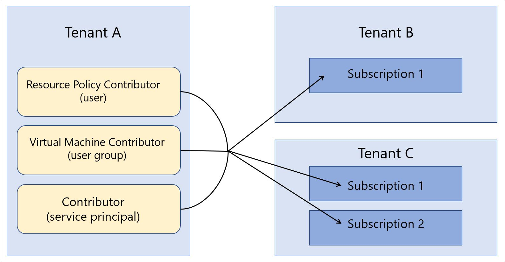

# Azure Lighthouse in enterprise scenarios

The most common scenario for [Azure Lighthouse](../overview.md) is a service provider managing resources in its customers’ Azure  Active Directory (Azure AD) tenants. However, the capabilities of Azure Lighthouse can also be used to simplify cross-tenant management within an enterprise which uses multiple Azure AD tenants.

## Single vs. multiple tenants

For most organizations, management is easier with a single Azure AD tenant. Having all resources within one tenant allows centralization of management tasks by designated users, user groups, or service principals within that tenant. We recommend using one tenant for your organization whenever possible.

At the same time, there are situations that may require an organization to maintain multiple Azure AD tenants. In some cases, this may be a temporary situation, as when acquisitions have taken place and a long-term tenant consolidation strategy will take some time to define. An organization may also need to maintain multiple tenants on an ongoing basis (due to wholly independent subsidiaries, geographical or legal requirements, and so on). In cases where a multi-tenant architecture is required, Azure delegated resource management can be used to centralize and streamline management operations. Subscriptions from multiple tenants can be onboarded for [Azure delegated resource management](azure-delegated-resource-management.md), allowing designated users in a managing tenant to perform [cross-tenant management functions](cross-tenant-management-experience.md) in a centralized and scalable manner.

## Tenant management architecture

When centralizing management operations across multiple tenants, you’ll need to determine which tenant will include the users performing management operations for the other tenants. In other words, you will need to determine which tenant will be the managing tenant for other tenants.

For example, say your organization has a single tenant that we’ll call *Tenant A*. Your organization then acquires two additional tenants, *Tenant B* and *Tenant C*, and you have business reasons that require you to maintain them as separate tenants.

Your organization wants to use the same policy definitions, backup practices, and security processes across all tenants. Since you already have users (including user groups and service principals) that are responsible for performing these tasks within Tenant A, you can onboard all of the subscriptions within Tenant B and Tenant C so that those same users in Tenant A can perform those tasks.

## Security and access considerations

In most enterprise scenarios, you’ll want to delegate a full subscription for Azure delegated resource management, although you can also delegate only specific resource groups within a subscription.

Either way, be sure to [follow the principle of least privilege when defining which users will have access to resources](recommended-security-practices.md#assign-permissions-to-groups-using-the-principle-of-least-privilege). Doing so helps to ensure that users only have the permissions needed to perform the required tasks and reduces the chance of inadvertent errors.

Azure Lighthouse and Azure delegated resource management only provide logical links between a managing tenant and managed tenants, rather than physically moving data or resources. Furthermore, the access always goes in only one direction, from the managing tenant to the managed tenants.  Users and groups in the managing tenant should continue to use multi-factor authentication when performing management operations on managed tenant resources.

Enterprises with internal or external governance and compliance guardrails can use [Azure Activity logs](../../azure-monitor/platform/platform-logs-overview.md) to meet their transparency requirements. When enterprise tenants have established managing and managed tenant relationships, users in each tenant can monitor and gain visibility to actions taken by the users in the other tenant by viewing logged activity.

## Onboarding process considerations

Subscriptions (or resource groups within a subscription) can be onboarded to Azure delegated resource management either by deploying Azure Resource Manager templates or through Managed Services offers published to Azure Marketplace, either privately or publicly.

Since enterprise users will normally be able to gain direct access to the enterprise’s tenants, and there’s no need to market or promote a management offering, it’s generally faster and more straightforward to deploy directly with Azure Resource Manager templates. While we refer to service providers and customers in the [onboarding guidance](../how-to/onboard-customer.md), enterprises can use the same processes.

If you prefer, tenants within an enterprise can be onboarded by [publishing a Managed Services offer to Azure Marketplace](../how-to/publish-managed-services-offers.md). To ensure that the offer is only available to the appropriate tenants, be sure that your plans are marked as private. With a private plan, you can provide the subscription IDs for each tenant that you plan to onboard, and no one else will be able to get your offer.

## Terminology notes

For cross-tenant management within the enterprise, references to service providers in the Azure Lighthouse documentation can be understood to apply to the managing tenant within an enterprise—that is, the tenant that includes the users who will manage resources in other tenants through Azure delegated resource management. Similarly, references to customers can be understood to apply to the tenants that are delegating resources to be managed through users in the managing tenant.

For instance, in the example described above, Tenant A can be thought of as the service provider tenant (the managing tenant) and Tenant B and Tenant C can be thought of as the customer tenants.

In that example, Tenant A users with the appropriate permissions can [view and manage delegated resources](../how-to/view-manage-customers.md) in the **My customers** page of the Azure portal. Likewise, Tenant B and Tenant C users with the appropriate permissions can [view and manage the resources that have been delegated](../how-to/view-manage-service-providers.md) to Tenant A in the **Service providers** page of the Azure portal.

## Next steps

- Learn about [cross-tenant management experiences](cross-tenant-management-experience.md).
- Learn about [Azure delegated resource management](azure-delegated-resource-management.md).