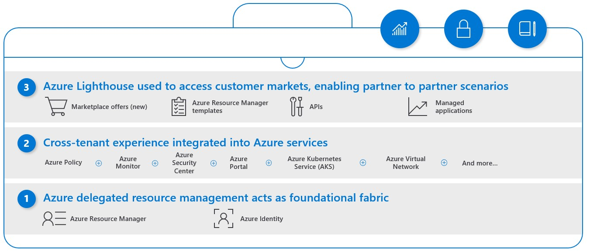

# What is Azure Lighthouse?

Azure Lighthouse enables multi-tenant management with scalability, higher automation, and enhanced governance across resources.

With Azure Lighthouse, service providers can deliver managed services using [comprehensive and robust tooling built into the Azure platform](concepts/architecture.md). Customers maintain control over who has access to their tenant, which resources they can access, and what actions can be taken. [Enterprise organizations](concepts/enterprise.md) managing resources across multiple tenants can use Azure Lighthouse to streamline management tasks.

[Cross-tenant management experiences](concepts/cross-tenant-management-experience.md) let you work more efficiently with Azure services such as [Azure Policy](how-to/policy-at-scale.md), [Microsoft Sentinel](how-to/manage-sentinel-workspaces.md), [Azure Arc](how-to/manage-hybrid-infrastructure-arc.md), and many more. Users can see what changes were made and by whom [in the activity log](how-to/view-service-provider-activity.md), which is stored in the customer's tenant and can be viewed by users in the managing tenant.

## Benefits

Azure Lighthouse helps service providers efficiently build and deliver managed services. Benefits include:

- **Management at scale**: Customer engagement and life-cycle operations to manage customer resources are easier and more scalable. Existing APIs, management tools, and workflows can be used with delegated resources, including machines hosted outside of Azure, regardless of the regions in which they're located.
- **Greater visibility and control for customers**: Customers have precise control over the scopes they delegate and the permissions that are allowed. They can [audit service provider actions](how-to/view-service-provider-activity.md) and remove access completely at any time.
- **Comprehensive and unified platform tooling**: Azure Lighthouse works with existing tools and APIs, [Azure managed applications](concepts/managed-applications.md), and partner programs like the [Cloud Solution Provider program (CSP)](concepts/cloud-solution-provider.md). This flexibility supports key service provider scenarios, including multiple licensing models such as EA, CSP and pay-as-you-go. You can integrate Azure Lighthouse into your existing workflows and applications, and track your impact on customer engagements by [linking your partner ID](how-to/partner-earned-credit.md).

## Capabilities

Azure Lighthouse includes multiple ways to help streamline engagement and management:

- **Azure delegated resource management**: [Manage your customers' Azure resources securely from within your own tenant](concepts/architecture.md), without having to switch context and control planes. Customer subscriptions and resource groups can be delegated to specified users and roles in the managing tenant, with the ability to remove access as needed.
- **New Azure portal experiences**: View cross-tenant information in the [**My customers** page](how-to/view-manage-customers.md) in the Azure portal. A corresponding [**Service providers** page](how-to/view-manage-service-providers.md) lets customers view and manage their service provider access.
- **Azure Resource Manager templates**: Use ARM templates to [onboard delegated customer resources](how-to/onboard-customer.md) and [perform cross-tenant management tasks](samples/index.md).
- **Managed Service offers in Azure Marketplace**: [Offer your services to customers](concepts/managed-services-offers.md) through private or public offers, and automatically onboard them to Azure Lighthouse.

> [!TIP]
> A similar offering, [Microsoft 365 Lighthouse](/microsoft-365/lighthouse/m365-lighthouse-overview), helps service providers onboard, monitor, and manage their Microsoft 365 customers at scale.

## Pricing and availability

There are no additional costs associated with using Azure Lighthouse to manage Azure resources. Any Azure customer or partner can use Azure Lighthouse.

## Cross-region and cloud considerations

Azure Lighthouse is a non-regional service. You can manage delegated resources that are located in different [regions](../availability-zones/az-overview.md#regions). However, you can't delegate resources across a [national cloud](../active-directory/develop/authentication-national-cloud.md) and the Azure public cloud, or across two separate national clouds.

## Support for Azure Lighthouse

For help using Azure Lighthouse, [open a support request](..//azure-portal/supportability/how-to-create-azure-support-request.md) in the Azure portal. For **Issue type**, choose **Technical**. Select a subscription, then select **Lighthouse** (under **Monitoring & Management**).

## Next steps

- Learn [how Azure Lighthouse works on a technical level](concepts/architecture.md).
- Explore [cross-tenant management experiences](concepts/cross-tenant-management-experience.md).
- See how to [use Azure Lighthouse within an enterprise](concepts/enterprise.md).
- View [availability](https://azure.microsoft.com/global-infrastructure/services/?products=azure-lighthouse&regions=all) and [FedRAMP and DoD CC SRG audit scope](../azure-government/compliance/azure-services-in-fedramp-auditscope.md) details for Azure Lighthouse.
