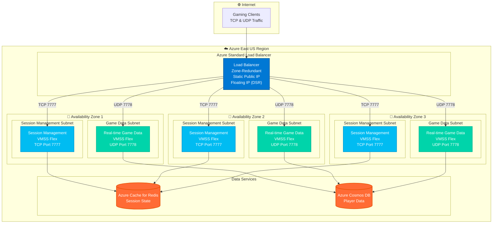

# Azure Load Balancer Gaming Platform Architecture

This diagram illustrates the Azure Load Balancer architecture for a gaming platform migration from AWS Network Load Balancer, featuring multi-protocol support, zone redundancy, and VMSS Flex orchestration.

## Architecture Components

### Load Balancer Configuration
- **Azure Standard Load Balancer** with zone-redundant deployment
- **Static Public IP** for consistent client endpoints
- **Floating IP (DSR)** enabled for client IP preservation
- **Multi-protocol support** for TCP and UDP traffic

### Backend Pools
- **Session Management Pool**: VMSS Flex orchestration handling TCP traffic on port 7777
- **Real-time Game Data Pool**: VMSS Flex orchestration handling UDP traffic on port 7778

### Availability Zones
- **Zone 1, 2, 3**: Each contains both service types in separate subnets
- **Subnet isolation**: Session management and game data services isolated per zone
- **Network Security Groups**: Protecting each subnet tier

### Data Services
- **Azure Cache for Redis**: Session state management for session services
- **Azure Cosmos DB**: Player data storage for game data services

### Traffic Flow
1. Gaming clients send TCP and UDP traffic through the internet
2. Azure Load Balancer receives traffic via static public IP
3. Load balancer routes TCP traffic (port 7777) to session management backend pool
4. Load balancer routes UDP traffic (port 7778) to game data backend pool
5. Session management services connect to Azure Cache for Redis
6. Game data services connect to Azure Cosmos DB for player data

This architecture provides high availability, ultra-low latency, and scalable performance for multiplayer gaming workloads migrated from AWS Network Load Balancer.
