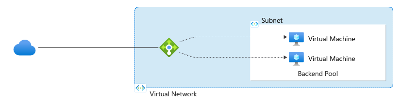
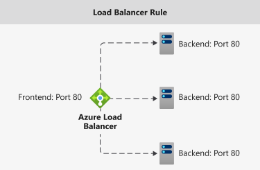
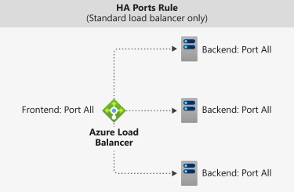
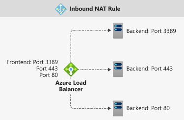

# Azure Load Balancer components

Azure Load Balancer includes a few key components. These components can be configured in your subscription via:

* Azure portal
* Azure CLI
* Azure PowerShell
* Resource Manager Templates

## Frontend IP configuration 

The IP address of your Azure Load Balancer. It's the point of contact for clients. These IP addresses can be either:

- **Public IP Address**
- **Private IP Address**

The nature of the IP address determines the **type** of load balancer created. Private IP address selection creates an internal load balancer. Public IP address selection creates a public load balancer.

|  | Public Load Balancer  | Internal Load Balancer |
| ---------- | ---------- | ---------- |
| Frontend IP configuration| Public IP address | Private IP address|
| Description | A public load balancer maps the public IP and port of incoming traffic to the private IP and port of the VM. Load balancer maps traffic the other way around for the response traffic from the VM. You can distribute specific types of traffic across multiple VMs or services by applying load-balancing rules. For example, you can spread the load of web request traffic across multiple web servers.| An internal load balancer distributes traffic to resources that are inside a virtual network. Azure restricts access to the frontend IP addresses of a virtual network that are load balanced. Front-end IP addresses and virtual networks are never directly exposed to an internet endpoint. Internal line-of-business applications run in Azure and are accessed from within Azure or from on-premises resources. |
| SKUs supported | Basic, Standard | Basic, Standard |

Load Balancer can have multiple frontend IPs. Learn more about [multiple frontends](load-balancer-multivip-overview.md).

## Backend pool

The group of virtual machines or instances in a virtual machine scale set that is serving the incoming request. To scale cost-effectively to meet high volumes of incoming traffic, computing guidelines generally recommend adding more instances to the backend pool.

Load balancer instantly reconfigures itself via automatic reconfiguration when you scale instances up or down. Adding or removing VMs from the backend pool reconfigures the load balancer without additional operations. The scope of the backend pool is any virtual machine in the virtual network.

When considering how to design your backend pool, design for the least number of individual backend pool resources to optimize the length of management operations. There's no difference in data plane performance or scale.

## Health probes

A health probe is used to determine the health status of the instances in the backend pool. During load balancer creation, configure a health probe for the load balancer to use.  This health probe will determine if an instance is healthy and can receive traffic.

You can define the unhealthy threshold for your health probes. When a probe fails to respond, Load Balancer stops sending new connections to the unhealthy instances. A probe failure doesn't affect existing connections. The connection continues until the application:

- Ends the flow
- Idle timeout occurs
- The VM shuts down

Load Balancer provides different health probe types for endpoints: TCP, HTTP, and HTTPS. [Learn more about Load Balancer Health probes](load-balancer-custom-probe-overview.md).

Basic Load Balancer doesn't support HTTPS probes. Basic Load Balancer closes all TCP connections (including established connections).

## Load Balancing rules

A Load Balancer rule is used to define how incoming traffic is distributed to the **all** the instances within the Backend Pool. A load-balancing rule maps a given Frontend IP configuration and port to multiple backend IP addresses and ports.

For example, use a load balancing rule for port 80 to route traffic from your frontend IP to port 80 of your backend instances.

  

*Figure: Load Balancing rules*

## High Availability Ports

A load balancer rule configured with **'protocol - all and port - 0'**. 

This rule enables a single rule to load-balance all TCP and UDP flows that arrive on all ports of an internal Standard Load Balancer. 

The load-balancing decision is made per flow. This action is based on the following five-tuple connection: 

1. source IP address
2. source port
3. destination IP address
4. destination port
5. protocol

The HA ports load-balancing rules help you with critical scenarios, such as high availability and scale for network virtual appliances (NVAs) inside virtual networks. The feature can help when a large number of ports must be load-balanced.

  

*Figure: HA Ports rules*

Learn more about [HA ports](load-balancer-ha-ports-overview.md).

## Inbound NAT rules

An inbound NAT rule forwards incoming traffic sent to Frontend IP address and port combination. The traffic is sent to a **specific** virtual machine or instance in the backend pool. Port forwarding is done by the same hash-based distribution as load balancing.

For example, if you would like Remote Desktop Protocol (RDP) or Secure Shell (SSH) sessions to separate VM instances in a backend pool. Multiple internal endpoints can be mapped to ports on the same Frontend IP address. The Frontend IP addresses can be used to remotely administer your VMs without an additional jump box.

  

*Figure: Inbound NAT rules*

Inbound NAT rules in the context of Virtual Machine Scale Sets are inbound NAT pools. Learn more about [Load Balancer components and virtual machine scale set](../virtual-machine-scale-sets/virtual-machine-scale-sets-networking.md#azure-virtual-machine-scale-sets-with-azure-load-balancer).

## Outbound rules

An outbound rule configures outbound Network Address Translation (NAT) for all virtual machines or instances identified by the backend pool. This rule enables instances in the backend to communicate (outbound) to the internet or other endpoints.

Learn more about [outbound connections and rules](load-balancer-outbound-connections.md).

Basic load balancer doesn't support Outbound rules.

## Next steps

- See [Create a public Standard Load Balancer](quickstart-load-balancer-standard-public-portal.md) to get started with using a Load Balancer.
- Learn more about [Azure Load Balancer](load-balancer-overview.md).
- Learn about [Public IP Address](https://docs.microsoft.com/azure/virtual-network/virtual-network-public-ip-address)
- Learn about [Private IP Address](https://docs.microsoft.com/azure/virtual-network/virtual-network-ip-addresses-overview-arm#private-ip-addresses)
- Learn about using [Standard Load Balancer and Availability Zones](load-balancer-standard-availability-zones.md).
- Learn about [Standard Load Balancer Diagnostics](load-balancer-standard-diagnostics.md).
- Learn about [TCP Reset on Idle](load-balancer-tcp-reset.md).
- Learn about [Standard Load Balancer with HA Ports load balancing rules](load-balancer-ha-ports-overview.md).
- Learn more about [Network Security Groups](../virtual-network/security-overview.md).
- Learn more about [Load balancer limits](https://docs.microsoft.com/azure/azure-resource-manager/management/azure-subscription-service-limits#load-balancer).
- Learn about using [Port forwarding](https://docs.microsoft.com/azure/load-balancer/tutorial-load-balancer-port-forwarding-portal).
