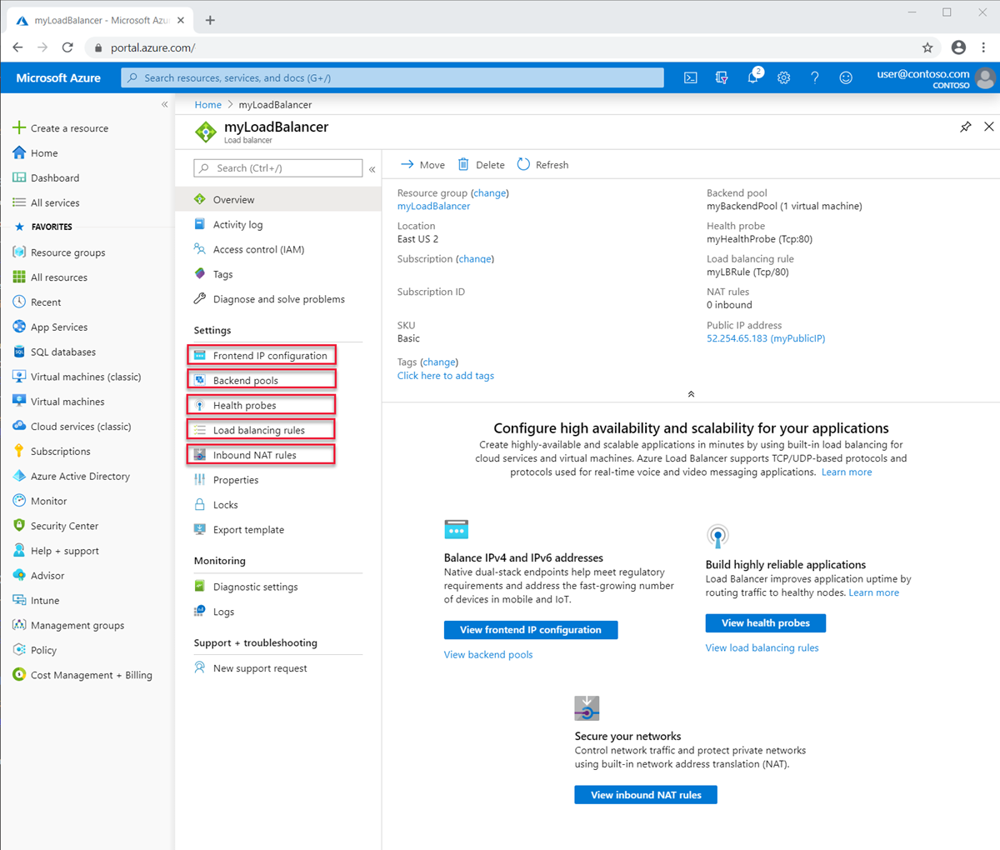
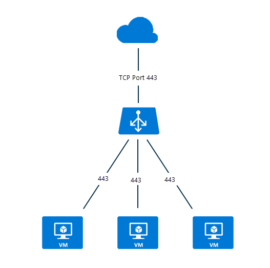
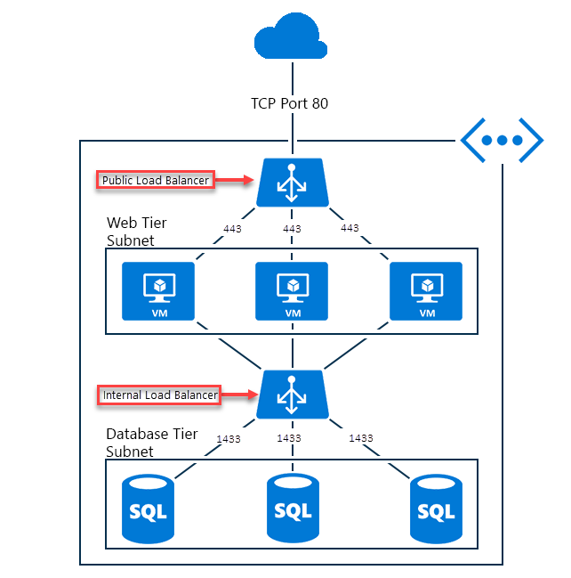

# Load Balancer components and limitations
Azure Load Balancer contains several key components for it's operation.  These components can be configured in your subscription via the Azure portal, Azure CLI, or Azure PowerShell.  

## Load Balancer components

* **Frontend IP configurations**: The IP address of the load balancer. It's the point of contact for clients. These addresses can be either: 

    - **[Public IP Address](https://docs.microsoft.com/azure/virtual-network/virtual-network-public-ip-address)**
    - **[Private IP Address](https://docs.microsoft.com/azure/virtual-network/virtual-network-ip-addresses-overview-arm#private-ip-addresses)**

* **Backend pool**: The group of virtual machines or instances in the Virtual Machine Scale Set that are going to serve the incoming request. To scale cost-effectively to meet high volumes of incoming traffic, computing guidelines generally recommend adding more instances to the backend pool. Load Balancer instantly reconfigures itself via automatic reconfiguration when you scale instances up or down. Adding or removing VMs from the backend pool reconfigures the Load Balancer without additional operations. The scope of the backend pool is any virtual machine in the virtual network. A backend pool can have up to 1000 backend instances or IP configurations.
Basic Load Balancers have limited scope (availability set) can only scale up to 300 IP configurations. For more information on limits, see [Load Balancer limits](https://docs.microsoft.com/azure/azure-resource-manager/management/azure-subscription-service-limits#load-balancer). When considering how to design your backend pool, you can design for the least number of individual backend pool resources to further optimize the duration of management operations. There is no difference in data plane performance or scale.
* **Health probes**: A **[health probe](https://docs.microsoft.com/azure/load-balancer/load-balancer-custom-probe-overview)** is used to determine the health of the instances in the backend pool. You can define the unhealthy threshold for your health probes. When a probe fails to respond, the Load Balancer stops sending new connections to the unhealthy instances. A probe failure doesn't affect existing connections. 
    
    The connection continues until the application: 
    - Ends the flow
    - Idle timeout occurs
    - The VM shuts down

    Load Balancer provides different health probe types for endpoints:
    - TCP
    - HTTP
    - HTTPS (HTTP probe with Transport Layer Security (TLS) wrapper)
     
     Basic Load Balancer does not support HTTPS probes. In addition, Basic Load Balancer will terminate all TCP connections (including established connections). 
    For more information, see [Probe types](load-balancer-custom-probe-overview.md#types).

* **Load-balancing rules**: Load-Balancing rules are the ones that tell the Load Balancer what needs to be done when. 
* **Inbound NAT rules**: An Inbound NAT rule forwards traffic from a specific port of a specific frontend IP address to a specific port of a specific backend instance inside the virtual network. **[Port forwarding](https://docs.microsoft.com/azure/load-balancer/tutorial-load-balancer-port-forwarding-portal)** is done by the same hash-based distribution as load balancing. Common scenarios for this capability are Remote Desktop Protocol (RDP) or Secure Shell (SSH) sessions to individual VM instances inside an Azure Virtual Network. You can map multiple internal endpoints to ports on the same front-end IP address. You can use the front-end IP addresses to remotely administer your VMs without an additional jump box.
* **Outbound rules**: An **[outbound rule](https://docs.microsoft.com/azure/load-balancer/load-balancer-outbound-rules-overview)** configures outbound Network Address Translation (NAT) for all virtual machines or instances identified by the backend pool of your Standard Load Balancer to be translated to the frontend.
Basic Load Balancer does not support Outbound Rules.

## Load Balancer concepts

Load Balancer provides the following fundamental capabilities for TCP and UDP applications:

* **Load-balancing algorithm**: With Azure Load Balancer, you can create a load-balancing rule to distribute traffic that arrives at the frontend to backend pool instances. Load Balancer uses a hashing algorithm for distribution of inbound flows and rewrites the headers of flows to backend pool instances. A server is available to receive new flows when a health probe indicates a healthy back-end endpoint.
By default, Load Balancer uses a 5-tuple hash. 

   The hash includes: 

   - **Source IP address**
   - **Source port**
   - **Destination IP address**
   - **Destination port**
   - **IP protocol number to map flows to available servers** 

You can create affinity to a source IP address by using a 2- or 3-tuple hash for a given rule. All packets of the same packet flow arrive on the same instance behind the load-balanced front end. When the client starts a new flow from the same source IP, the source port is changed. As a result, the 5-tuple hash might cause the traffic to go to a different backend endpoint.
For more information, see [Configure the distribution mode for Azure Load Balancer](./load-balancer-distribution-mode.md). 

The following image displays the hash-based distribution:

  

  *Figure: Hash-based distribution*

* **Application independence and transparency**: Load Balancer doesn't directly interact with TCP or UDP or the application layer. Any TCP or UDP application scenario can be supported. Load Balancer doesn't terminate or originate flows, interact with the payload of the flow, or provide any application layer gateway function. Protocol handshakes always occur directly between the client and the back-end pool instance. A response to an inbound flow is always a response from a virtual machine. When the flow arrives on the virtual machine, the original source IP address is also preserved.
  * Every endpoint is only answered by a VM. For example, a TCP handshake always occurs between the client and the selected back-end VM. A response to a request to a front end is a response generated by a back-end VM. When you successfully validate connectivity to a front end, you're validating the end-to-end connectivity to at least one back-end virtual machine.
  * Application payloads are transparent to Load Balancer. Any UDP or TCP application can be supported.
  * Because Load Balancer doesn't interact with the TCP payload and provide TLS offload, you can build end-to-end encrypted scenarios. Using Load Balancer gains large scale-out for TLS applications by ending the TLS connection on the VM itself. For example, your TLS session keying capacity is only limited by the type and number of VMs you add to the back-end pool.

* **Outbound connections**: All outbound flows from private IP addresses inside your virtual network to public IP addresses on the internet can be translated to a frontend IP address of the Load Balancer. When a public front end is tied to a backend VM by way of a load-balancing rule, Azure translates outbound connections to the public frontend IP address. This configuration has the following advantages:
  * Easy upgrade and disaster recovery of services, because the front end can be dynamically mapped to another instance of the service.
  * Easier access control list (ACL) management. ACLs expressed as front-end IPs don't change as services scale up or down or get redeployed. Translating outbound connections to a smaller number of IP addresses than machines reduces the burden of implementing safe recipient lists.

  Standard Load Balancer utilizes a [robust, scalable, and predictable SNAT algorithm](load-balancer-outbound-connections.md#snat).These are the key tenets to remember when working with Standard Load Balancer:

    - load-balancing rules infer how SNAT is programmed. Load balancing rules are protocol specific. SNAT is protocol specific and configuration should reflect this rather than create a side effect.

    - **Multiple frontends**
    When multiple frontends are available, all frontends are used and each frontend multiplies the number of available SNAT ports. If you want more SNAT ports because you are expecting or are already experiencing a high demand for outbound connections, you can also add incremental SNAT port inventory by configuring additional frontends, rules, and backend pools to the same virtual machine resources.

    - **Control which frontend is used for outbound**
    You can choose and control if you do not wish for a particular frontend to be used for outbound connections. If you want to constrain outbound connections to only originate from a specific frontend IP address, you can optionally disable outbound SNAT on the rule that expresses the outbound mapping.

    - **Control outbound connectivity**
    outbound scenarios are explicit and outbound connectivity does not exist until it has been specified. Standard Load Balancer exists within the context of the virtual network.  A virtual network is an isolated, private network.  Unless an association with a public IP address exists, public connectivity is not allowed.  You can reach [VNet Service Endpoints](../virtual-network/virtual-network-service-endpoints-overview.md) because they are inside of and local to your virtual network.  If you want to establish outbound connectivity to a destination outside of your virtual network, you have two options:
        - assign a Standard SKU public IP address as an Instance-Level Public IP address to the virtual machine resource or
        - place the virtual machine resource in the backend pool of a public Standard Load Balancer.

        Both will allow outbound connectivity from the virtual network to outside of the virtual network. 

        If you _only_ have an internal Standard Load Balancer associated with the backend pool in which your virtual machine resource is located, your virtual machine can only reach virtual network resources and [VNet Service Endpoints](../virtual-network/virtual-network-service-endpoints-overview.md).  You can follow the steps described in the preceding paragraph to create outbound connectivity.

        Outbound connectivity of a virtual machine resource not associated with Standard SKUs remains as before.

        Review [detailed discussion of Outbound Connections](load-balancer-outbound-connections.md).

* **Availability Zones**: Standard Load Balancer supports additional abilities in regions where Availability Zones are available. These features are incremental to all Standard Load Balancer provides.  Availability Zones configurations are available for both types, public and internal Standard Load Balancer.
 A zone-redundant frontend survives zone failure and is served by dedicated infrastructure in all of the zones simultaneously. 
Additionally, you can guarantee a frontend to a specific zone. A zonal frontend shares fate with the respective zone and is served only by dedicated infrastructure in a single zone.
Cross-zone load balancing is available for the backend pool, and any virtual machine resource in a virtual network can be part of a backend pool.
Basic Load Balancer does not support zones.
Review [detailed discussion of Availability Zones related abilities](load-balancer-standard-availability-zones.md) and [Availability Zones Overview](../availability-zones/az-overview.md) for more information.

* **HA Ports**: You can configure load-balancing rules to make your application scale and be highly reliable. When you use an HA Ports load-balancing rule, Standard Load Balancer will provide per flow load balancing on every ephemeral port of an internal Standard Load Balancer's frontend IP address.  The feature is useful for other scenarios where it is impractical or undesirable to specify individual ports. An HA Ports load-balancing rule allows you to create active-passive or active-active n+1 scenarios for Network Virtual Appliances and any application, which requires large ranges of inbound ports.  A health probe can be used to determine which backends should be receiving new flows.  You can use a Network Security Group to emulate a port range scenario. Basic Load Balancer does not support HA Ports.
Review [detailed discussion of HA Ports](load-balancer-ha-ports-overview.md)
>[!IMPORTANT]
> If you are planning to use a Network Virtual Appliance, check with your vendor for guidance on whether their product has been tested with HA Ports and follow their specific guidance for implementation. 

* **Multiple frontends**: Load Balancer supports multiple rules with multiple frontends.  Standard Load Balancer expands this to outbound scenarios.  Outbound scenarios are essentially the inverse of an inbound load-balancing rule.  The inbound load-balancing rule also creates an associate for outbound connections. Standard Load Balancer uses all frontends associated with a virtual machine resource through a load-balancing rule.  Additionally, a parameter on the load-balancing rule and allows you to suppress a load-balancing rule for the purposes of outbound connectivity, which allows the selection of specific frontends including none.

For comparison, Basic Load Balancer selects a single frontend at random and there is no ability to control which one was selected.
## Load Balancer types

### Public Load Balancer

A public Load Balancer maps the public IP address and port of incoming traffic to the private IP address and port of the VM. Load Balancer maps traffic the other way around for the response traffic from the VM. You can distribute specific types of traffic across multiple VMs or services by applying load-balancing rules. For example, you can spread the load of web request traffic across multiple web servers.

>[!NOTE]
>You can implement only one public Load Balancer and one internal Load Balancer per availability set.

The following figure shows a load-balanced endpoint for web traffic that is shared among three VMs for the public and TCP port 80. These three VMs are in a load-balanced set.

*Figure: Balancing web traffic by using a public Load Balancer*

Internet clients send webpage requests to the public IP address of a web app on TCP port 80. Azure Load Balancer distributes the requests across the three VMs in the load-balanced set. For more information about Load Balancer algorithms, see [Load Balancer concepts](concepts-limitations.md#load-balancer-concepts).

Azure Load Balancer distributes network traffic equally among multiple VM instances by default. You can also configure session affinity. For more information, see [Configure the distribution mode for Azure Load Balancer](load-balancer-distribution-mode.md).

###  Internal Load Balancer

An internal load balancer directs traffic only to resources that are inside a virtual network or that use a VPN to access Azure infrastructure, in contrast to a public load balancer. Azure infrastructure restricts access to the load-balanced front-end IP addresses of a virtual network. Front-end IP addresses and virtual networks are never directly exposed to an internet endpoint. Internal line-of-business applications run in Azure and are accessed from within Azure or from on-premises resources.

An internal Load Balancer enables the following types of load balancing:

* **Within a virtual network**: Load balancing from VMs in the virtual network to a set of VMs that are in the same virtual network.
* **For a cross-premises virtual network**: Load balancing from on-premises computers to a set of VMs that are in the same virtual network.
* **For multi-tier applications**: Load balancing for internet-facing multi-tier applications where the back-end tiers aren't internet-facing. The back-end tiers require traffic load balancing from the internet-facing tier. See the next figure.
* **For line-of-business applications**: Load balancing for line-of-business applications that are hosted in Azure without additional load balancer hardware or software. This scenario includes on-premises servers that are in the set of computers whose traffic is load balanced.

*Figure: Balancing multi-tier applications by using both public and internal Load Balancer*

##  Load Balancer SKU comparison

Load balancer supports both Basic and Standard SKUs. These SKUs differ in scenario scale, features, and pricing. Any scenario that's possible with Basic Load Balancer can be created with Standard Load Balancer. The APIs for both SKUs are similar and are invoked through the specification of a SKU. The API for supporting SKUs for load balancer and the public IP is available starting with the `2017-08-01` API. Both SKUs share the same general API and structure.

The complete scenario configuration might differ slightly depending on SKU. Load balancer documentation calls out when an article applies only to a specific SKU. To compare and understand the differences, see the following table. For more information, see [Azure Standard Load Balancer overview](load-balancer-standard-overview.md).

>[!NOTE]
> Microsoft recommends Standard Load Balancer.
Standalone VMs, availability sets, and virtual machine scale sets can be connected to only one SKU, never both. Load Balancer and the public IP address SKU must match when you use them with public IP addresses. Load Balancer and public IP SKUs aren't mutable.

[!INCLUDE [comparison table](../../includes/load-balancer-comparison-table.md)]

For more information, see [Load balancer limits](https://docs.microsoft.com/azure/azure-resource-manager/management/azure-subscription-service-limits#load-balancer). For Standard Load Balancer details, see [overview](load-balancer-standard-overview.md), [pricing](https://aka.ms/lbpricing), and [SLA](https://aka.ms/lbsla).

## Limitations

- SKUs are not mutable. You may not change the SKU of an existing resource.
- A standalone virtual machine resource, availability set resource, or virtual machine scale set resource can reference one SKU, never both.
- A Load Balancer rule cannot span two virtual networks.  Frontends and their related backend instances must be located in the same virtual network.  
- [Move subscription operations](../azure-resource-manager/management/move-resource-group-and-subscription.md) are not supported for Standard LB and Public IP resources.
- Web Worker Roles without a VNet and other Microsoft platform services can be accessible from instances behind only an internal Standard Load Balancer. You must not rely on this as the respective service itself or the underlying platform can change without notice. You must always assume you need to create [outbound connectivity](load-balancer-outbound-connections.md) explicitly if desired when using an internal Standard Load Balancer only.

- Load Balancer provides load balancing and port forwarding for specific TCP or UDP protocols. Load-balancing rules and inbound NAT rules support TCP and UDP, but not other IP protocols including ICMP.

  Load Balancer doesn't terminate, respond, or otherwise interact with the payload of a UDP or TCP flow. It's not a proxy. Successful validation of connectivity to a front end must take place in-band with the same protocol used in a load balancing or inbound NAT rule. At least one of your virtual machines must generate a response for a client to see a response from a front end.

  Not receiving an in-band response from the Load Balancer front end indicates no virtual machines could respond. Nothing can interact with a Load Balancer front end without a virtual machine able to respond. This principle also applies to outbound connections where port masquerade SNAT is only supported for TCP and UDP. Any other IP protocols, including ICMP, fail. Assign an instance-level public IP address to mitigate this issue. For more information, see [Understanding SNAT and PAT](load-balancer-outbound-connections.md#snat).

- Internal Load Balancers don't translate outbound originated connections to the front end of an internal Load Balancer because both are in private IP address space. Public Load Balancers provide [outbound connections](load-balancer-outbound-connections.md) from private IP addresses inside the virtual network to public IP addresses. For internal Load Balancers, this approach avoids potential SNAT port exhaustion inside a unique internal IP address space, where translation isn't required.

  A side effect is that if an outbound flow from a VM in the back-end pool attempts a flow to front end of the internal Load Balancer in its pool _and_ is mapped back to itself, the two legs of the flow don't match. Because they don't match, the flow fails. The flow succeeds if the flow didn't map back to the same VM in the back-end pool that created the flow to the front end.

  When the flow maps back to itself, the outbound flow appears to originate from the VM to the front end and the corresponding inbound flow appears to originate from the VM to itself. From the guest operating system's point of view, the inbound and outbound parts of the same flow don't match inside the virtual machine. The TCP stack won't recognize these halves of the same flow as being part of the same flow. The source and destination don't match. When the flow maps to any other VM in the back-end pool, the halves of the flow do match and the VM can respond to the flow.

  The symptom for this scenario is intermittent connection timeouts when the flow returns to the same backend that originated the flow. Common workarounds include insertion of a proxy layer behind the internal Load Balancer and using Direct Server Return (DSR) style rules. For more information, see [Multiple Front ends for Azure Load Balancer](load-balancer-multivip-overview.md).

  You can combine an internal Load Balancer with any third-party proxy or use internal [Application Gateway](../application-gateway/application-gateway-introduction.md) for proxy scenarios with HTTP/HTTPS. While you could use a public Load Balancer to mitigate this issue, the resulting scenario is prone to [SNAT exhaustion](load-balancer-outbound-connections.md#snat). Avoid this second approach unless carefully managed.

- In general, forwarding IP fragments isn't supported on load-balancing rules. IP fragmentation of UDP and TCP packets isn't supported on load-balancing rules. High availability ports load-balancing rules can be used to forward existing IP fragments. For more information, see [High availability ports overview](load-balancer-ha-ports-overview.md).

## Next steps

- See [Create a public Standard Load Balancer](quickstart-load-balancer-standard-public-portal.md) to get started with using a Load Balancer: create one, create VMs with a custom IIS extension installed, and load balance the web app between the VMs.
- Learn more about [Azure Load Balancer](load-balancer-overview.md).
- Learn about using [Standard Load Balancer and Availability Zones](load-balancer-standard-availability-zones.md).
- Learn about [Health Probes](load-balancer-custom-probe-overview.md).
- Learn about [Standard Load Balancer Diagnostics](load-balancer-standard-diagnostics.md).
- Learn about using [Load Balancer for outbound connections](load-balancer-outbound-connections.md).
- Learn about [Outbound Rules](load-balancer-outbound-rules-overview.md).
- Learn about [TCP Reset on Idle](load-balancer-tcp-reset.md).
- Learn about [Standard Load Balancer with HA Ports load balancing rules](load-balancer-ha-ports-overview.md).
- Learn about using [Load Balancer with Multiple Frontends](load-balancer-multivip-overview.md).
- Learn more about [Network Security Groups](../virtual-network/security-overview.md).