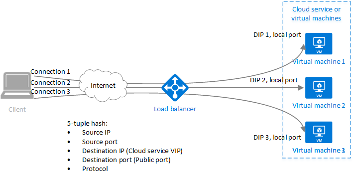

# Azure Load Balancer concepts

Load balancer provides several capabilities for both UDP and TCP applications. 

## Load balancing algorithm
You can create a load-balancing rule to distribute traffic from the frontend to a backend pool. Azure Load Balancer uses a hashing algorithm for distribution of inbound flows (not bytes). Load balancer rewrites the headers of flows to backend pool instances. A server is available to receive new flows when a health probe indicates a healthy back-end endpoint.

By default, Load balancer uses a Five-tuple hash.

The hash includes:

- **Source IP address**
- **Source port**
- **Destination IP address**
- **Destination port**
- **IP protocol number to map flows to available servers**

Affinity to a source IP address is created by using a two or three-tuple hash. Packets of the same flow arrive on the same instance behind the load-balanced front end. 

The source port changes when a client starts a new flow from the same source IP. As a result, the five-tuple hash might cause the traffic to go to a different backend endpoint.
For more information, see [Configure the distribution mode for Azure Load Balancer](./load-balancer-distribution-mode.md).

The following image displays the hash-based distribution:

  

  *Figure: Hash-based distribution*

## Application independence and transparency

Load balancer doesn't directly interact with TCP or UDP or the application layer. Any TCP or UDP application scenario can be supported. Load balancer doesn't close or originate flows or interact with the payload of the flow. Load balancer doesn't provide application layer gateway functionality. Protocol handshakes always occur directly between the client and the back-end pool instance. A response to an inbound flow is always a response from a virtual machine. When the flow arrives on the virtual machine, the original source IP address is also preserved.

* Every endpoint is answered by a VM. For example, a TCP handshake occurs between the client and the selected back-end VM. A response to a request to a front end is a response generated by a back-end VM. When you successfully validate connectivity to a front end, you're validating the connectivity throughout to at least one back-end virtual machine.
* Application payloads are transparent to the load balancer. Any UDP or TCP application can be supported.
* Because the load balancer doesn't interact with the TCP payload and provide TLS offload, you can build comprehensive encrypted scenarios. Using load balancer gains large scale-out for TLS applications by ending the TLS connection on the VM itself. For example, your TLS session keying capacity is only limited by the type and number of VMs you add to the back-end pool.

## Load Balancer Terminology
| Concept | What does it mean? | Detailed document |
| ---------- | ---------- | ----------|
Outbound connections | Flows from the backend pool to public IPs are mapped to the frontend. Azure translates outbound connections to the public frontend IP address via the load-balancing outbound rule. This configuration has the following advantages. Easy upgrade and disaster recovery of services, because the front end can be dynamically mapped to another instance of the service. Easier access control list (ACL) management. ACLs expressed as front-end IPs don't change as services scale up or down or get redeployed. Translating outbound connections to a smaller number of IP addresses than machines reduces the burden of implementing safe recipient lists.| To learn more about Source Network Address Translation (SNAT) and Azure Load Balancer, see [SNAT and Azure Load Balancer](load-balancer-outbound-connections.md#snat).
Availability Zones | Standard load balancer supports additional abilities in regions where Availability Zones are available. These features are incremental to all standard load balancer provides.  Availability Zones configurations are available for both types of Standard load balancer; public and internal.A zone-redundant frontend survives zone failure by using dedicated infrastructure in all of the zones simultaneously. Additionally, you can guarantee a frontend to a specific zone. A zonal frontend is served by dedicated infrastructure in a single zone. Cross-zone load balancing is available for the backend pool. Any virtual machine resource in a virtual network can be part of a backend pool.Basic load balancer doesn't support zones.| Review [detailed discussion of Availability Zones related abilities](load-balancer-standard-availability-zones.md) and [Availability Zones Overview](../availability-zones/az-overview.md) for more information.
| HA Ports | You can configure HA port load-balancing rules to make your application scale and be highly reliable. Load balancing per flow on short-lived ports of the internal load balancer's frontend IP is provided by these rules. The feature is useful when it's impractical or undesirable to specify individual ports. An HA ports rule allows you to create active-passive or active-active n+1 scenarios. These scenarios are for network virtual appliances and any application, which requires large ranges of inbound ports. A health probe can be used to determine which back-ends should be receiving new flows.  You can use a Network Security Group to emulate a port range scenario. Basic load balancer doesn't support HA Ports. | Review [detailed discussion of HA Ports](load-balancer-ha-ports-overview.md)
| Multiple frontends | Load balancer supports multiple rules with multiple frontends.  Standard Load Balancer expands this capability to outbound scenarios. Outbound rules are the inverse of an inbound rule. The outbound rule creates an association for outbound connections. Standard load balancer uses all frontends associated with a virtual machine resource through a load-balancing rule. Additionally, a parameter on the load-balancing rule allows you to suppress a load-balancing rule for the purposes of outbound connectivity, which allows the selection of specific frontends including none. For comparison, Basic load balancer selects a single frontend at random. There isn't an ability to control which frontend was selected.|

## Limitations

- A load balancer rule can't span two virtual networks.  Frontends and their backend instances must be located in the same virtual network.  

- Web Worker Roles without a virtual network and other Microsoft platform services can be accessible from instances behind only a Standard internal Load balancer. Don't rely on this accessibility, as the respective service itself or the underlying platform can change without notice. If outbound connectivity is required when using a standard internal load balancer, [outbound connectivity](load-balancer-outbound-connections.md) must be configured.

- Load balancer provides load balancing and port forwarding for specific TCP or UDP protocols. Load-balancing rules and inbound NAT rules support TCP and UDP, but not other IP protocols including ICMP.

- Outbound flow from a backend VM to a frontend of an internal Load Balancer will fail.

- Forwarding IP fragments isn't supported on load-balancing rules. IP fragmentation of UDP and TCP packets isn't supported on load-balancing rules. HA ports load-balancing rules can be used to forward existing IP fragments. For more information, see [High availability ports overview](load-balancer-ha-ports-overview.md).

## Next steps

- See [Create a public Standard Load Balancer](quickstart-load-balancer-standard-public-portal.md) to get started with using a Load Balancer: create one, create VMs with a custom IIS extension installed, and load balance the web app between the VMs.
- Learn about [Azure Load Balancer outbound connections](load-balancer-outbound-connections.md).
- Learn more about [Azure Load Balancer](load-balancer-overview.md).
- Learn about [Health Probes](load-balancer-custom-probe-overview.md).
- Learn about [Standard Load Balancer Diagnostics](load-balancer-standard-diagnostics.md).
- Learn more about [Network Security Groups](../virtual-network/security-overview.md).
