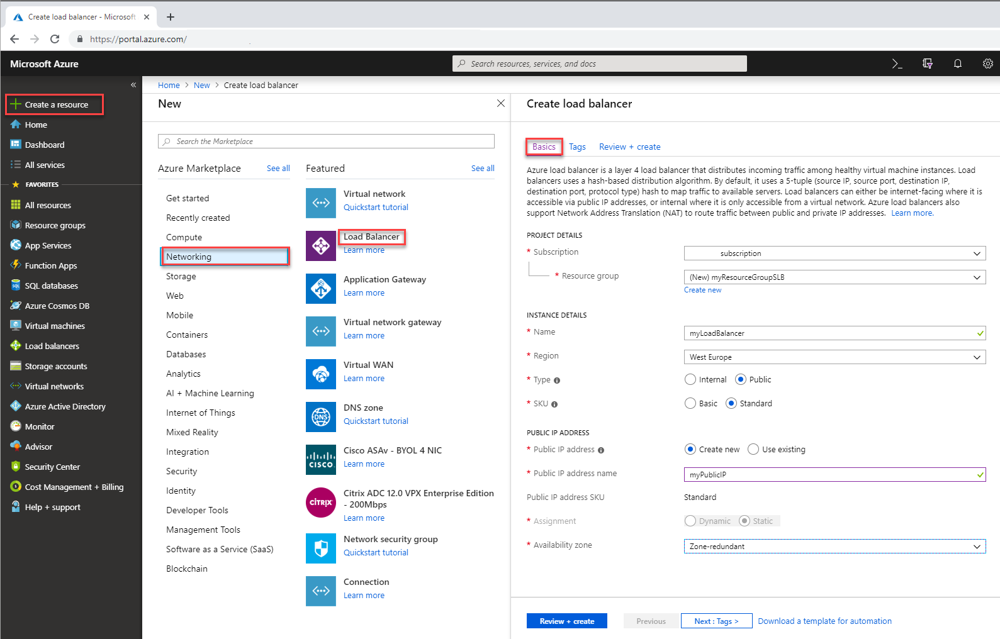

# Configure load balancing and outbound rules in Standard Load Balancer by using the Azure portal

This article shows you how to configure outbound rules in Standard Load Balancer by using the Azure portal.  

The load balancer resource contains two front ends and their associated rules. You have one front end for inbound traffic and another front end for outbound traffic.  

Each front end references a public IP address. In this scenario, the public IP address for inbound traffic is different from the address for outbound traffic.   The load-balancing rule provides only inbound load balancing. The outbound rule controls the outbound network address translation (NAT) for the VM.  

The scenario uses two back-end pools: one for inbound traffic and one for outbound traffic. These pools illustrate capability and provide flexibility for the scenario.

If you don't have an Azure subscription, create a [free account](https://azure.microsoft.com/free/?WT.mc_id=A261C142F) before you begin. 

## Sign in to Azure

Sign in to the Azure portal at [https://portal.azure.com](https://portal.azure.com).

## Create a load balancer

In this section, you create a load balancer that will load balance virtual machines. You can create a public load balancer or an internal load balancer. When you create a public load balancer, you create a new Public IP address that is configured as the frontend for the load balancer. The frontend will be named **LoadBalancerFrontEnd** by default.

1. On the top left-hand side of the screen, select **Create a resource** > **Networking** > **Load Balancer**.
2. In the **Basics** tab of the **Create load balancer** page, enter, or select the following information:

    | Setting                 | Value                                              |
    | ---                     | ---                                                |
    | Subscription               | Select your subscription.    |    
    | Resource group         | Select **Create new** and type **myResourceGroupSLB** in the text box.|
    | Name                   | **myLoadBalancer**                                   |
    | Region         | Select **West Europe**.                                        |
    | Type          | Select **Public**.                                        |
    | SKU           | Select **Standard** or **Basic**. Microsoft recommends Standard for production workloads. |
    | Public IP address | Select **Create new**. If you have an existing Public IP you would like to use, select **Use existing**.  Existing public IP must be **Standard** SKU.  Basic public IPs aren't compatible with **Standard** SKU load balancer.  |
    | Public IP address name              | Type **myPublicIP** in the text box.|
    | Availability zone | Select **Zone-redundant** to create a resilient Load Balancer. To create a zonal Load Balancer, select a specific zone from 1, 2, or 3 |

3. Accept the defaults for the rest of the configuration.
4. Select **Review + create**

    > [!IMPORTANT]
    > The rest of this quickstart assumes that **Standard** SKU is chosen during the SKU selection process above.

5. In the **Review + create** tab, select **Create**.   

    

## Create load balancer resources

In this section, you configure load balancer settings for a backend address pool, a health probe, and specify a balancer rule.

### Create a backend pool

A backend address pool contains the IP addresses of the virtual NICs in the backend pool. Create the backend address pool **myBackendPool** to include virtual machines for load-balancing internet traffic.

1. Select **All services** in the left-hand menu, select **All resources**, and then select **myLoadBalancer** from the resources list.
2. Under **Settings**, select **Backend pools**, then select **Add**.
3. On the **Add a backend pool** page, for name, type **myBackendPool**, as the name for your backend pool, and then select **Add**.

### Create a health probe

A health probe is used to monitor the status of your app. The health probe adds or removes VMs from the load balancer based on their response to health checks. Create a health probe **myHealthProbe** to monitor the health of the VMs.

1. Select **All services** in the left-hand menu, select **All resources**, and then select **myLoadBalancer** from the resources list.
2. Under **Settings**, select **Health probes**, then select **Add**.
    
    | Setting | Value |
    | ------- | ----- |
    | Name | Enter **myHealthProbe**. |
    | Protocol | Select **HTTP**. |
    | Port | Enter **80**.|
    | Interval | Enter **15** for number of **Interval** in seconds between probe attempts. |
    | Unhealthy threshold | Select **2** for number of **Unhealthy threshold** or consecutive probe failures that must occur before a VM is considered unhealthy.|
    | | |
4. Select **OK**.

### Create a load balancer rule
A load balancer rule is used to define how traffic is distributed to the VMs. 

You define the:
 - Frontend IP configuration for the incoming traffic.
 - The backend IP pool to receive the traffic.
 - The required source and destination port. 

In the following section, you create a:
 - Load balancer rule **myHTTPRule** for listening to port 80.
 - Frontend **LoadBalancerFrontEnd**.
 - Backend address pool **myBackEndPool** also using port 80. 

1. Select **All services** in the left-hand menu, select **All resources**, and then select **myLoadBalancer** from the resources list.
2. Under **Settings**, select **Load balancing rules**, then select **Add**.
3. Use these values to configure the load-balancing rule:
    
    | Setting | Value |
    | ------- | ----- |
    | Name | Enter **myHTTPRule**. |
    | Protocol | Select **TCP**. |
    | Port | Enter **80**.|
    | Backend port | Enter **80**. |
    | Backend pool | Select **myBackendPool**.|
    | Health probe | Select **myHealthProbe**. |
    | Create implicit outbound rules | Select **No**. We'll create outbound rules in a later section using a dedicated public IP. |
4. Leave the rest of the defaults and then select **OK**.

## Create outbound rule configuration
Load balancer outbound rules configure outbound SNAT for VMs in the backend pool. 

### Create an outbound public IP address and frontend

1. Select **All services** in the left-hand menu, select **All resources**, and then select **myLoadBalancer** from the resources list.

2. Under **Settings**, select **Frontend IP configuration**, then select **Add**.

3. Use these values to configure the frontend IP configuration for outbound:

    | Setting | Value |
    | ------- | ----- |
    | Name | Enter **LoadBalancerFrontEndOutbound**. |
    | IP version | Select **IPv4**. |
    | IP type | Select **IP address**.|
    | Public IP address | Select **Create new**. In the **Add a public IP address**, enter **myPublicIPOutbound**.  Select **OK**. |

4. Select **Add**.

### Create an outbound backend pool

1. Select **All services** in the left-hand menu, select **All resources**, and then select **myLoadBalancer** from the resources list.

2. Under **Settings**, select **Backend pools**, then select **Add**.

3. On the **Add a backend pool** page, for name, type **myBackendPoolOutbound**, as the name for your backend pool, and then select **Add**.

### Create outbound rule

1. Select **All services** in the left-hand menu, select **All resources**, and then select **myLoadBalancer** from the resources list.

2. Under **Settings**, select **Outbound rules**, then select **Add**.

3. Use these values to configure the outbound rules:

    | Setting | Value |
    | ------- | ----- |
    | Name | Enter **myOutboundRule**. |
    | Frontend IP address | Select **LoadBalancerFrontEndOutbound**. |
    | Idle timeout (minutes) | Move slider to **15 minutes.|
    | TCP Reset | Select **Enabled**.|
    | Backend pool | Select **myBackendPoolOutbound** |
    | Port allocation -> Port allocation | Select **Manually choose number of outbound ports** |
    | Outbound ports -> Choose by | Select **Ports per instance** |
    | Outbound ports -> Ports per instance | Enter **10,000**. |

4. Select **Add**.

## Clean up resources

When no longer needed, delete the resource group, load balancer, and all related resources. Select the resource group **myResourceGroupSLB** that contains the load balancer, and then select **Delete**.

## Next steps

In this article:
 - You created a standard load balancer.
 - Configured both inbound and outbound load-balancer traffic rules.
 - Configured a health probe for the VMs in the back-end pool. 

To learn more, continue to the [tutorials for Azure Load Balancer](tutorial-load-balancer-standard-public-zone-redundant-portal.md).
