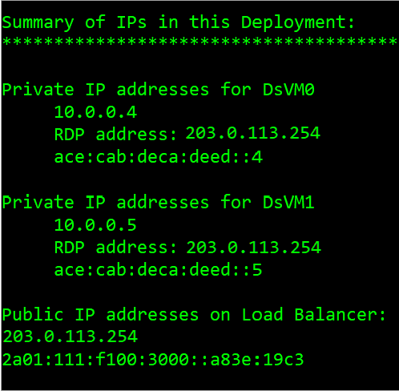

# Deploy IPv6 dual stack application with Azure Load Balancer

This article shows you how to deploy a dual stack (IPv4 + IPv6) application using Standard Load Balancer in Azure. The scenario includes a dual stack virtual network with a dual stack subnet, a Standard Load Balancer with dual (IPv4 + IPv6) frontend configurations, VMs with NICs that have a dual IP configuration, dual network security group rules, and dual public IPs.

## Prerequisites

# [Azure CLI](#tab/azurecli/)

- An Azure account with an active subscription. [Create an account for free](https://azure.microsoft.com/free/?WT.mc_id=A261C142F).

[!INCLUDE [azure-cli-prepare-your-environment-no-header.md](~/reusable-content/azure-cli/azure-cli-prepare-your-environment-no-header.md)]

# [Azure PowerShell](#tab/azurepowershell/)

- An Azure account with an active subscription. [Create an account for free](https://azure.microsoft.com/free/?WT.mc_id=A261C142F).

# [ARM template](#tab/arm-template/)

- An Azure account with an active subscription. [Create an account for free](https://azure.microsoft.com/free/?WT.mc_id=A261C142F).

---

## Deploy a dual stack (IPv4 + IPv6) application

# [Azure PowerShell](#tab/azurepowershell/)

Follow these instructions in Azure PowerShell to deploy a dual stack (IPv4 + IPv6) application using Standard Load Balancer in Azure.

## Create a resource group

Before you can create your dual-stack virtual network, you must create a resource group with [New-AzResourceGroup](/powershell/module/az.resources/new-azresourcegroup). The following example creates a resource group named *myRGDualStack* in the *east us* location:

```azurepowershell-interactive
   $rg = New-AzResourceGroup `
  -ResourceGroupName "dsRG1"  `
  -Location "east us"
```

## Create IPv4 and IPv6 public IP addresses
To access your virtual machines from the Internet, you need IPv4 and IPv6 public IP addresses for the load balancer. Create public IP addresses with [New-AzPublicIpAddress](/powershell/module/az.network/new-azpublicipaddress). The following example creates IPv4 and IPv6 public IP address named *dsPublicIP_v4* and *dsPublicIP_v6* in the *dsRG1* resource group:

```azurepowershell-interactive
$PublicIP_v4 = New-AzPublicIpAddress `
  -Name "dsPublicIP_v4" `
  -ResourceGroupName $rg.ResourceGroupName `
  -Location $rg.Location  `
  -AllocationMethod Static `
  -IpAddressVersion IPv4 `
  -Sku Standard
  
$PublicIP_v6 = New-AzPublicIpAddress `
  -Name "dsPublicIP_v6" `
  -ResourceGroupName $rg.ResourceGroupName `
  -Location $rg.Location  `
  -AllocationMethod Static `
  -IpAddressVersion IPv6 `
  -Sku Standard
```
To access your virtual machines using a RDP connection, create an IPV4 public IP addresses for the virtual machines with [New-AzPublicIpAddress](/powershell/module/az.network/new-azpublicipaddress).

```azurepowershell-interactive
  $RdpPublicIP_1 = New-AzPublicIpAddress `
  -Name "RdpPublicIP_1" `
  -ResourceGroupName $rg.ResourceGroupName `
  -Location $rg.Location  `
  -AllocationMethod Static `
  -Sku Standard `
  -IpAddressVersion IPv4
  
  $RdpPublicIP_2 = New-AzPublicIpAddress `
   -Name "RdpPublicIP_2" `
   -ResourceGroupName $rg.ResourceGroupName `
   -Location $rg.Location  `
   -AllocationMethod Static `
   -Sku Standard `
   -IpAddressVersion IPv4
```

## Create Standard Load Balancer

In this section, you configure dual frontend IP (IPv4 and IPv6) and the backend address pool for the load balancer and then create a Standard Load Balancer.

### Create frontend IP

Create a frontend IP with [New-AzLoadBalancerFrontendIpConfig](/powershell/module/az.network/new-azloadbalancerfrontendipconfig). The following example creates IPv4 and IPv6 frontend IP configurations named *dsLbFrontEnd_v4* and *dsLbFrontEnd_v6*:

```azurepowershell-interactive
$frontendIPv4 = New-AzLoadBalancerFrontendIpConfig `
  -Name "dsLbFrontEnd_v4" `
  -PublicIpAddress $PublicIP_v4

$frontendIPv6 = New-AzLoadBalancerFrontendIpConfig `
  -Name "dsLbFrontEnd_v6" `
  -PublicIpAddress $PublicIP_v6

```

### Configure backend address pool

Create a backend address pool with [New-AzLoadBalancerBackendAddressPoolConfig](/powershell/module/az.network/new-azloadbalancerbackendaddresspoolconfig) for the virtual machines deployed later. The following example creates backend address pools named *dsLbBackEndPool_v4* and *dsLbBackEndPool_v6* to include virtual machines with both IPV4 and IPv6 NIC configurations:

```azurepowershell-interactive
$backendPoolv4 = New-AzLoadBalancerBackendAddressPoolConfig `
-Name "dsLbBackEndPool_v4"

$backendPoolv6 = New-AzLoadBalancerBackendAddressPoolConfig `
-Name "dsLbBackEndPool_v6"
```
### Create a health probe
Use [Add-AzLoadBalancerProbeConfig](/powershell/module/az.network/add-azloadbalancerprobeconfig) to create a health probe to monitor the health of the VMs.
```azurepowershell
$probe = New-AzLoadBalancerProbeConfig -Name MyProbe -Protocol tcp -Port 3389 -IntervalInSeconds 15 -ProbeCount 2
```
### Create a load balancer rule

A load balancer rule is used to define how traffic is distributed to the VMs. You define the frontend IP configuration for the incoming traffic and the backend IP pool to receive the traffic, along with the required source and destination port. To make sure only healthy VMs receive traffic, you can optionally define a health probe. Basic load balancer uses an IPv4 probe to assess health for both IPv4 and IPv6 endpoints on the VMs. Standard load balancer includes support for explicitly IPv6 health probes.

Create a load balancer rule with [Add-AzLoadBalancerRuleConfig](/powershell/module/az.network/add-azloadbalancerruleconfig). The following example creates load balancer rules named *dsLBrule_v4* and *dsLBrule_v6* and balances traffic on *TCP* port *80* to the IPv4 and IPv6 frontend IP configurations:

```azurepowershell-interactive
$lbrule_v4 = New-AzLoadBalancerRuleConfig `
  -Name "dsLBrule_v4" `
  -FrontendIpConfiguration $frontendIPv4 `
  -BackendAddressPool $backendPoolv4 `
  -Protocol Tcp `
  -FrontendPort 80 `
  -BackendPort 80 `
   -probe $probe

$lbrule_v6 = New-AzLoadBalancerRuleConfig `
  -Name "dsLBrule_v6" `
  -FrontendIpConfiguration $frontendIPv6 `
  -BackendAddressPool $backendPoolv6 `
  -Protocol Tcp `
  -FrontendPort 80 `
  -BackendPort 80 `
   -probe $probe
```

### Create load balancer

Create a Standard Load Balancer with [New-AzLoadBalancer](/powershell/module/az.network/new-azloadbalancer). The following example creates a public Standard Load Balancer named *myLoadBalancer* using the IPv4 and IPv6 frontend IP configurations, backend pools, and load-balancing rules that you created in the preceding steps:

```azurepowershell-interactive
$lb = New-AzLoadBalancer `
-ResourceGroupName $rg.ResourceGroupName `
-Location $rg.Location  `
-Name "MyLoadBalancer" `
-Sku "Standard" `
-FrontendIpConfiguration $frontendIPv4,$frontendIPv6 `
-BackendAddressPool $backendPoolv4,$backendPoolv6 `
-LoadBalancingRule $lbrule_v4,$lbrule_v6 `
-Probe $probe
```

## Create network resources
Before you deploy some VMs and can test your balancer, you must create supporting network resources - availability set, network security group, virtual network, and virtual NICs. 

### Create an availability set
To improve the high availability of your app, place your VMs in an availability set.

Create an availability set with [New-AzAvailabilitySet](/powershell/module/az.compute/new-azavailabilityset). The following example creates an availability set named *myAvailabilitySet*:

```azurepowershell-interactive
$avset = New-AzAvailabilitySet `
  -ResourceGroupName $rg.ResourceGroupName `
  -Location $rg.Location  `
  -Name "dsAVset" `
  -PlatformFaultDomainCount 2 `
  -PlatformUpdateDomainCount 2 `
  -Sku aligned
```

### Create network security group

Create a network security group for the rules that govern inbound and outbound communication in your virtual network.

#### Create a network security group rule for port 3389

Create a network security group rule to allow RDP connections through port 3389 with [New-AzNetworkSecurityRuleConfig](/powershell/module/az.network/new-aznetworksecurityruleconfig).

```azurepowershell-interactive
$rule1 = New-AzNetworkSecurityRuleConfig `
-Name 'myNetworkSecurityGroupRuleRDP' `
-Description 'Allow RDP' `
-Access Allow `
-Protocol Tcp `
-Direction Inbound `
-Priority 100 `
-SourceAddressPrefix * `
-SourcePortRange * `
-DestinationAddressPrefix * `
-DestinationPortRange 3389
```
#### Create a network security group rule for port 80

Create a network security group rule to allow internet connections through port 80 with [New-AzNetworkSecurityRuleConfig](/powershell/module/az.network/new-aznetworksecurityruleconfig).

```azurepowershell-interactive
$rule2 = New-AzNetworkSecurityRuleConfig `
  -Name 'myNetworkSecurityGroupRuleHTTP' `
  -Description 'Allow HTTP' `
  -Access Allow `
  -Protocol Tcp `
  -Direction Inbound `
  -Priority 200 `
  -SourceAddressPrefix * `
  -SourcePortRange * `
  -DestinationAddressPrefix * `
  -DestinationPortRange 80
```
#### Create a network security group

Create a network security group with [New-AzNetworkSecurityGroup](/powershell/module/az.network/new-aznetworksecuritygroup).

```azurepowershell-interactive
$nsg = New-AzNetworkSecurityGroup `
-ResourceGroupName $rg.ResourceGroupName `
-Location $rg.Location  `
-Name "dsNSG1"  `
-SecurityRules $rule1,$rule2
```
### Create a virtual network

Create a virtual network with [New-AzVirtualNetwork](/powershell/module/az.network/new-azvirtualnetwork). The following example creates a virtual network named *dsVnet* with *mySubnet*:

```azurepowershell-interactive
# Create dual stack subnet
$subnet = New-AzVirtualNetworkSubnetConfig `
-Name "dsSubnet" `
-AddressPrefix "10.0.0.0/24","fd00:db8:deca:deed::/64"

# Create the virtual network
$vnet = New-AzVirtualNetwork `
  -ResourceGroupName $rg.ResourceGroupName `
  -Location $rg.Location  `
  -Name "dsVnet" `
  -AddressPrefix "10.0.0.0/16","fd00:db8:deca::/48"  `
  -Subnet $subnet
```

### Create NICs

Create virtual NICs with [New-AzNetworkInterface](/powershell/module/az.network/new-aznetworkinterface). The following example creates two virtual NICs both with IPv4 and IPv6 configurations. (One virtual NIC for each VM you create for your app in the following steps).

```azurepowershell-interactive
  $Ip4Config=New-AzNetworkInterfaceIpConfig `
    -Name dsIp4Config `
    -Subnet $vnet.subnets[0] `
    -PrivateIpAddressVersion IPv4 `
    -LoadBalancerBackendAddressPool $backendPoolv4 `
    -PublicIpAddress  $RdpPublicIP_1
      
  $Ip6Config=New-AzNetworkInterfaceIpConfig `
    -Name dsIp6Config `
    -Subnet $vnet.subnets[0] `
    -PrivateIpAddressVersion IPv6 `
    -LoadBalancerBackendAddressPool $backendPoolv6
    
  $NIC_1 = New-AzNetworkInterface `
    -Name "dsNIC1" `
    -ResourceGroupName $rg.ResourceGroupName `
    -Location $rg.Location  `
    -NetworkSecurityGroupId $nsg.Id `
    -IpConfiguration $Ip4Config,$Ip6Config 
    
  $Ip4Config=New-AzNetworkInterfaceIpConfig `
    -Name dsIp4Config `
    -Subnet $vnet.subnets[0] `
    -PrivateIpAddressVersion IPv4 `
    -LoadBalancerBackendAddressPool $backendPoolv4 `
    -PublicIpAddress  $RdpPublicIP_2  

  $NIC_2 = New-AzNetworkInterface `
    -Name "dsNIC2" `
    -ResourceGroupName $rg.ResourceGroupName `
    -Location $rg.Location  `
    -NetworkSecurityGroupId $nsg.Id `
    -IpConfiguration $Ip4Config,$Ip6Config 

```

### Create virtual machines

Set an administrator username and password for the VMs with [Get-Credential](/powershell/module/microsoft.powershell.security/get-credential):

```azurepowershell-interactive
$cred = get-credential -Message "DUAL STACK VNET SAMPLE:  Please enter the Administrator credential to log into the VMs."
```

Now you can create the VMs with [New-AzVM](/powershell/module/az.compute/new-azvm). The following example creates two VMs and the required virtual network components if they don't already exist. 

```azurepowershell-interactive
$vmsize = "Standard_A2"
$ImagePublisher = "MicrosoftWindowsServer"
$imageOffer = "WindowsServer"
$imageSKU = "2019-Datacenter"

$vmName= "dsVM1"
$VMconfig1 = New-AzVMConfig -VMName $vmName -VMSize $vmsize -AvailabilitySetId $avset.Id 3> $null | Set-AzVMOperatingSystem -Windows -ComputerName $vmName -Credential $cred -ProvisionVMAgent 3> $null | Set-AzVMSourceImage -PublisherName $ImagePublisher -Offer $imageOffer -Skus $imageSKU -Version "latest" 3> $null | Set-AzVMOSDisk -Name "$vmName.vhd" -CreateOption fromImage  3> $null | Add-AzVMNetworkInterface -Id $NIC_1.Id  3> $null 
$VM1 = New-AzVM -ResourceGroupName $rg.ResourceGroupName  -Location $rg.Location  -VM $VMconfig1 

$vmName= "dsVM2"
$VMconfig2 = New-AzVMConfig -VMName $vmName -VMSize $vmsize -AvailabilitySetId $avset.Id 3> $null | Set-AzVMOperatingSystem -Windows -ComputerName $vmName -Credential $cred -ProvisionVMAgent 3> $null | Set-AzVMSourceImage -PublisherName $ImagePublisher -Offer $imageOffer -Skus $imageSKU -Version "latest" 3> $null | Set-AzVMOSDisk -Name "$vmName.vhd" -CreateOption fromImage  3> $null | Add-AzVMNetworkInterface -Id $NIC_2.Id  3> $null 
$VM2 = New-AzVM -ResourceGroupName $rg.ResourceGroupName  -Location $rg.Location  -VM $VMconfig2
```

## Determine IP addresses of the IPv4 and IPv6 endpoints

Get all Network Interface Objects in the resource group to summarize the IPs used in this deployment with `get-AzNetworkInterface`. Also, get the Load Balancer's frontend addresses of the IPv4 and IPv6 endpoints with `get-AzpublicIpAddress`.

```azurepowershell-interactive
$rgName= "dsRG1"
$NICsInRG= get-AzNetworkInterface -resourceGroupName $rgName 
write-host `nSummary of IPs in this Deployment: 
write-host ******************************************
foreach ($NIC in $NICsInRG) {
 
    $VMid= $NIC.virtualmachine.id 
    $VMnamebits= $VMid.split("/") 
    $VMname= $VMnamebits[($VMnamebits.count-1)] 
    write-host `nPrivate IP addresses for $VMname 
    $IPconfigsInNIC= $NIC.IPconfigurations 
    foreach ($IPconfig in $IPconfigsInNIC) {
 
        $IPaddress= $IPconfig.privateipaddress 
        write-host "    "$IPaddress 
        IF ($IPconfig.PublicIpAddress.ID) {
 
            $IDbits= ($IPconfig.PublicIpAddress.ID).split("/")
            $PipName= $IDbits[($IDbits.count-1)]
            $PipObject= get-azPublicIpAddress -name $PipName -resourceGroup $rgName
            write-host "    "RDP address:  $PipObject.IpAddress
                 }
         }
 }
 
 
 
  write-host `nPublic IP addresses on Load Balancer:
 
  (get-AzpublicIpAddress -resourcegroupname $rgName | where { $_.name -notlike "RdpPublicIP*" }).IpAddress
```
The following figure shows a sample output that lists the private IPv4 and IPv6 addresses of the two VMs, and the frontend IPv4 and IPv6 IP addresses of the Load Balancer.



## View IPv6 dual stack virtual network in Azure portal

You can view the IPv6 dual stack virtual network in Azure portal as follows:
1. In the portal's search bar, enter *dsVnet*.
2. When **dsVnet** appears in the search results, select it. This launches the **Overview** page of the dual stack virtual network named *dsVnet*. The dual stack virtual network shows the two NICs with both IPv4 and IPv6 configurations located in the dual stack subnet named *dsSubnet*.

## Clean up resources

When no longer needed, you can use the [Remove-AzResourceGroup](/powershell/module/az.resources/remove-azresourcegroup) command to remove the resource group, VM, and all related resources.

```azurepowershell-interactive
Remove-AzResourceGroup -Name dsRG1
```

# [Azure CLI](#tab/azurecli/)

Follow these instructions in Azure CLI to deploy a dual stack (IPv4 + IPv6) application using Standard Load Balancer in Azure. 

## Create a resource group

Before you can create your dual-stack virtual network, you must create a resource group with [az group create](/cli/azure/group). The following example creates a resource group named *DsResourceGroup01* in the *eastus* location:

```azurecli-interactive
az group create \
--name DsResourceGroup01 \
--location eastus
```

## Create IPv4 and IPv6 public IP addresses for load balancer
To access your IPv4 and IPv6 endpoints on the Internet, you need IPv4 and IPv6 public IP addresses for the load balancer. Create a public IP address with [az network public-ip create](/cli/azure/network/public-ip). The following example creates IPv4 and IPv6 public IP address named *dsPublicIP_v4* and *dsPublicIP_v6* in the *DsResourceGroup01* resource group:

```azurecli-interactive
# Create an IPV4 IP address
az network public-ip create \
--name dsPublicIP_v4  \
--resource-group DsResourceGroup01  \
--location eastus  \
--sku STANDARD  \
--allocation-method static  \
--version IPv4

# Create an IPV6 IP address
az network public-ip create \
--name dsPublicIP_v6  \
--resource-group DsResourceGroup01  \
--location eastus \
--sku STANDARD  \
--allocation-method static  \
--version IPv6

```

## Create public IP addresses for VMs

To remotely access your VMs on the internet, you need IPv4 public IP addresses for the VMs. Create a public IP address with [az network public-ip create](/cli/azure/network/public-ip).

```azurecli-interactive
az network public-ip create \
--name dsVM0_remote_access  \
--resource-group DsResourceGroup01 \
--location eastus  \
--sku Standard  \
--allocation-method static  \
--version IPv4

az network public-ip create \
--name dsVM1_remote_access  \
--resource-group DsResourceGroup01  \
--location eastus  \
--sku Standard  \
--allocation-method static  \
--version IPv4
```

## Create Standard Load Balancer

In this section, you configure dual frontend IP (IPv4 and IPv6) and the backend address pool for the load balancer and then create a Standard Load Balancer.

### Create load balancer

Create the Standard Load Balancer with [az network lb create](/cli/azure/network/lb) named **dsLB** that includes a frontend pool named **dsLbFrontEnd_v4**, a backend pool named **dsLbBackEndPool_v4** that is associated with the IPv4 public IP address **dsPublicIP_v4** that you created in the preceding step. 

```azurecli-interactive
az network lb create \
--name dsLB  \
--resource-group DsResourceGroup01 \
--sku Standard \
--location eastus \
--frontend-ip-name dsLbFrontEnd_v4  \
--public-ip-address dsPublicIP_v4  \
--backend-pool-name dsLbBackEndPool_v4
```

### Create IPv6 frontend

Create an IPV6 frontend IP with [az network lb frontend-ip create](/cli/azure/network/lb/frontend-ip#az-network-lb-frontend-ip-create). The following example creates a frontend IP configuration named *dsLbFrontEnd_v6* and attaches the *dsPublicIP_v6* address:

```azurecli-interactive
az network lb frontend-ip create \
--lb-name dsLB  \
--name dsLbFrontEnd_v6  \
--resource-group DsResourceGroup01  \
--public-ip-address dsPublicIP_v6

```

### Configure IPv6 backend address pool

Create a IPv6 backend address pools with [az network lb address-pool create](/cli/azure/network/lb/address-pool#az-network-lb-address-pool-create). The following example creates backend address pool named *dsLbBackEndPool_v6*  to include VMs with IPv6 NIC configurations:

```azurecli-interactive
az network lb address-pool create \
--lb-name dsLB  \
--name dsLbBackEndPool_v6  \
--resource-group DsResourceGroup01
```

### Create a health probe
Create a health probe with [az network lb probe create](/cli/azure/network/lb/probe) to monitor the health of the virtual machines. 

```azurecli-interactive
az network lb probe create -g DsResourceGroup01  --lb-name dsLB -n dsProbe --protocol tcp --port 3389
```

### Create a load balancer rule

A load balancer rule is used to define how traffic is distributed to the VMs. You define the frontend IP configuration for the incoming traffic and the backend IP pool to receive the traffic, along with the required source and destination port. 

Create a load balancer rule with [az network lb rule create](/cli/azure/network/lb/rule#az-network-lb-rule-create). The following example creates load balancer rules named *dsLBrule_v4* and *dsLBrule_v6* and balances traffic on *TCP* port *80* to the IPv4 and IPv6 frontend IP configurations:

```azurecli-interactive
az network lb rule create \
--lb-name dsLB  \
--name dsLBrule_v4  \
--resource-group DsResourceGroup01  \
--frontend-ip-name dsLbFrontEnd_v4  \
--protocol Tcp  \
--frontend-port 80  \
--backend-port 80  \
--probe-name dsProbe \
--backend-pool-name dsLbBackEndPool_v4


az network lb rule create \
--lb-name dsLB  \
--name dsLBrule_v6  \
--resource-group DsResourceGroup01 \
--frontend-ip-name dsLbFrontEnd_v6  \
--protocol Tcp  \
--frontend-port 80 \
--backend-port 80  \
--probe-name dsProbe \
--backend-pool-name dsLbBackEndPool_v6

```

## Create network resources
Before you deploy some VMs, you must create supporting network resources - availability set, network security group, virtual network, and virtual NICs. 
### Create an availability set
To improve the availability of your app, place your VMs in an availability set.

Create an availability set with [az vm availability-set create](/cli/azure/vm/availability-set). The following example creates an availability set named *dsAVset*:

```azurecli-interactive
az vm availability-set create \
--name dsAVset  \
--resource-group DsResourceGroup01  \
--location eastus \
--platform-fault-domain-count 2  \
--platform-update-domain-count 2  
```

### Create network security group

Create a network security group for the rules that govern inbound and outbound communication in your virtual network.

#### Create a network security group

Create a network security group with [az network nsg create](/cli/azure/network/nsg#az-network-nsg-create)


```azurecli-interactive
az network nsg create \
--name dsNSG1  \
--resource-group DsResourceGroup01  \
--location eastus

```

#### Create a network security group rule for inbound and outbound connections

Create a network security group rule to allow RDP connections through port 3389, internet connection through port 80, and for outbound connections with [az network nsg rule create](/cli/azure/network/nsg/rule#az-network-nsg-rule-create).

```azurecli-interactive
# Create inbound rule for port 3389
az network nsg rule create \
--name allowRdpIn  \
--nsg-name dsNSG1  \
--resource-group DsResourceGroup01  \
--priority 100  \
--description "Allow Remote Desktop In"  \
--access Allow  \
--protocol "*"  \
--direction Inbound  \
--source-address-prefixes "*"  \
--source-port-ranges "*"  \
--destination-address-prefixes "*"  \
--destination-port-ranges 3389

# Create inbound rule for port 80
az network nsg rule create \
--name allowHTTPIn  \
--nsg-name dsNSG1  \
--resource-group DsResourceGroup01  \
--priority 200  \
--description "Allow HTTP In"  \
--access Allow  \
--protocol "*"  \
--direction Inbound  \
--source-address-prefixes "*"  \
--source-port-ranges 80  \
--destination-address-prefixes "*"  \
--destination-port-ranges 80

# Create outbound rule

az network nsg rule create \
--name allowAllOut  \
--nsg-name dsNSG1  \
--resource-group DsResourceGroup01  \
--priority 300  \
--description "Allow All Out"  \
--access Allow  \
--protocol "*"  \
--direction Outbound  \
--source-address-prefixes "*"  \
--source-port-ranges "*"  \
--destination-address-prefixes "*"  \
--destination-port-ranges "*"
```


### Create a virtual network

Create a virtual network with [az network vnet create](/cli/azure/network/vnet#az-network-vnet-create). The following example creates a virtual network named *dsVNET* with subnets *dsSubNET_v4* and *dsSubNET_v6*:

```azurecli-interactive
# Create the virtual network
az network vnet create \
--name dsVNET \
--resource-group DsResourceGroup01 \
--location eastus  \
--address-prefixes "10.0.0.0/16" "fd00:db8:deca::/48"

# Create a single dual stack subnet

az network vnet subnet create \
--name dsSubNET \
--resource-group DsResourceGroup01 \
--vnet-name dsVNET \
--address-prefixes "10.0.0.0/24" "fd00:db8:deca:deed::/64" \
--network-security-group dsNSG1
```

### Create NICs

Create virtual NICs for each VM with [az network nic create](/cli/azure/network/nic#az-network-nic-create). The following example creates a virtual NIC for each VM. Each NIC has two IP configurations (1 IPv4 config, 1 IPv6 config). You create the IPV6 configuration with [az network nic ip-config create](/cli/azure/network/nic/ip-config#az-network-nic-ip-config-create).
 
```azurecli-interactive
# Create NICs
az network nic create \
--name dsNIC0  \
--resource-group DsResourceGroup01 \
--network-security-group dsNSG1  \
--vnet-name dsVNET  \
--subnet dsSubNet  \
--private-ip-address-version IPv4 \
--lb-address-pools dsLbBackEndPool_v4  \
--lb-name dsLB  \
--public-ip-address dsVM0_remote_access

az network nic create \
--name dsNIC1 \
--resource-group DsResourceGroup01 \
--network-security-group dsNSG1 \
--vnet-name dsVNET \
--subnet dsSubNet \
--private-ip-address-version IPv4 \
--lb-address-pools dsLbBackEndPool_v4 \
--lb-name dsLB \
--public-ip-address dsVM1_remote_access

# Create IPV6 configurations for each NIC

az network nic ip-config create \
--name dsIp6Config_NIC0  \
--nic-name dsNIC0  \
--resource-group DsResourceGroup01 \
--vnet-name dsVNET \
--subnet dsSubNet \
--private-ip-address-version IPv6 \
--lb-address-pools dsLbBackEndPool_v6 \
--lb-name dsLB

az network nic ip-config create \
--name dsIp6Config_NIC1 \
--nic-name dsNIC1 \
--resource-group DsResourceGroup01 \
--vnet-name dsVNET \
--subnet dsSubNet \
--private-ip-address-version IPv6 \
--lb-address-pools dsLbBackEndPool_v6 \
--lb-name dsLB
```

### Create virtual machines

Create the VMs with [az vm create](/cli/azure/vm#az-vm-create). The following example creates two VMs and the required virtual network components if they don't already exist. 

Create virtual machine *dsVM0* as follows:

```azurecli-interactive
 az vm create \
--name dsVM0 \
--resource-group DsResourceGroup01 \
--nics dsNIC0 \
--size Standard_A2 \
--availability-set dsAVset \
--image MicrosoftWindowsServer:WindowsServer:2019-Datacenter:latest  
```

Create virtual machine *dsVM1* as follows:

```azurecli-interactive
az vm create \
--name dsVM1 \
--resource-group DsResourceGroup01 \
--nics dsNIC1 \
--size Standard_A2 \
--availability-set dsAVset \
--image MicrosoftWindowsServer:WindowsServer:2019-Datacenter:latest 
```

## View IPv6 dual stack virtual network in Azure portal

You can view the IPv6 dual stack virtual network in Azure portal as follows:
1. In the portal's search bar, enter *dsVnet*.
2. When **myVirtualNetwork** appears in the search results, select it. This launches the **Overview** page of the dual stack virtual network named *dsVnet*. The dual stack virtual network shows the two NICs with both IPv4 and IPv6 configurations located in the dual stack subnet named *dsSubnet*.

## Clean up resources

When no longer needed, you can use the [az group delete](/cli/azure/group#az-group-delete) command to remove the resource group, VM, and all related resources.

```azurecli-interactive
 az group delete --name DsResourceGroup01
```

# [ARM template](#tab/arm-template/)

Use the template described in this article to deploy a dual stack (IPv4 + IPv6) application using Standard Load Balancer in Azure.

## Required configurations

Search for the template sections in the template to see where they should occur.

### IPv6 addressSpace for the virtual network

Template section to add:

```JSON
        "addressSpace": {
          "addressPrefixes": [
            "[variables('vnetv4AddressRange')]",
            "[variables('vnetv6AddressRange')]"    
```

### IPv6 subnet within the IPv6 virtual network addressSpace

Template section to add:
```JSON
          {
            "name": "V6Subnet",
            "properties": {
              "addressPrefix": "[variables('subnetv6AddressRange')]"
            }

```

### IPv6 configuration for the NIC

Template section to add:
```JSON
          {
            "name": "ipconfig-v6",
            "properties": {
              "privateIPAllocationMethod": "Dynamic",
          "privateIPAddressVersion":"IPv6",
              "subnet": {
                "id": "[variables('v6-subnet-id')]"
              },
              "loadBalancerBackendAddressPools": [
                {
                  "id": "[concat(resourceId('Microsoft.Network/loadBalancers','loadBalancer'),'/backendAddressPools/LBBAP-v6')]"
                }
```

### IPv6 network security group (NSG) rules

```JSON
          {
            "name": "default-allow-rdp",
            "properties": {
              "description": "Allow RDP",
              "protocol": "Tcp",
              "sourcePortRange": "33819-33829",
              "destinationPortRange": "5000-6000",
              "sourceAddressPrefix": "fd00:db8:deca:deed::/64",
              "destinationAddressPrefix": "fd00:db8:deca:deed::/64",
              "access": "Allow",
              "priority": 1003,
              "direction": "Inbound"
            }
```

## Conditional configuration

If you're using a network virtual appliance, add IPv6 routes in the Route Table. Otherwise, this configuration is optional.

```JSON
    {
      "type": "Microsoft.Network/routeTables",
      "name": "v6route",
      "apiVersion": "[variables('ApiVersion')]",
      "location": "[resourceGroup().location]",
      "properties": {
        "routes": [
          {
            "name": "v6route",
            "properties": {
              "addressPrefix": "fd00:db8:deca:deed::/64",
              "nextHopType": "VirtualAppliance",
              "nextHopIpAddress": "fd00:db8:ace:f00d::1"
            }
```

## Optional configuration

### IPv6 Internet access for the virtual network

```JSON
{
            "name": "LBFE-v6",
            "properties": {
              "publicIPAddress": {
                "id": "[resourceId('Microsoft.Network/publicIPAddresses','lbpublicip-v6')]"
              }
```

### IPv6 Public IP addresses

```JSON
    {
      "apiVersion": "[variables('ApiVersion')]",
      "type": "Microsoft.Network/publicIPAddresses",
      "name": "lbpublicip-v6",
      "location": "[resourceGroup().location]",
      "sku": {
        "name": "Standard"
      },
      "properties": {
        "publicIPAllocationMethod": "Static",
        "publicIPAddressVersion": "IPv6"
      }
```

### IPv6 Front end for Load Balancer

```JSON
          {
            "name": "LBFE-v6",
            "properties": {
              "publicIPAddress": {
                "id": "[resourceId('Microsoft.Network/publicIPAddresses','lbpublicip-v6')]"
              }
```

### IPv6 Backend address pool for Load Balancer

```JSON
              "backendAddressPool": {
                "id": "[concat(resourceId('Microsoft.Network/loadBalancers', 'loadBalancer'), '/backendAddressPools/LBBAP-v6')]"
              },
              "protocol": "Tcp",
              "frontendPort": 8080,
              "backendPort": 8080
            },
            "name": "lbrule-v6"
```

### IPv6 load balancer rules to associate incoming and outgoing ports

```JSON
          {
            "name": "ipconfig-v6",
            "properties": {
              "privateIPAllocationMethod": "Dynamic",
          "privateIPAddressVersion":"IPv6",
              "subnet": {
                "id": "[variables('v6-subnet-id')]"
              },
              "loadBalancerBackendAddressPools": [
                {
                  "id": "[concat(resourceId('Microsoft.Network/loadBalancers','loadBalancer'),'/backendAddressPools/LBBAP-v6')]"
                }
```

## Sample VM template JSON
To deploy an IPv6 dual stack application in Azure virtual network using Azure Resource Manager template, view sample template [here](https://azure.microsoft.com/resources/templates/ipv6-in-vnet-stdlb/).

---

## Next steps

> [!div class="nextstepaction"]
> [What is IPv6 for Azure Virtual Network?](../virtual-network/ip-services/ipv6-overview.md)