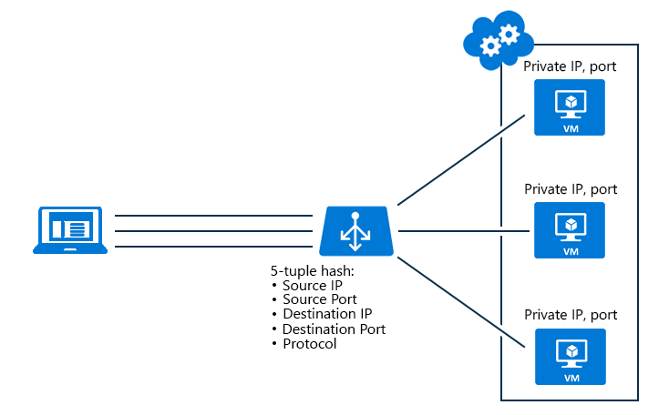

# Azure Load Balancer distribution modes

Azure Load Balancer supports two distribution modes for routing connections to your load-balanced application:

* Hash based
* Source IP affinity

## Hash based

The default distribution mode for Azure Load Balancer is a five-tuple hash. 

The tuple is composed of the:
* **Source IP**
* **Source port**
* **Destination IP**
* **Destination port**
* **Protocol type**

The hash is used to map traffic to the available servers. The algorithm provides stickiness only within a transport session. Packets that are in the same session are directed to the same datacenter IP behind the load-balanced endpoint. When the client starts a new session from the same source IP, the source port changes and causes the traffic to go to a different datacenter endpoint.

Hash-based mode has one configuration type:

* **None (hash-based)** - Specifies that successive requests from the same client may be handled by any virtual machine.

## Source IP affinity

This distribution mode is also known as session affinity or client IP affinity. The mode uses a two-tuple (source IP and destination IP) or three-tuple (source IP, destination IP, and protocol type) hash to map traffic to the available servers. 

By using source IP affinity, connections that are started from the same client computer go to the same datacenter endpoint.

The following figure illustrates a two-tuple configuration. Notice how the two-tuple runs through the load balancer to virtual machine 1 (VM1). VM1 is then backed up by VM2 and VM3.

Source IP affinity mode has two configuration types:

* **Client IP (source IP affinity 2-tuple)** - Specifies that successive requests from the same client IP address will be handled by the same virtual machine.
* **Client IP and protocol (source IP affinity 3-tuple)** - Specifies that successive requests from the same client IP address and protocol combination will be handled by the same virtual machine.

## Use cases

Source IP affinity with client IP and protocol (source IP affinity 3-tuple), solves an incompatibility between Azure Load Balancer and Remote Desktop Gateway (RD Gateway). 

Another use case scenario is media upload. The data upload happens through UDP, but the control plane is achieved through TCP:

* A client starts a TCP session to the load-balanced public address and is directed to a specific DIP. The channel is left active to monitor the connection health.
* A new UDP session from the same client computer is started to the same load-balanced public endpoint. The connection is directed to the same DIP endpoint as the previous TCP connection. The media upload can be executed at high throughput while maintaining a control channel through TCP.

> [!NOTE]
> When a load-balanced set changes by removing or adding a virtual machine, the distribution of client requests is recomputed. You can't depend on new connections from existing clients to end up at the same server. Additionally, using source IP affinity distribution mode can cause an unequal distribution of traffic. Clients that run behind proxies might be seen as one unique client application.

## Next steps

For more information on how to configure the distribution mode of Azure Load Balancer, see [Configure the distribution mode for Azure Load Balancer](load-balancer-distribution-mode.md).

