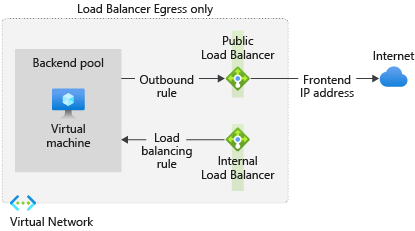

# Outbound-only load balancer configuration

Use a combination of internal and external standard load balancers to create outbound connectivity for VMs behind an internal load balancer. 

This configuration provides outbound NAT for an internal load balancer scenario, producing an "egress only" setup for your backend pool.

  

<!-- 
:::image type="content" source="./media/egress-only/load-balancer-egress-only.png" alt-text="Figure depicts a egress only load balancer configuration" border="true":::
-->

*Figure: Egress only load balancer configuration*

The steps required are:

1. Create a virtual network with a bastion host.
2. Create a virtual machine with only a private IP.
3. Create both internal and public standard load balancers.
4. Add backend pools to both load balancers and place the VM into each pool.
5. Connect to your VM through the bastion host and:
    1. Test outbound connectivity, 
    2. Configure an outbound rule on the public load balancer.
    3. Retest outbound connectivity.

## Create virtual network and virtual machine

Create a virtual network with two subnets:

* Primary subnet
* Bastion subnet

Create a virtual machine in the new virtual network.

### Create the virtual network

1. [Sign in](https://portal.azure.com) to the Azure portal.

2. On the upper-left side of the screen, select **Create a resource > Networking > Virtual network** or search for **Virtual network** in the search box.

2. In **Create virtual network**, enter or select this information in the **Basics** tab:

    | **Setting**          | **Value**                                                           |
    |------------------|-----------------------------------------------------------------|
    | **Project Details**  |                                                                 |
    | Subscription     | Select your Azure subscription                                  |
    | Resource Group   | Select **Create new**.   Enter **myResourceGroupLB**.   Select **OK**. |
    | **Instance details** |                                                                 |
    | Name             | Enter **myVNet**                                    |
    | Region           | Select **East US 2** |

3. Select the **IP Addresses** tab or select the **Next: IP Addresses** button at the bottom of the page.

4. In the **IP Addresses** tab, enter this information:

    | Setting            | Value                      |
    |--------------------|----------------------------|
    | IPv4 address space | Enter **10.1.0.0/16** |

5. Under **Subnet name**, select the word **default**.

6. In **Edit subnet**, enter this information:

    | Setting            | Value                      |
    |--------------------|----------------------------|
    | Subnet name | Enter **myBackendSubnet** |
    | Subnet address range | Enter **10.1.0.0/24** |

7. Select **Save**.

8. Select the **Security** tab.

9. Under **BastionHost**, select **Enable**. Enter this information:

    | Setting            | Value                      |
    |--------------------|----------------------------|
    | Bastion name | Enter **myBastionHost** |
    | AzureBastionSubnet address space | Enter **10.1.1.0/24** |
    | Public IP Address | Select **Create new**.   For **Name**, enter **myBastionIP**.   Select **OK**. |

8. Select the **Review + create** tab or select the **Review + create** button.

9. Select **Create**.

### Create a virtual machine

1. On the upper-left side of the portal, select **Create a resource** > **Compute** > **Virtual machine**. 
   
2. In **Create a virtual machine**, type or select the values in the **Basics** tab:

    | Setting | Value                                          |
    |-----------------------|----------------------------------|
    | **Project Details** |  |
    | Subscription | Select your Azure subscription |
    | Resource Group | Select **myResourceGroupLB** |
    | **Instance details** |  |
    | Virtual machine name | Enter **myVM** |
    | Region | Select **East US 2** |
    | Availability Options | Select **No infrastructure redundancy required** |
    | Image | Select **Windows Server 2019 Datacenter** |
    | Azure Spot instance | Select **No** |
    | Size | Choose VM size or take default setting |
    | **Administrator account** |  |
    | Username | Enter a username |
    | Password | Enter a password |
    | Confirm password | Reenter password |
    | **Inbound port rules** |  |
    | Public inbound ports | Select **Allow selected ports** |
    | Select inbound ports | Select **RDP (3389)** |

3. Select the **Networking** tab, or select **Next: Disks**, then **Next: Networking**.
  
4. In the Networking tab, select or enter:

    | Setting | Value |
    |-----|------------|
    | **Network interface** |  |
    | Virtual network | **myVNet** |
    | Subnet | **myBackendSubnet** |
    | Public IP | Select **None**. |
    | NIC network security group | Select **None**|
    | Place this virtual machine behind an existing load-balancing solution? | Select **No** |
   
5. Select the **Management** tab, or select **Next** > **Management**.

6. In the **Management** tab, select or enter:
    
    | Setting | Value |
    |-|-|
    | **Monitoring** |  |
    | Boot diagnostics | Select **Off** |
   
7. Select **Review + create**. 
  
8. Review the settings, and then select **Create**.

## Create load balancers and test connectivity

Use the Azure portal to create:

* Internal load balancer
* Public load balancer
 
Add your created VM to the backend pool of each.  You'll then set up a configuration to only permit outbound connectivity from your VM, testing before and after.

### Create internal load balancer

1. On the top left-hand side of the screen, select **Create a resource** > **Networking** > **Load Balancer**.

2. In the **Basics** tab of the **Create load balancer** page, enter, or select the following information: 

    | Setting                 | Value                                              |
    | ---                     | ---                                                |
    | Subscription               | Select your subscription.    |    
    | Resource group         | Select **myResourceGroupLB** created in the previous step.|
    | Name                   | Enter **myInternalLoadBalancer**                                   |
    | Region         | Select **East US 2**.                                        |
    | Type          | Select **Internal**.                                        |
    | SKU           | Select **Standard** |
    | Virtual network | Select **myVNet** created in the previous step. |
    | Subnet  | Select **myBackendSubnet** created in the previous step. |
    | IP address assignment | Select **Dynamic**. |

3. Accept the defaults for the remaining settings, and then select **Review + create**.

4. In the **Review + create** tab, select **Create**.   

### Create public load balancer

1. On the top left-hand side of the screen, select **Create a resource** > **Networking** > **Load Balancer**.

2. In the **Basics** tab of the **Create load balancer** page, enter, or select the following information: 

    | Setting                 | Value                                              |
    | ---                     | ---                                                |
    | Subscription               | Select your subscription.    |    
    | Resource group         | Select **Create new** and enter **myResourceGroupLB** in the text box.|
    | Name                   | Enter **myPublicLoadBalancer**                                   |
    | Region         | Select **East US 2**.                                        |
    | Type          | Select **Public**.                                        |
    | SKU           | Select **Standard** |
    | Public IP address | Select **Create new**. |
    | Public IP address name | Enter **myFrontendIP** in the text box.|
    | Availability zone | Select **Zone-redundant** |
    | Add a public IPv6 address | Select **No**. |

3. Accept the defaults for the remaining settings, and then select **Review + create**.

4. In the **Review + create** tab, select **Create**.   
   
### Create internal backend address pool

Create the backend address pool **myInternalBackendPool**:

1. Select **All services** in the left-hand menu, select **All resources**, and then select **myInternalLoadBalancer** from the resources list.

2. Under **Settings**, select **Backend pools**, then select **Add**.

3. On the **Add a backend pool** page, for name, type **myInternalBackendPool**, as the name for your backend pool.
 
4. In **Virtual network**, select **myVNet**.

5. Under **Virtual machines**, select **Add** and choose **myVM**.
 
6. select **Add**.

### Create public backend address pool

Create the backend address pool **myPublicBackendPool**:

1. Select **All services** in the left-hand menu, select **All resources**, and then select **myPublicLoadBalancer** from the resources list.

2. Under **Settings**, select **Backend pools**, then select **Add**.

3. On the **Add a backend pool** page, for name, type **myPublicBackendPool**, as the name for your backend pool.

4. In **Virtual network**, select **myVNet**.
 
5. Under **Virtual machines**, select **Add** and choose **myVM**.
 
6. select **Add**.

### Test connectivity before outbound rule

1. Select **All services** in the left-hand menu, select **All resources**, and then from the resources list, select **myVM** that is located in the **myResourceGroupLB** resource group.

2. On the **Overview** page, select **Connect**, then **Bastion**.

4. Enter the username and password entered during VM creation.

5. Select **Connect**.

6. Open Internet Explorer.

7. Enter **https://whatsmyip.org** in the address bar.

8. The connection should fail. By default, standard public load balancer [doesn't allow outbound traffic without a defined outbound rule](load-balancer-overview.md#securebydefault).
 
### Create a public load balancer outbound rule

1. Select **All services** in the left-hand menu, select **All resources**, and then select **myPublicLoadBalancer** from the resources list.

2. Under **Settings**, select **Outbound rules**, then select **Add**.

3. Use these values to configure the outbound rules:

    | Setting | Value |
    | ------- | ----- |
    | Name | Enter **myOutboundRule**. |
    | Frontend IP address | Select **LoadBalancerFrontEnd**.|
    | Idle timeout (minutes) | Move slider to **15 minutes**.|
    | TCP Reset | Select **Enabled**.|
    | Backend pool | Select **myPublicBackendPool**.|
    | Port allocation -> Port allocation | Select **Use the default number of outbound ports** |

4. Select **Add**.

### Test connectivity after outbound rule

1. Select **All services** in the left-hand menu, select **All resources**, and then from the resources list, select **myVM** that is located in the **myResourceGroupLB** resource group.

2. On the **Overview** page, select **Connect**, then **Bastion**.

4. Enter the username and password entered during VM creation.

5. Select **Connect**.

6. Open Internet Explorer.

7. Enter **https://whatsmyip.org** in the address bar.

8. The connection should succeed.

9. The IP address displayed should be the frontend IP address of **myPublicLoadBalancer**.

## Clean up resources

When no longer needed, delete the resource group, load Balancers, VM, and all related resources. 

To do so, select the resource group **myResourceGroupLB** and then select **Delete**.

## Next steps

In this tutorial, you created an "egress only" configuration with a combination of public and internal load balancers.  

This configuration allows you to load balance incoming internal traffic to your backend pool while still preventing any public inbound connections.

- Learn about [Azure Load Balancer](load-balancer-overview.md).
- Learn about [outbound connections in Azure](load-balancer-outbound-connections.md).
- Load balancer [FAQs](load-balancer-faqs.yml).
- Learn about [Azure Bastion](../bastion/bastion-overview.md)
