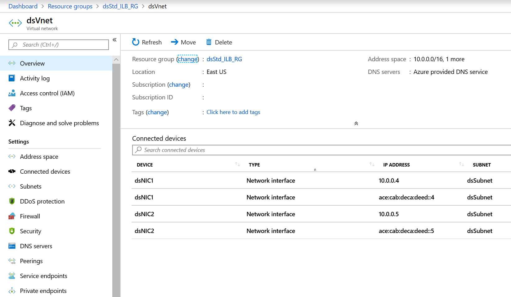

# Deploy an IPv6 dual stack application using Standard Internal Load Balancer in Azure using PowerShell

This article shows you how to deploy a dual stack (IPv4 + IPv6) application in Azure that includes a dual stack virtual network and subnet, a Standard Internal Load Balancer with dual (IPv4 + IPv6) front-end configurations, VMs with NICs that have a dual IP configuration, network security group, and public IPs.

The procedure to create an IPv6-capable Internal Load Balancer is nearly identical to the process for creating an Internet-facing IPv6 Load Balancer described [here](virtual-network-ipv4-ipv6-dual-stack-standard-load-balancer-powershell.md). The only differences for creating an internal load balancer are in the front-end configuration as illustrated in the PowerShell example below:

```azurepowershell
 $frontendIPv6 = New-AzLoadBalancerFrontendIpConfig `
 -Name "dsLbFrontEnd_v6" `
 -PrivateIpAddress "fd00:db8:deca:deed::100" `
 -PrivateIpAddressVersion "IPv6" `
 -Subnet $DsSubnet
```

The changes that make the above an internal load balancer front-end configuration are:
- The `PrivateIpAddressVersion` is specified as “IPv6”
- The `-PublicIpAddress` argument has been either omitted or replaced with `-PrivateIpAddress`. Note that the private address must be in the range of the Subnet IP space in which the internal load balancer will be deployed. If a static `-PrivateIpAddress` is omitted, the next free IPv6 address will be selected from the subnet in which the internal load Balancer is deployed.
- The dual stack subnet in which the internal load balancer will be deployed is specified with either a `-Subnet` or `-SubnetId` argument.

[!INCLUDE [cloud-shell-try-it.md](../../includes/cloud-shell-try-it.md)]

If you choose to install and use PowerShell locally, this article requires the Azure PowerShell module version 6.9.0 or later. Run `Get-Module -ListAvailable Az` to find the installed version. If you need to upgrade, see [Install Azure PowerShell module](/powershell/azure/install-azure-powershell). If you are running PowerShell locally, you also need to run `Connect-AzAccount` to create a connection with Azure.

## Create a resource group

Before you can create your dual-stack virtual network, you must create a resource group with [New-AzResourceGroup](/powershell/module/az.resources/new-azresourcegroup). The following example creates a resource group named *dsStd_ILB_RG* in the *east us* location:

```azurepowershell
$rg = New-AzResourceGroup `
  -ResourceGroupName "dsStd_ILB_RG"  `
  -Location "east us"
```

## Create IPv4 and IPv6 public IP addresses
To access your virtual machines from the Internet, you need IPv4 and IPv6 public IP addresses for the VMs. Create public IP addresses with [New-AzPublicIpAddress](/powershell/module/az.network/new-azpublicipaddress). The following example creates IPv4 and IPv6 public IP address named *RdpPublicIP_1* and *RdpPublicIP_2* in the *dsStd_ILB_RG* resource group:

```azurepowershell
$RdpPublicIP_1 = New-AzPublicIpAddress `
  -Name "RdpPublicIP_1" `
  -ResourceGroupName $rg.ResourceGroupName `
  -Location $rg.Location  `
  -AllocationMethod Static `
  -IpAddressVersion IPv4  `
  -sku Standard
  
$RdpPublicIP_2 = New-AzPublicIpAddress `
  -Name "RdpPublicIP_2" `
  -ResourceGroupName $rg.ResourceGroupName `
  -Location $rg.Location  `
  -AllocationMethod Static `
  -IpAddressVersion IPv6  `
  -sku Standard
```
## Create the virtual network and the subnet

Create a virtual network using [New-AzVirtualNetwork](/powershell/module/az.network/new-azvirtualnetwork) with dual stack a subnet configuration using [New-AzVirtualNetworkSubnetConfig](/powershell/module/az.network/new-azvirtualnetworksubnetconfig). The following example creates a virtual network named *dsVnet* with *dsSubnet*.

```azurepowershell
# Create dual stack subnet config
$DsSubnet = New-AzVirtualNetworkSubnetConfig `
  -Name "dsSubnet" `
  -AddressPrefix "10.0.0.0/24","fd00:db8:deca:deed::/64"

# Create the virtual network
$vnet = New-AzVirtualNetwork `
  -ResourceGroupName $rg.ResourceGroupName `
  -Location $rg.Location  `
  -Name "dsVnet" `
  -AddressPrefix "10.0.0.0/16","fd00:db8:deca::/48"  `
  -Subnet $DsSubnet

#Refresh the fully populated subnet for use in load balancer frontend configuration
$DsSubnet = get-AzVirtualNetworkSubnetconfig -name dsSubnet -VirtualNetwork $vnet
```
## Create Standard Load Balancer

In this section, you configure dual frontend IP (IPv4 and IPv6) and the back-end address pool for the load balancer and then create a Standard Load Balancer.

### Create front-end IP

Create a front-end IP with [New-AzLoadBalancerFrontendIpConfig](/powershell/module/az.network/new-azloadbalancerfrontendipconfig). The following example creates IPv4 and IPv6 frontend IP configurations named *dsLbFrontEnd_v4* and *dsLbFrontEnd_v6*:

```azurepowershell
$frontendIPv4 = New-AzLoadBalancerFrontendIpConfig `
  -Name "dsLbFrontEnd_v4" `
  -PrivateIpAddress "10.0.0.100"  `
  -PrivateIpAddressVersion "IPv4"   `
  -Subnet $DsSubnet

$frontendIPv6 = New-AzLoadBalancerFrontendIpConfig `
  -Name "dsLbFrontEnd_v6" `
  -PrivateIpAddress "fd00:db8:deca:deed::100"  `
  -PrivateIpAddressVersion "IPv6"   `
  -Subnet $DsSubnet

```

### Configure back-end address pool

Create a back-end address pool with [New-AzLoadBalancerBackendAddressPoolConfig](/powershell/module/az.network/new-azloadbalancerbackendaddresspoolconfig). The VMs attach to this back-end pool in the remaining steps. The following example creates back-end address pools named *dsLbBackEndPool_v4* and *dsLbBackEndPool_v6* to include VMs with both IPV4 and IPv6 NIC configurations:

```azurepowershell
$backendPoolv4 = New-AzLoadBalancerBackendAddressPoolConfig -Name "dsLbBackEndPool_v4"

$backendPoolv6 = New-AzLoadBalancerBackendAddressPoolConfig -Name "dsLbBackEndPool_v6"
```

### Create a load balancer rule

A load balancer rule is used to define how traffic is distributed to the VMs. You define the frontend IP configuration for the incoming traffic and the backend IP pool to receive the traffic, along with the required source and destination port. To make sure only healthy VMs receive traffic, you can optionally define a health probe. Basic load balancer uses an IPv4 probe to assess health for both IPv4 and IPv6 endpoints on the VMs. Standard load balancer includes support for explicitly IPv6 health probes.

Create a load balancer rule with [Add-AzLoadBalancerRuleConfig](/powershell/module/az.network/add-azloadbalancerruleconfig). The following example creates load balancer rules named *dsLBrule_v4* and *dsLBrule_v6* and balances traffic on *TCP* port *80* to the IPv4 and IPv6 frontend IP configurations:

```azurepowershell
$lbrule_v4 = New-AzLoadBalancerRuleConfig `
  -Name "dsLBrule_v4" `
  -FrontendIpConfiguration $frontendIPv4 `
  -BackendAddressPool $backendPoolv4 `
  -Protocol Tcp `
  -FrontendPort 80 `
  -BackendPort 80

$lbrule_v6 = New-AzLoadBalancerRuleConfig `
  -Name "dsLBrule_v6" `
  -FrontendIpConfiguration $frontendIPv6 `
  -BackendAddressPool $backendPoolv6 `
  -Protocol Tcp `
  -FrontendPort 80 `
  -BackendPort 80
```

### Create load balancer

Create a Standard Load Balancer with [New-AzLoadBalancer](/powershell/module/az.network/new-azloadbalancer). The following example creates a public Standard Load Balancer named *myInternalLoadBalancer* using the IPv4 and IPv6 frontend IP configurations, backend pools, and load-balancing rules that you created in the preceding steps:

```azurepowershell
$lb = New-AzLoadBalancer  `
  -ResourceGroupName $rg.ResourceGroupName  `
  -Location $rg.Location  `
  -Name  "MyInternalLoadBalancer"  `
  -Sku "Standard"  `
  -FrontendIpConfiguration  $frontendIPv4,$frontendIPv6  `
  -BackendAddressPool  $backendPoolv4,$backendPoolv6  `
  -LoadBalancingRule  $lbrule_v4,$lbrule_v6

```

## Create network resources
Before you deploy some VMs and can test your balancer, you must create supporting network resources - availability set, network security group, and virtual NICs. 

### Create an availability set
To improve the high availability of your application, place your VMs in an availability set.

Create an availability set with [New-AzAvailabilitySet](/powershell/module/az.compute/new-azavailabilityset). The following example creates an availability set named *dsAVset*:

```azurepowershell
$avset = New-AzAvailabilitySet `
  -ResourceGroupName $rg.ResourceGroupName `
  -Location $rg.Location  `
  -Name "dsAVset" `
  -PlatformFaultDomainCount 2 `
  -PlatformUpdateDomainCount 2 `
  -Sku aligned
```

### Create network security group

Create a network security group for the rules that will govern inbound and outbound communication in your VNet.

#### Create a network security group rule for port 3389

Create a network security group rule to allow RDP connections through port 3389 with [New-AzNetworkSecurityRuleConfig](/powershell/module/az.network/new-aznetworksecurityruleconfig).

```azurepowershell
$rule1 = New-AzNetworkSecurityRuleConfig `
  -Name 'myNetworkSecurityGroupRuleRDP' `
  -Description 'Allow RDP' `
  -Access Allow `
  -Protocol Tcp `
  -Direction Inbound `
  -Priority 100 `
  -SourceAddressPrefix * `
  -SourcePortRange * `
  -DestinationAddressPrefix * `
  -DestinationPortRange 3389
```
#### Create a network security group rule for port 80

Create a network security group rule to allow internet connections through port 80 with [New-AzNetworkSecurityRuleConfig](/powershell/module/az.network/new-aznetworksecurityruleconfig).

```azurepowershell
$rule2 = New-AzNetworkSecurityRuleConfig `
  -Name 'myNetworkSecurityGroupRuleHTTP' `
  -Description 'Allow HTTP' `
  -Access Allow `
  -Protocol Tcp `
  -Direction Inbound `
  -Priority 200 `
  -SourceAddressPrefix * `
  -SourcePortRange 80 `
  -DestinationAddressPrefix * `
  -DestinationPortRange 80
```
#### Create a network security group

Create a network security group with [New-AzNetworkSecurityGroup](/powershell/module/az.network/new-aznetworksecuritygroup).

```azurepowershell
$nsg = New-AzNetworkSecurityGroup `
  -ResourceGroupName $rg.ResourceGroupName `
  -Location $rg.Location  `
  -Name "dsNSG1"  `
  -SecurityRules $rule1,$rule2
```
### Create NICs

Create virtual NICs with [New-AzNetworkInterface](/powershell/module/az.network/new-aznetworkinterface). The following example creates two virtual NICs both with IPv4 and IPv6 configurations. (One virtual NIC for each VM you create for your app in the following steps).

```azurepowershell

# Create the IPv4 configuration for NIC 1
$Ip4Config=New-AzNetworkInterfaceIpConfig `
  -Name dsIp4Config `
  -Subnet $vnet.subnets[0] `
  -PrivateIpAddressVersion IPv4 `
  -LoadBalancerBackendAddressPool $backendPoolv4 `
  -PublicIpAddress  $RdpPublicIP_1

# Create the IPv6 configuration
$Ip6Config=New-AzNetworkInterfaceIpConfig `
  -Name dsIp6Config `
  -Subnet $vnet.subnets[0] `
  -PrivateIpAddressVersion IPv6 `
  -LoadBalancerBackendAddressPool $backendPoolv6

# Create NIC 1
$NIC_1 = New-AzNetworkInterface `
  -Name "dsNIC1" `
  -ResourceGroupName $rg.ResourceGroupName `
  -Location $rg.Location  `
  -NetworkSecurityGroupId $nsg.Id `
  -IpConfiguration $Ip4Config,$Ip6Config

# Create the IPv4 configuration for NIC 2
$Ip4Config=New-AzNetworkInterfaceIpConfig `
  -Name dsIp4Config `
  -Subnet $vnet.subnets[0] `
  -PrivateIpAddressVersion IPv4 `
  -LoadBalancerBackendAddressPool $backendPoolv4 `
  -PublicIpAddress  $RdpPublicIP_2

# Create NIC 2 reusing the IPv6 configuration from NIC 1
$NIC_2 = New-AzNetworkInterface `
  -Name "dsNIC2" `
  -ResourceGroupName $rg.ResourceGroupName `
  -Location $rg.Location  `
  -NetworkSecurityGroupId $nsg.Id `
  -IpConfiguration $Ip4Config,$Ip6Config

```

### Create virtual machines

Set an administrator username and password for the VMs with [Get-Credential](/powershell/module/microsoft.powershell.security/get-credential):

```azurepowershell
$cred = get-credential -Message "DUAL STACK VNET SAMPLE:  Please enter the Administrator credential to log into the VM's"
```

Now you can create the VMs with [New-AzVM](/powershell/module/az.compute/new-azvm). The following example creates two VMs and the required virtual network components if they do not already exist.

```azurepowershell
$vmsize = "Standard_A2"
$ImagePublisher = "MicrosoftWindowsServer"
$imageOffer = "WindowsServer"
$imageSKU = "2019-Datacenter"

$vmName= "dsVM1"
$VMconfig1 = New-AzVMConfig -VMName $vmName -VMSize $vmsize -AvailabilitySetId $avset.Id 3> $null | Set-AzVMOperatingSystem -Windows -ComputerName $vmName -Credential $cred -ProvisionVMAgent 3> $null | Set-AzVMSourceImage -PublisherName $ImagePublisher -Offer $imageOffer -Skus $imageSKU -Version "latest" 3> $null | Set-AzVMOSDisk -Name "$vmName.vhd" -CreateOption fromImage  3> $null | Add-AzVMNetworkInterface -Id $NIC_1.Id  3> $null
$VM1 = New-AzVM -ResourceGroupName $rg.ResourceGroupName  -Location $rg.Location  -VM $VMconfig1


$vmName= "dsVM2"
$VMconfig2 = New-AzVMConfig -VMName $vmName -VMSize $vmsize -AvailabilitySetId $avset.Id 3> $null | Set-AzVMOperatingSystem -Windows -ComputerName $vmName -Credential $cred -ProvisionVMAgent 3> $null | Set-AzVMSourceImage -PublisherName $ImagePublisher -Offer $imageOffer -Skus $imageSKU -Version "latest" 3> $null | Set-AzVMOSDisk -Name "$vmName.vhd" -CreateOption fromImage  3> $null | Add-AzVMNetworkInterface -Id $NIC_2.Id  3> $null
$VM2 = New-AzVM -ResourceGroupName $rg.ResourceGroupName  -Location $rg.Location  -VM $VMconfig2
```
## View IPv6 dual stack virtual network in Azure portal
You can view the IPv6 dual stack virtual network in Azure portal as follows:
1. In the portal's search bar, enter *dsVnet*.
2. When **dsVnet** appears in the search results, select it. This launches the **Overview** page of the dual stack virtual network named *dsVnet*. The dual stack virtual network shows the two NICs with both IPv4 and IPv6 configurations located in the dual stack subnet named *dsSubnet*.




> [!NOTE]
> The IPv6 for Azure virtual network is available in the Azure portal in read-only for this preview release.

## Clean up resources

When no longer needed, you can use the [Remove-AzResourceGroup](/powershell/module/az.resources/remove-azresourcegroup) command to remove the resource group, VM, and all related resources.

```azurepowershell
Remove-AzResourceGroup -Name dsStd_ILB_RG
```

## Next steps

In this article, you created a Standard Load Balancer with a dual frontend IP configuration (IPv4 and IPv6). You also created a two virtual machines that included NICs with dual IP configurations (IPV4 + IPv6) that were added to the back-end pool of the load balancer. To learn more about IPv6 support in Azure virtual networks, see [What is IPv6 for Azure Virtual Network?](../virtual-network/ip-services/ipv6-overview.md)
