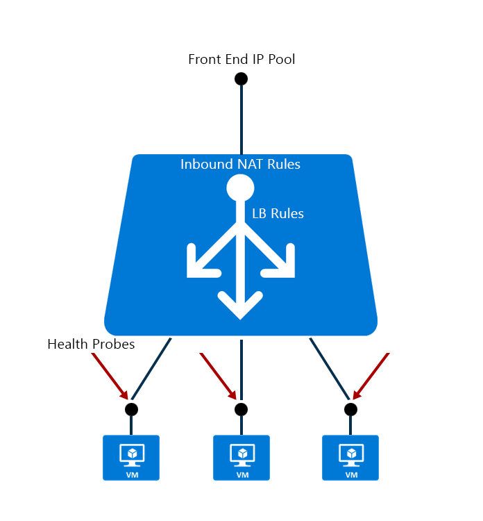

<properties
   pageTitle="Azure Resource Manager support for Load Balancer Preview | Microsoft Azure "
   description="Using powershell for Load Balancer with Azure Resource Manager in preview. Using templates for load balancer"
   services="load-balancer"
   documentationCenter="na"
   authors="sdwheeler"
   manager="carmonm"
   editor="tysonn" />
<tags
   ms.service="load-balancer"
   ms.devlang="na"
   ms.topic="article"
   ms.tgt_pltfrm="na"
   ms.workload="infrastructure-services"
   ms.date="08/25/2016"
   ms.author="sewhee" />

# Azure Resource Manager Support for Load Balancer

Azure Resource Manager is the preferred management framework for services in Azure. Azure Load Balancer can be managed using Azure Resource Manager-based APIs and tools.

## Concepts

With Resource Manager, Azure Load Balancer contains the following child resources:

- Front-end IP configuration – a Load balancer can include one or more front end IP addresses, otherwise known as a virtual IPs (VIPs). These IP addresses serve as ingress for the traffic.

- Back-end address pool – these are IP addresses associated with the virtual machine Network Interface Card (NIC) to which load will be distributed.

- Load balancing rules – a rule property maps a given front end IP and port combination to a set of back end IP addresses and port combination. A single load balancer can have multiple load balancing rules. Each rule is a combination of a front-end IP and port and back-end IP and port associated with VMs.

- Probes – probes enable you to keep track of the health of VM instances. If a health probe fails, the VM instance will be taken out of rotation automatically.

- Inbound NAT rules – NAT rules defining the inbound traffic flowing through the front end IP and distributed to the back end IP.

## Quickstart templates

Azure Resource Manager allows you to provision your applications using a declarative template. In a single template, you can deploy multiple services along with their dependencies. You use the same template to repeatedly deploy your application during every stage of the application lifecycle.

Templates can include definitions for Virtual Machines, Virtual Networks, Availability Sets, Network Interfaces (NICs), Storage Accounts, Load Balancers, Network Security Groups, and Public IPs. With templates you can create everything you need for a complex application. The template file can be checked into content management system for version control and collaboration.

[Learn more about templates](http://go.microsoft.com/fwlink/?LinkId=544798)

[Learn more about Network Resources](../virtual-network/resource-groups-networking.md)

Quickstart templates using Azure Load Balancer can be found in a [GitHub repository](https://github.com/Azure/azure-quickstart-templates) hosting a set of community generated templates.

Examples of templates:

- [2 VMs in a Load Balancer and load balancing rules](http://go.microsoft.com/fwlink/?LinkId=544799)
- [2 VMs in a VNET with an Internal Load Balancer and Load Balancer rules](http://go.microsoft.com/fwlink/?LinkId=544800)
- [2 VMs in a Load Balancer and configure NAT rules on the LB](http://go.microsoft.com/fwlink/?LinkId=544801)

## Setting up Azure Load Balancer with a PowerShell or CLI

Get started with Azure Resource Manager cmdlets, command line tools, and REST APIs

- [Azure Networking Cmdlets](https://msdn.microsoft.com/library/azure/mt163510.aspx) can be used to create a Load Balancer.
- [How to create a load balancer using Azure Resource Manager](load-balancer-get-started-ilb-arm-ps.md)
- [Using the Azure CLI with Azure Resource Management](../xplat-cli-azure-resource-manager.md)
- [Load Balancer REST APIs](https://msdn.microsoft.com/library/azure/mt163651.aspx)

## Next steps

You can also [get started creating an Internet facing load balancer](load-balancer-get-started-internet-arm-ps.md) and configure what type of [distribution mode](load-balancer-distribution-mode.md) for a specific load balancer network traffic behavior.

Learn how to manage [idle TCP timeout settings for a load balancer](load-balancer-tcp-idle-timeout.md). This is important when your application needs to keep connections alive for servers behind a load balancer.
