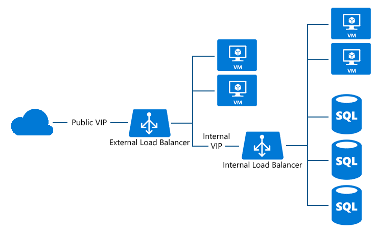

# Configure load balancer for SQL always on

SQL Server AlwaysOn Availability Groups can now be run with ILB. Availability Group is SQL Server's flagship solution for high availability and disaster recovery. The Availability Group Listener allows client applications to seamlessly connect to the primary replica, irrespective of the number of the replicas in the configuration.

The listener (DNS) name is mapped to a load-balanced IP address and Azure's load balancer directs the incoming traffic to only the primary server in the replica set.

You can use ILB support for SQL Server AlwaysOn (listener) endpoints. You now have control over the accessibility of the listener and can choose the load-balanced IP address from a specific subnet in your Virtual Network (VNet).

By using ILB on the listener, the SQL server endpoint (e.g. Server=tcp:ListenerName,1433;Database=DatabaseName) is accessible only by:

* Services and VMs in the same Virtual network
* Services and VMs from connected on-premises network
* Services and VMs from interconnected VNets



Figure 1 - SQL AlwaysOn configured with Internet-facing load balancer

## Add Internal Load Balancer to the service

1. In the following example, we will configure a Virtual network that contains a subnet  called 'Subnet-1':

    ```powershell
    Add-AzureInternalLoadBalancer -InternalLoadBalancerName ILB_SQL_AO -SubnetName Subnet-1 -ServiceName SqlSvc
    ```
2. Add load balanced endpoints for ILB on each VM

    ```powershell
    Get-AzureVM -ServiceName SqlSvc -Name sqlsvc1 | Add-AzureEndpoint -Name "LisEUep" -LBSetName "ILBSet1" -Protocol tcp -LocalPort 1433 -PublicPort 1433 -ProbePort 59999 -ProbeProtocol tcp -ProbeIntervalInSeconds 10 -
    DirectServerReturn $true -InternalLoadBalancerName ILB_SQL_AO | Update-AzureVM

    Get-AzureVM -ServiceName SqlSvc -Name sqlsvc2 | Add-AzureEndpoint -Name "LisEUep" -LBSetName "ILBSet1" -Protocol tcp -LocalPort 1433 -PublicPort 1433 -ProbePort 59999 -ProbeProtocol tcp -ProbeIntervalInSeconds 10 -DirectServerReturn $true -InternalLoadBalancerName ILB_SQL_AO | Update-AzureVM
    ```

    In the example above, you have 2 VM's called "sqlsvc1" and "sqlsvc2" running in the cloud service "Sqlsvc". After creating the ILB with `DirectServerReturn` switch, you add load balanced endpoints to the ILB to allow SQL to configure the listeners for the availability groups.

For more information about SQL AlwaysOn, see [Configure an internal load balancer for an AlwaysOn availability group in Azure](../virtual-machines/windows/sql/virtual-machines-windows-portal-sql-alwayson-int-listener.md).

## See Also
[Get started configuring an Internet facing load balancer](load-balancer-get-started-internet-arm-ps.md)

[Get started configuring an Internal load balancer](load-balancer-get-started-ilb-arm-ps.md)

[Configure a Load balancer distribution mode](load-balancer-distribution-mode.md)

[Configure idle TCP timeout settings for your load balancer](load-balancer-tcp-idle-timeout.md)
