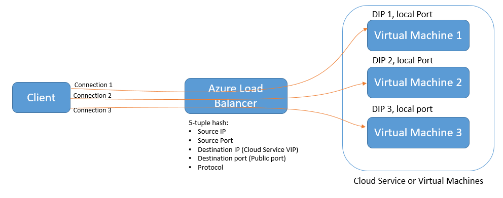
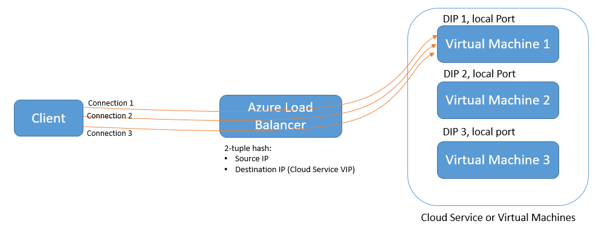

# Configure the distribution mode for Azure Load Balancer

## Hash-based distribution mode

The default distribution mode for Azure Load Balancer is a 5-tuple hash. The tuple is composed of the source IP, source port, destination IP, destination port, and protocol type. The hash is used to map traffic to the available servers and the algorithm provides stickiness only within a transport session. Packets that are in the same session are directed to the same datacenter IP (DIP) instance behind the load-balanced endpoint. When the client starts a new session from the same source IP, the source port changes and causes the traffic to go to a different DIP endpoint.



## Source IP affinity mode

Load Balancer can also be configured by using the source IP affinity distribution mode. This distribution mode is also known as session affinity or client IP affinity. The mode uses a 2-tuple (source IP and destination IP) or 3-tuple (source IP, destination IP, and protocol type) hash to map traffic to the available servers. By using source IP affinity, connections that are initiated from the same client computer go to the same DIP endpoint.

The following figure illustrates a 2-tuple configuration. Notice how the 2-tuple runs through the load balancer to virtual machine 1 (VM1). VM1 is then backed up by VM2 and VM3.



Source IP affinity mode solves an incompatibility between Azure Load Balancer and Remote Desktop Gateway (RD Gateway). By using this mode, you can build an RD Gateway farm in a single cloud service.

Another use case scenario is media upload. The data upload happens through UDP, but the control plane is achieved through TCP:

* A client initiates a TCP session to the load-balanced public address and is directed to a specific DIP. The channel is left active to monitor the connection health.
* A new UDP session from the same client computer is initiated to the same load-balanced public endpoint. The connection is directed to the same DIP endpoint as the previous TCP connection. The media upload can be executed at high throughput while maintaining a control channel through TCP.

> [!NOTE]
> When a load-balanced set changes by removing or adding a virtual machine, the distribution of client requests is recomputed. You can't depend on new connections from existing clients to end up at the same server. Additionally, using source IP affinity distribution mode can cause an unequal distribution of traffic. Clients that run behind proxies might be seen as one unique client application.

## Configure source IP affinity settings

For virtual machines deployed with Resource Manager, use PowerShell to change the load balancer distribution settings on an existing load balancing rule. This updates the distribution mode: 

```powershell 
$lb = Get-AzureRmLoadBalancer -Name MyLb -ResourceGroupName MyLbRg 
$lb.LoadBalancingRules[0].LoadDistribution = 'sourceIp' 
Set-AzureRmLoadBalancer -LoadBalancer $lb 
```

For classic virtual machines, use Azure PowerShell to change the distribution settings. Add an Azure endpoint to a virtual machine and configure the load balancer distribution mode:

```powershell
Get-AzureVM -ServiceName mySvc -Name MyVM1 | Add-AzureEndpoint -Name HttpIn -Protocol TCP -PublicPort 80 -LocalPort 8080 –LoadBalancerDistribution sourceIP | Update-AzureVM
```

Set the value of the `LoadBalancerDistribution` element for the desired amount of load balancing. Specify sourceIP for 2-tuple (source IP and destination IP) load balancing. Specify sourceIPProtocol for 3-tuple (source IP, destination IP, and protocol type) load balancing. Specify none for the default behavior of 5-tuple load balancing.

Retrieve an endpoint load balancer distribution mode configuration by using these settings:

    PS C:\> Get-AzureVM –ServiceName MyService –Name MyVM | Get-AzureEndpoint

    VERBOSE: 6:43:50 PM - Completed Operation: Get Deployment
    LBSetName : MyLoadBalancedSet
    LocalPort : 80
    Name : HTTP
    Port : 80
    Protocol : tcp
    Vip : 65.52.xxx.xxx
    ProbePath :
    ProbePort : 80
    ProbeProtocol : tcp
    ProbeIntervalInSeconds : 15
    ProbeTimeoutInSeconds : 31
    EnableDirectServerReturn : False
    Acl : {}
    InternalLoadBalancerName :
    IdleTimeoutInMinutes : 15
    LoadBalancerDistribution : sourceIP

When the `LoadBalancerDistribution` element is not present, Azure Load Balancer uses the default 5-tuple algorithm.

### Configure distribution mode on load-balanced endpoint set

When endpoints are part of a load-balanced endpoint set, the distribution mode must be configured on the load-balanced endpoint set:

```powershell
Set-AzureLoadBalancedEndpoint -ServiceName MyService -LBSetName LBSet1 -Protocol TCP -LocalPort 80 -ProbeProtocolTCP -ProbePort 8080 –LoadBalancerDistribution sourceIP
```

### Configure distribution mode for Cloud Services endpoints

Use the Azure SDK for .NET 2.5 to update your cloud service. The endpoint settings for Cloud Services are made in the .csdef file. To update the load balancer distribution mode for a Cloud Services deployment, a deployment upgrade is required.

Here is an example of .csdef changes for endpoint settings:

```xml
<WorkerRole name="worker-role-name" vmsize="worker-role-size" enableNativeCodeExecution="[true|false]">
    <Endpoints>
    <InputEndpoint name="input-endpoint-name" protocol="[http|https|tcp|udp]" localPort="local-port-number" port="port-number" certificate="certificate-name" loadBalancerProbe="load-balancer-probe-name" loadBalancerDistribution="sourceIP" />
    </Endpoints>
</WorkerRole>
<NetworkConfiguration>
    <VirtualNetworkSite name="VNet"/>
    <AddressAssignments>
<InstanceAddress roleName="VMRolePersisted">
    <PublicIPs>
    <PublicIP name="public-ip-name" idleTimeoutInMinutes="timeout-in-minutes"/>
    </PublicIPs>
</InstanceAddress>
    </AddressAssignments>
</NetworkConfiguration>
```

## API example

The following example shows how to reconfigure the load balancer distribution mode for a specified load-balanced set in a deployment. 

### Change distribution mode for deployed load-balanced set

Use the Azure classic deployment model to change an existing deployment configuration. Add the `x-ms-version` header and set the value to version 2014-09-01 or later.

#### Request

    POST https://management.core.windows.net/<subscription-id>/services/hostedservices/<cloudservice-name>/deployments/<deployment-name>?comp=UpdateLbSet   x-ms-version: 2014-09-01
    Content-Type: application/xml

    <LoadBalancedEndpointList xmlns="http://schemas.microsoft.com/windowsazure" xmlns:i="http://www.w3.org/2001/XMLSchema-instance">
      <InputEndpoint>
        <LoadBalancedEndpointSetName> endpoint-set-name </LoadBalancedEndpointSetName>
        <LocalPort> local-port-number </LocalPort>
        <Port> external-port-number </Port>
        <LoadBalancerProbe>
          <Port> port-assigned-to-probe </Port>
          <Protocol> probe-protocol </Protocol>
          <IntervalInSeconds> interval-of-probe </IntervalInSeconds>
          <TimeoutInSeconds> timeout-for-probe </TimeoutInSeconds>
        </LoadBalancerProbe>
        <Protocol> endpoint-protocol </Protocol>
        <EnableDirectServerReturn> enable-direct-server-return </EnableDirectServerReturn>
        <IdleTimeoutInMinutes>idle-time-out</IdleTimeoutInMinutes>
        <LoadBalancerDistribution>sourceIP</LoadBalancerDistribution>
      </InputEndpoint>
    </LoadBalancedEndpointList>

As previously described, set the `LoadBalancerDistribution` element to sourceIP for 2-tuple affinity, sourceIPProtocol for 3-tuple affinity, or none for no affinity (5-tuple affinity).

#### Response

    HTTP/1.1 202 Accepted
    Cache-Control: no-cache
    Content-Length: 0
    Server: 1.0.6198.146 (rd_rdfe_stable.141015-1306) Microsoft-HTTPAPI/2.0
    x-ms-servedbyregion: ussouth2
    x-ms-request-id: 9c7bda3e67c621a6b57096323069f7af
    Date: Thu, 16 Oct 2014 22:49:21 GMT

## Next steps

* [Azure Internal Load Balancer overview](load-balancer-internal-overview.md)
* [Get started with configuring an internet-facing load balancer](load-balancer-get-started-internet-arm-ps.md)
* [Configure idle TCP timeout settings for your load balancer](load-balancer-tcp-idle-timeout.md)
