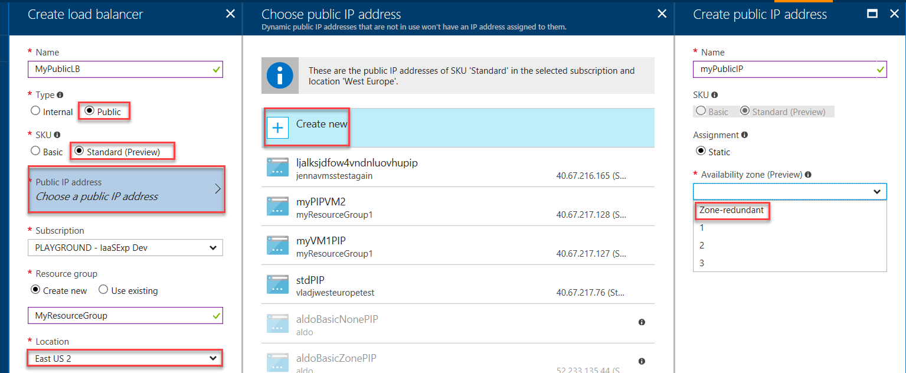

#  Create a public Load Balancer Standard with zone-redundant Public IP address frontend using Azure portal

This article steps through creating a public [Load Balancer Standard](https://aka.ms/azureloadbalancerstandard) with a zone-redundant frontend using a Public IP Standard address.

If you don't have an Azure subscription, create a [free account](https://azure.microsoft.com/free/?WT.mc_id=A261C142F) before you begin.

## Register for Availability Zones, Load Balancer Standard, and Public IP Standard Preview
 
>[!NOTE]
[Load Balancer Standard SKU](https://aka.ms/azureloadbalancerstandard) is currently in Preview. During preview, the feature may not have the same level of availability and reliability as features that are in general availability release. For more information, see [Microsoft Azure Supplemental Terms of Use for Microsoft Azure Previews](https://azure.microsoft.com/support/legal/preview-supplemental-terms/). Use the Generally Available [Load Balancer Basic SKU](load-balancer-overview.md) for your production services. 

> [!NOTE]
> Availability zones are in preview and are ready for your development and test scenarios. Support is available for select Azure resources and regions, and VM size families. For more information on how to get started, and which Azure resources, regions, and VM size families you can try availability zones with, see [Overview of Availability Zones](https://docs.microsoft.com/azure/availability-zones/az-overview). For support, you can reach out on [StackOverflow](https://stackoverflow.com/questions/tagged/azure-availability-zones) or [open an Azure support ticket](../azure-supportability/how-to-create-azure-support-request.md?toc=%2fazure%2fvirtual-network%2ftoc.json).  

Before selecting a zone or zone-redundant option for the frontend Public IP Address for the Load Balancer, you must first complete the steps in [register for the availability zones preview](https://docs.microsoft.com/azure/availability-zones/az-overview).

## Log in to Azure 

Log in to the Azure portal at https://portal.azure.com.

## Create a zone redundant load balancer

1. From a browser navigate to the Azure portal: [http://portal.azure.com](http://portal.azure.com) and login with your Azure account.
2. On the top left-hand side of the screen, select **New** > **Networking** > **Load Balancer.**
3. In the **Create load balancer, under **Name** type **myPublicLB**.
4. Under **Type**, select **Public**.
5. Under SKU, select **Standard (Preview)**.
6. Click **Public IP address**, click **Create new**, on the **Create a public IP address** page, under name, type **myPublicIPStandard**, and for **Availability zone (Preview)**, select **Zone-redundant**.
7. Under **Location**, select **East US2**, and then click **OK**. The load balancer then starts to deploy and takes a few minutes to successfully complete deployment.

    

## Next steps
- Learn how [create a Public IP in an availability zone](../virtual-network/create-public-ip-availability-zone-portal.md)

