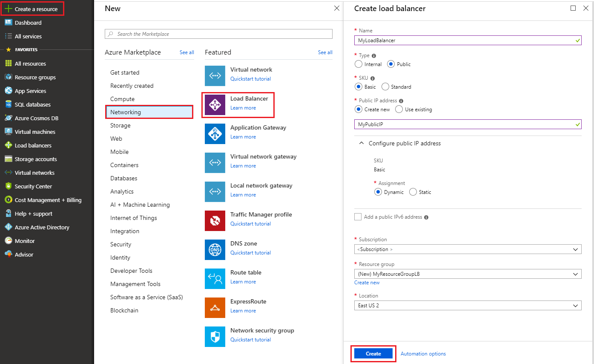
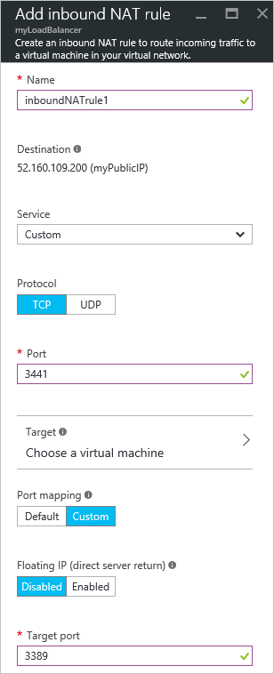

# Creating an Internet-facing load balancer using the Azure portal

> [!div class="op_single_selector"]
> * [Portal](../load-balancer/load-balancer-get-started-internet-portal.md)
> * [PowerShell](../load-balancer/load-balancer-get-started-internet-arm-ps.md)
> * [Azure CLI](../load-balancer/load-balancer-get-started-internet-arm-cli.md)
> * [Template](../load-balancer/load-balancer-get-started-internet-arm-template.md)

[!INCLUDE [load-balancer-get-started-internet-intro-include.md](../../includes/load-balancer-get-started-internet-intro-include.md)]

[!INCLUDE [azure-arm-classic-important-include](../../includes/azure-arm-classic-important-include.md)]

This article covers the Resource Manager deployment model. You can also [Learn how to create an Internet-facing load balancer using classic deployment](load-balancer-get-started-internet-classic-portal.md)

[!INCLUDE [load-balancer-get-started-internet-scenario-include.md](../../includes/load-balancer-get-started-internet-scenario-include.md)]

This covers the sequence of individual tasks that have to be done to create a load balancer and explain in detail what is being done to accomplish the goal.

## What is required to create an Internet-facing load balancer?

You need to create and configure the following objects to deploy a load balancer.

* Front-end IP configuration - contains public IP addresses for incoming network traffic.
* Back-end address pool - contains network interfaces (NICs) for the virtual machines to receive network traffic from the load balancer.
* Load balancing rules - contains rules mapping a public port on the load balancer to port in the back-end address pool.
* Inbound NAT rules - contains rules mapping a public port on the load balancer to a port for a specific virtual machine in the back-end address pool.
* Probes - contains health probes used to check availability of virtual machines instances in the back-end address pool.

You can get more information about load balancer components with Azure Resource Manager at [Azure Resource Manager support for Load Balancer](load-balancer-arm.md).

## Set up a load balancer in Azure portal

> [!IMPORTANT]
> This example assumes you have a virtual network called **myVNet**. Refer to [create virtual network](../virtual-network/virtual-networks-create-vnet-arm-pportal.md) to do this. It also assumes there is a subnet within **myVNet** called **LB-Subnet-BE** and two VMs called **web1** and **web2** respectively within the same availability set called **myAvailSet** in **myVNet**. Refer to [this link](../virtual-machines/virtual-machines-windows-hero-tutorial.md?toc=%2fazure%2fvirtual-machines%2fwindows%2ftoc.json) to create VMs.

1. From a browser navigate to the Azure portal: [http://portal.azure.com](http://portal.azure.com) and login with your Azure account.
2. On the top left-hand side of the screen select **New** > **Networking** > **Load Balancer.**
3. In the **Create load balancer** blade, type a name for your load balancer. Here it is called **myLoadBalancer**.
4. Under **Type**, select **Public**.
5. Under **Public IP address**, create a new public IP called **myPublicIP**.
6. Under Resource Group, select **myRG**. Then select an appropriate **Location**, and then click **OK**. The load balancer will then start to deploy and will take a few minutes to successfully complete deployment.

    

## Create a back-end address pool

1. Once your load balancer has successfully deployed, select it from within your resources. Under settings, select Backend Pools. Type a name for your backend pool. Then click on the **Add** button toward the top of the blade that shows up.
2. Click on **Add a virtual machine** in the **Add backend pool** blade.  Select **Choose an availability set** under **Availability set** and select **myAvailSet**. Next, select **Choose the virtual machines** under the Virtual Machines section in the blade and click on **web1** and **web2**, the two VMs created for load balancing. Ensure that both have blue check marks to the left as shown in the image below. Then, click **Select** in that blade followed by OK in the **Choose Virtual machines** blade and then **OK** in the **Add backend pool** blade.

    

3. Check to make sure your notifications drop down list has an update regarding saving the load balancer backend pool in addition to updating the network interface for both the VMs **web1** and **web2**.

## Create a probe, LB rule, and NAT rules

1. Create a health probe.

    Under Settings of your load balancer, select Probes. Then click **Add** located at the top of the blade.

    There are two ways to configure a probe: HTTP or TCP. This example shows HTTP, but TCP can be configured in a similar manner.
    Update the necessary information. As mentioned, **myLoadBalancer** will load balance traffic on Port 80. The path selected is HealthProbe.aspx, Interval is 15 seconds, and Unhealthy threshold is 2. Once finished, click **OK** to create the probe.

    Hover your pointer over the 'i' icon to learn more about these individual configurations and how they can be changed to cater to your requirements.

    

2. Create a load balancer rule.

    Click on Load balancing rules in the Settings section of your load balancer. In the new blade, click on **Add**. Name your rule. Here, it is HTTP. Choose the frontend port and Backend port. Here, 80 is chosen for both. Choose **LB-backend** as your Backend pool and the previously created **HealthProbe** as the Probe. Other configurations can be set according to your requirements. Then click OK to save the load balancing rule.

    

3. Create inbound NAT rules

    Click on Inbound NAT rules under the settings section of your load balancer. In the new blade that, click **Add**. Then name your inbound NAT rule. Here it is called **inboundNATrule1**. The destination should be the Public IP previously created. Select Custom under Service and select the protocol you would like to use. Here TCP is selected. Enter the port, 3441, and the Target port, in this case, 3389. then click OK to save this rule.

    Once the first rule is created, repeat this step for the second inbound NAT rule called inboundNATrule2 from port 3442 to Target port 3389.

    

## Remove a Load Balancer

To delete a load balancer, select the load balancer you want to remove. In the *Load Balancer* blade, click on **Delete** located at the top of the blade. Then select **Yes** when prompted.

## Next steps

[Get started configuring an internal load balancer](load-balancer-get-started-ilb-arm-cli.md)

[Configure a load balancer distribution mode](load-balancer-distribution-mode.md)

[Configure idle TCP timeout settings for your load balancer](load-balancer-tcp-idle-timeout.md)
