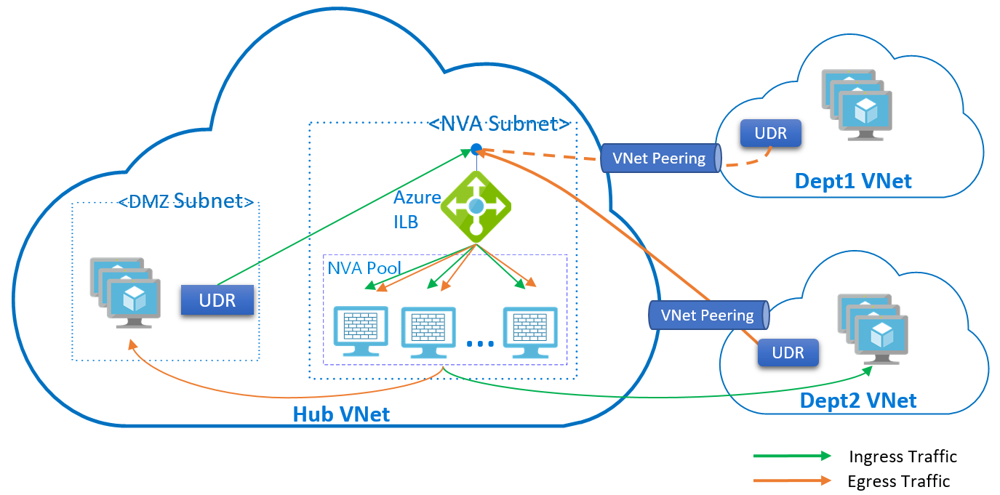

# High availability ports overview

Azure Standard Load Balancer helps you load-balance TCP and UDP flows on all ports simultaneously when you're using an internal load balancer. 

A high availability (HA) ports load balancing rule is a variant of a load balancing rule, configured on an internal Standard Load Balancer. You can simplify the use of a load balancer by providing a single rule to load-balance all TCP and UDP flows that arrive on all ports of an internal Standard Load Balancer. The load-balancing decision is made per flow. This action is based on the following five-tuple connection: source IP address, source port, destination IP address, destination port, and protocol

The HA ports load balancing rules help you with critical scenarios, such as high availability and scale for network virtual appliances (NVAs) inside virtual networks. The feature can also help when a large number of ports must be load-balanced. 

The HA ports load balancing rules is configured when you set the front-end and back-end ports to **0** and the protocol to **All**. The internal load balancer resource then balances all TCP and UDP flows, regardless of port number

## Why use HA ports?

### Network virtual appliances

You can use NVAs to help secure your Azure workload from multiple types of security threats. When you use NVAs in these scenarios, they must be reliable and highly available, and they must scale out for demand.

You can achieve these goals simply by adding NVA instances to the back-end pool of your internal load balancer and configuring an HA ports load-balancer rule.

For NVA HA scenarios, HA ports offer the following advantages:
- Provide fast failover to healthy instances, with per-instance health probes
- Ensure higher performance with scale-out to *n*-active instances
- Provide *n*-active and active-passive scenarios
- Eliminate the need for complex solutions, such as Apache ZooKeeper nodes for monitoring appliances

The following diagram presents a hub-and-spoke virtual network deployment. The spokes force-tunnel their traffic to the hub virtual network and through the NVA, before leaving the trusted space. The NVAs are behind an internal Standard Load Balancer with an HA ports configuration. All traffic can be processed and forwarded accordingly. When configured as show in the following diagram, an HA Ports load balancing rule additionally provides flow symmetry for ingress and egress traffic.

>[!NOTE]
> If you are using NVAs, confirm with their providers how to best use HA ports and to learn which scenarios are supported.

### Load-balancing large numbers of ports

You can also use HA ports for applications that require load balancing of large numbers of ports. You can simplify these scenarios by using an internal [Standard Load Balancer](load-balancer-standard-overview.md) with HA ports. A single load-balancing rule replaces multiple individual load-balancing rules, one for each port.

## Region availability

The HA ports feature is available in all the global Azure regions.

## Supported configurations

### A single, non-floating IP (non-Direct Server Return) HA-ports configuration on an internal Standard Load Balancer

This configuration is a basic HA ports configuration. You can configure an HA ports load-balancing rule on a single front-end IP address by doing the following:
1. While configuring Standard Load Balancer, select the **HA ports** check box in the Load Balancer rule configuration.
2. For **Floating IP**, select **Disabled**.

This configuration does not allow any other load-balancing rule configuration on the current load balancer resource. It also allows no other internal load balancer resource configuration for the given set of back-end instances.

However, you can configure a public Standard Load Balancer for the back-end instances in addition to this HA ports rule.

### A single, floating IP (Direct Server Return) HA-ports configuration on an internal Standard Load Balancer

You can similarly configure your load balancer to use a load-balancing rule with **HA Port** with a single front end by setting the **Floating IP** to **Enabled**. 

By using this configuration, you can add more floating IP load-balancing rules and/or a public load balancer. However, you cannot use a non-floating IP, HA-ports load-balancing configuration on top of this configuration.

### Multiple HA-ports configurations on an internal Standard Load Balancer

If your scenario requires that you configure more than one HA port front end for the same back-end pool, you can do the following: 
- Configure more than one front-end private IP address for a single internal Standard Load Balancer resource.
- Configure multiple load-balancing rules, where each rule has a single unique front-end IP address selected.
- Select the **HA ports** option, and then set **Floating IP** to **Enabled** for all the load-balancing rules.

### An internal load balancer with HA ports and a public load balancer on the same back-end instance

You can configure *one* public Standard Load Balancer resource for the back-end resources, along with a single internal Standard Load Balancer with HA ports.

>[!NOTE]
>This capability is currently available via Azure Resource Manager templates, but it is not available via the Azure portal.

## Limitations

- HA ports configuration is available only for internal load balancers. It is not available for public load balancers.

- The combining of an HA ports load-balancing rule and a non-HA ports load-balancing rule is not supported.

- The HA ports feature is not available for IPv6.

- Flow symmetry (primarily for NVA scenarios) is supported with backend instance and a single NIC (and single IP configuration) only when used as shown in the diagram above and using HA Ports load balancing rules. It is not provided in any other scenario. This means that two or more Load Balancer resources and their respective rules make independent decisions and are never coordinated. See the description and diagram for [network virtual appliances](#nva). When you are using a multiple NICs or sandwiching the NVA between a public and internal Load Balancer, flow symmetry is not available.  You may be able to work around this by source NAT'ing the ingress flow to the IP of the appliance to allow replies to arrive on the same NVA.  However, we strongly recommend using a single NIC and using the reference architecture shown in the diagram above.

## Next steps

- [Configure HA ports on an internal Standard Load Balancer](load-balancer-configure-ha-ports.md)
- [Learn about Standard Load Balancer](load-balancer-standard-overview.md)
